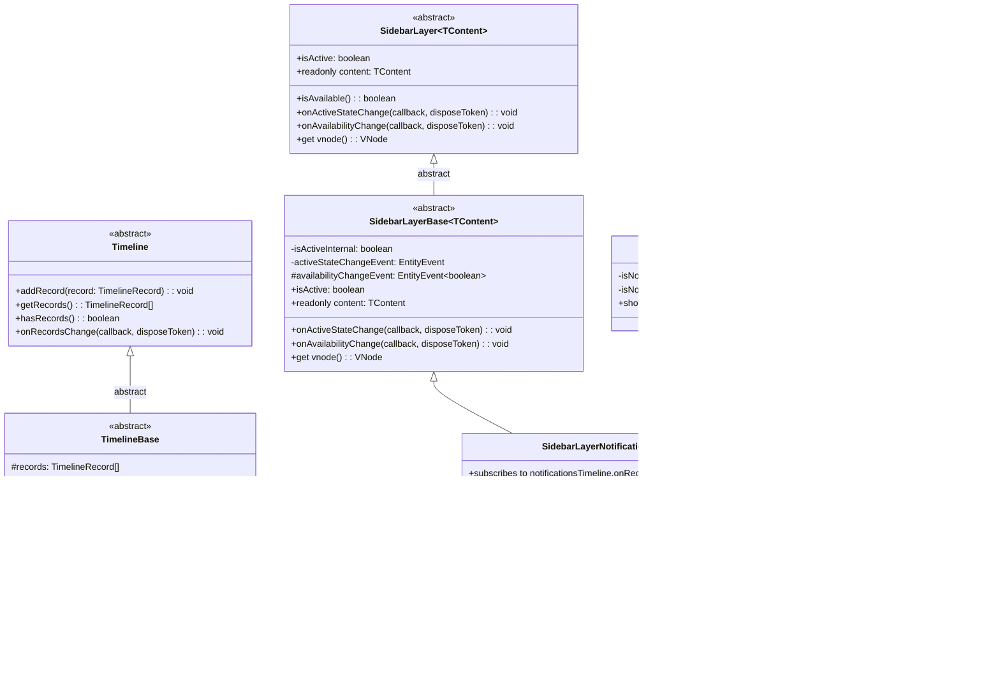
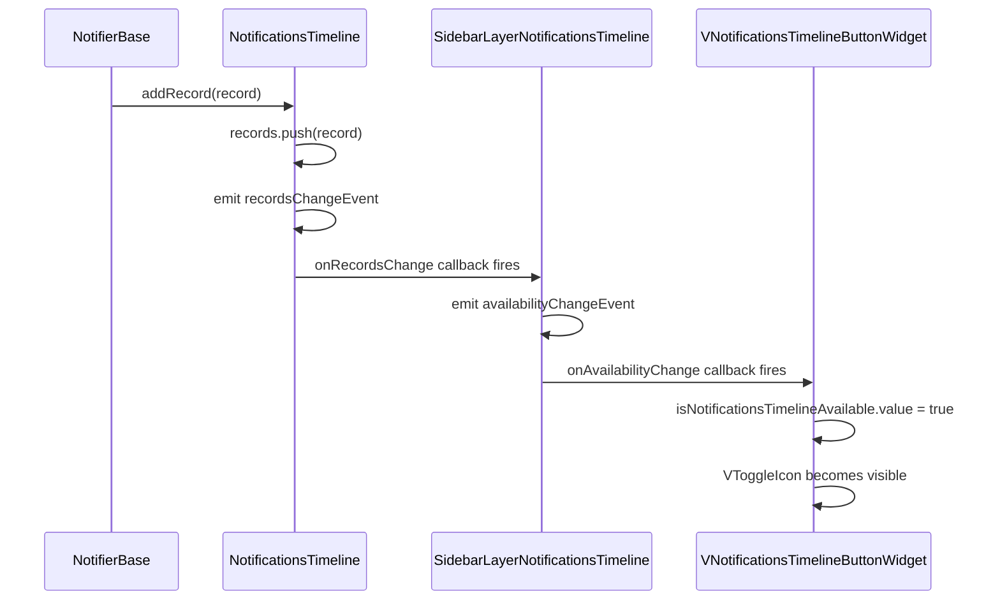

# Add Notifications Timeline Availability

## Overview

This plan adds the concept of "availability" to the notifications timeline system. The goal is to:

1. Add `hasRecords` / `onRecordsChange` to `Timeline` and `TimelineBase` so consumers can know when records exist.
2. Refactor `SidebarLayer` → `SidebarLayerBase` (abstract implementation), extract abstract `SidebarLayer` class as the public interface.
3. Create `SidebarLayerNotificationsTimeline` — extends `SidebarLayerBase`, implements `isAvailable()` method that delegates to `notificationsTimeline.hasRecords()`, subscribes to `NotificationsTimeline.onRecordsChange` to trigger `availabilityChangeEvent`.
4. Update `VNotificationsTimelineButtonWidget` to only show the toggle icon when the notifications timeline is available.

## Architecture



## Data Flow



## Files to Modify

| # | File | Change |
|---|------|--------|
| 1 | `app/modules/uikit/entities/timeline.ts` | Add abstract `hasRecords()` method and `onRecordsChange` method |
| 2 | `app/modules/uikit/entities/timelineBase.ts` | Implement `hasRecords()` and `onRecordsChange` using `EntityEvent` |
| 3 | `app/modules/sidebar/entities/sidebarLayer.ts` | **Rename to `SidebarLayerBase`** (abstract), extract abstract `SidebarLayer` class; add `#availabilityChangeEvent` and `onAvailabilityChange` |
| 4 | `app/modules/sidebar/entities/sidebarLayerNotificationsTimeline.ts` | **New file:** `SidebarLayerNotificationsTimeline` extends `SidebarLayerBase` |
| 5 | `app/modules/sidebar/entities/sidebarBase.ts` | Update to use `SidebarLayerNotificationsTimeline` |
| 6 | `app/modules/sidebar/entities/sidebar.ts` | No change needed — type still references abstract `SidebarLayer` |
| 7 | `app/modules/layouts/components/VNotificationsTimelineButtonWidget.vue` | Add `isNotificationsTimelineAvailable` ref, conditionally show `VToggleIcon` |
| 8 | `app/modules/sidebar/test/nuxt/sidebarLayer.test.ts` | **Replace** with `SidebarLayerNotificationsTimeline` tests |
| 9 | `app/modules/sidebar/test/nuxt/sidebarBase.test.ts` | No changes expected |
| 10 | `app/modules/uikit/mocks/notificationsTimelineMock.ts` | Add `hasRecords` and `onRecordsChange` mocks |

## Detailed Implementation Steps

### Step 1: Add `hasRecords()` / `onRecordsChange` to `Timeline` (abstract)

**File:** `app/modules/uikit/entities/timeline.ts`

Add two new abstract members — `hasRecords` as a **method** (not a getter):

```typescript
import { UIElement } from './uiElement';
import type { TimelineRecord } from '../types/timelineRecord';
import type { Action } from '@packages/shared';
import type { DisposeToken } from '@packages/shared';

export abstract class Timeline extends UIElement
{
    abstract addRecord(record: TimelineRecord): void;
    abstract getRecords(): TimelineRecord[];

    abstract hasRecords(): boolean;
    abstract onRecordsChange(callback: Action<[]>, disposeToken?: DisposeToken): void;
}
```

### Step 2: Add `hasRecords()` / `onRecordsChange` to `TimelineBase`

**File:** `app/modules/uikit/entities/timelineBase.ts`

- Add a private `recordsChangeEvent` field of type `EntityEvent`
- Implement `hasRecords()` as a method returning `this.records.length > 0`
- Implement `onRecordsChange` that delegates to `recordsChangeEvent.on`
- Override `addRecord` to also emit `recordsChangeEvent` after pushing
- Dispose `recordsChangeEvent` in `[Symbol.dispose]()`

```typescript
import { h } from 'vue';
import { Timeline } from './timeline';
import type { TimelineRecord } from '../types/timelineRecord';
import VTimeline from '../components/VTimeline.vue';
import { EntityEvent } from '@packages/shared';
import type { Action } from '@packages/shared';
import type { DisposeToken } from '@packages/shared';

export abstract class TimelineBase extends Timeline
{
    protected records: TimelineRecord[] = [];
    private recordsChangeEvent = new EntityEvent();

    override addRecord(record: TimelineRecord): void
    {
        this.records.push(record);
        this.recordsChangeEvent.emit();
    }

    override getRecords(): TimelineRecord[]
    {
        return this.records;
    }

    override hasRecords(): boolean
    {
        return this.records.length > 0;
    }

    override onRecordsChange(callback: Action<[]>, disposeToken?: DisposeToken): void
    {
        this.recordsChangeEvent.on(callback, disposeToken);
    }

    override get vnode()
    {
        return h(VTimeline, { records: this.records });
    }

    override[Symbol.dispose](): void
    {
        this.recordsChangeEvent[Symbol.dispose]();
    }
}
```

### Step 3: Rename `SidebarLayer` → `SidebarLayerBase` (abstract), extract abstract `SidebarLayer`

**File:** `app/modules/sidebar/entities/sidebarLayer.ts`

Key design:
- `SidebarLayer` (abstract) declares: `isActive` (as a property, not get/set), `isAvailable()` (method), `content`, `onActiveStateChange`, `onAvailabilityChange`, `vnode`, `[Symbol.dispose]`
- `SidebarLayerBase` (abstract, extends `SidebarLayer`) implements: `isActive` with backing field + event, `onActiveStateChange`, `onAvailabilityChange`, `vnode`, `[Symbol.dispose]`
- `availabilityChangeEvent` is a **protected** property on `SidebarLayerBase` so subclasses can emit it
- `onAvailabilityChange` is implemented on `SidebarLayerBase` (delegates to `availabilityChangeEvent.on`)
- `SidebarLayerBase` does NOT implement `isAvailable()` — it stays abstract for subclasses to implement

```typescript
import { UIElement } from '@/modules/uikit/entities/uiElement';
import { EntityEvent } from '@packages/shared';
import type { Action } from '@packages/shared';
import type { DisposeToken } from '@packages/shared';
import { getUniqueId } from '@packages/shared';

// ===== Public abstract interface =====

export abstract class SidebarLayer<TContent extends UIElement> extends UIElement
{
    abstract isActive: boolean;
    abstract readonly content: TContent;

    abstract isAvailable(): boolean;
    abstract onActiveStateChange(callback: Action<[boolean]>, disposeToken?: DisposeToken): void;
    abstract onAvailabilityChange(callback: Action<[boolean]>, disposeToken?: DisposeToken): void;
}

// ===== Base implementation =====

export abstract class SidebarLayerBase<TContent extends UIElement> extends SidebarLayer<TContent>
{
    private isActiveInternal = false;
    private activeStateChangeEvent = new EntityEvent<boolean>({ skipEmitOnSameValue: true });
    protected availabilityChangeEvent = new EntityEvent<boolean>({ skipEmitOnSameValue: true });
    readonly key = getUniqueId('sidebar-layer');

    constructor(
        public override readonly content: TContent,
    )
    {
        super();
    }

    override get isActive(): boolean
    {
        return this.isActiveInternal;
    }

    override set isActive(value: boolean)
    {
        if (this.isActiveInternal !== value)
        {
            this.isActiveInternal = value;
            this.activeStateChangeEvent.emit(this.isActiveInternal);
        }
    }

    override onActiveStateChange(callback: Action<[boolean]>, disposeToken?: DisposeToken): void
    {
        this.activeStateChangeEvent.on(callback, disposeToken);
    }

    override onAvailabilityChange(callback: Action<[boolean]>, disposeToken?: DisposeToken): void
    {
        this.availabilityChangeEvent.on(callback, disposeToken);
    }

    override get vnode()
    {
        return this.content.vnode;
    }

    override[Symbol.dispose](): void
    {
        this.activeStateChangeEvent[Symbol.dispose]();
        this.availabilityChangeEvent[Symbol.dispose]();
    }
}
```

### Step 4: Create `SidebarLayerNotificationsTimeline`

**File:** `app/modules/sidebar/entities/sidebarLayerNotificationsTimeline.ts` (new file)

- Extends `SidebarLayerBase<NotificationsTimeline>`
- Implements `isAvailable()` as a **method** that delegates to `notificationsTimeline.hasRecords()`
- Constructor takes `NotificationsTimeline`, subscribes to `onRecordsChange`
- When `onRecordsChange` fires, emits `this.availabilityChangeEvent.emit(this.isAvailable())`
- No separate `isAvailableInternal` field — `isAvailable()` always reads from the timeline directly

```typescript
import { SidebarLayerBase } from './sidebarLayer';
import type { NotificationsTimeline } from '@/modules/uikit/entities/notificationsTimeline';

export class SidebarLayerNotificationsTimeline extends SidebarLayerBase<NotificationsTimeline>
{
    constructor(
        notificationsTimeline: NotificationsTimeline,
    )
    {
        super(notificationsTimeline);

        notificationsTimeline.onRecordsChange(() =>
        {
            this.availabilityChangeEvent.emit(this.isAvailable());
        });
    }

    isAvailable(): boolean
    {
        return this.content.hasRecords();
    }
}
```

### Step 5: Update `SidebarBase` to use `SidebarLayerNotificationsTimeline`

**File:** `app/modules/sidebar/entities/sidebarBase.ts`

- Import `SidebarLayerNotificationsTimeline` instead of `SidebarLayer`
- Replace `new SidebarLayer(notificationsTimeline)` with `new SidebarLayerNotificationsTimeline(notificationsTimeline)`

```typescript
import { dependency } from '@packages/di';
import { Sidebar } from './sidebar';
import type { SidebarLayers } from './sidebar';
import { SidebarLayerNotificationsTimeline } from './sidebarLayerNotificationsTimeline';
import { NotificationsTimeline } from '@/modules/uikit/entities/notificationsTimeline';
import { EntityEvent } from '@packages/shared';
import type { Action } from '@packages/shared';
import type { DisposeToken } from '@packages/shared';

@dependency(NotificationsTimeline)
export class SidebarBase extends Sidebar
{
    readonly layers: SidebarLayers;

    private layersChangeEvent = new EntityEvent();

    constructor(
        notificationsTimeline: NotificationsTimeline,
    )
    {
        super();

        this.layers = Object.freeze({
            notificationsTimeline: new SidebarLayerNotificationsTimeline(notificationsTimeline),
        });

        this.setupLayersTracking();
    }

    private setupLayersTracking(): void
    {
        for (const layer of Object.values(this.layers))
        {
            layer.onActiveStateChange(() =>
            {
                this.layersChangeEvent.emit();
            });
        }
    }

    override onLayersChange(callback: Action<[]>, disposeToken?: DisposeToken): void
    {
        this.layersChangeEvent.on(callback, disposeToken);
    }

    override[Symbol.dispose](): void
    {
        this.layersChangeEvent[Symbol.dispose]();
    }
}
```

### Step 6: Update `SidebarLayers` type

**File:** `app/modules/sidebar/entities/sidebar.ts`

No change needed — the type already references the abstract `SidebarLayer` which is still exported from `sidebarLayer.ts`:

```typescript
import type { SidebarLayer } from './sidebarLayer';
import type { NotificationsTimeline } from '@/modules/uikit/entities/notificationsTimeline';
import type { Action } from '@packages/shared';
import type { DisposeToken } from '@packages/shared';

export type SidebarLayers = {
    notificationsTimeline: SidebarLayer<NotificationsTimeline>;
};

export abstract class Sidebar implements Disposable
{
    abstract readonly layers: SidebarLayers;

    abstract onLayersChange(callback: Action<[]>, disposeToken?: DisposeToken): void;
    abstract [Symbol.dispose](): void;
}
```

### Step 7: Update `VNotificationsTimelineButtonWidget`

**File:** `app/modules/layouts/components/VNotificationsTimelineButtonWidget.vue`

- Add `isNotificationsTimelineAvailable` event-driven ref constructed from `notificationsLayer.isAvailable()` / `notificationsLayer.onAvailabilityChange`
- Wrap `VToggleIcon` in `v-if="isNotificationsTimelineAvailable"`

```vue
<template>
  <VToggleIcon
    v-if="isNotificationsTimelineAvailable"
    v-model:is-active="isNotificationsTimelineActive"
    :active-icon="Icon.bellActive"
    :inactive-icon="Icon.bellInactive"
  />
</template>

<script setup lang="ts">
import VToggleIcon from '@/modules/uikit/components/VToggleIcon.vue';
import { Icon } from '@packages/shared';
import { useService } from '@packages/shared';
import { useEventDrivenRef } from '@packages/shared';
import { Sidebar } from '@/modules/sidebar/entities/sidebar';

const sidebar = useService(Sidebar);

const notificationsLayer = sidebar.layers.notificationsTimeline;

const isNotificationsTimelineActive = useEventDrivenRef({
    getter: () => notificationsLayer.isActive,
    setter: (value) => {
      notificationsLayer.isActive = value
    },
    on: (callback, disposeToken) => notificationsLayer.onActiveStateChange(callback, disposeToken),
});

const isNotificationsTimelineAvailable = useEventDrivenRef({
    getter: () => notificationsLayer.isAvailable(),
    on: (callback, disposeToken) => notificationsLayer.onAvailabilityChange(callback, disposeToken),
});
</script>
```

### Step 8: Update tests

#### 8a: Update `notificationsTimelineMock`

**File:** `app/modules/uikit/mocks/notificationsTimelineMock.ts`

Add `hasRecords` and `onRecordsChange` mocks:

```typescript
import { vi } from 'vitest';
import type { NotificationsTimeline } from '../entities/notificationsTimeline';

export const notificationsTimelineMock = {
    key: '',
    vnode: {} as VNode,
    addRecord: vi.fn(),
    getRecords: vi.fn(),
    hasRecords: vi.fn(),
    onRecordsChange: vi.fn(),
    [Symbol.dispose]: vi.fn(),
} satisfies NotificationsTimeline;
```

#### 8b: Replace `sidebarLayer.test.ts` with `SidebarLayerNotificationsTimeline` tests

**File:** `app/modules/sidebar/test/nuxt/sidebarLayer.test.ts`

Replace the old `SidebarLayer` tests with tests for `SidebarLayerNotificationsTimeline`. Follow the same pattern as other tests: `let layer` at the root describe level, `beforeEach` to recreate it:

```typescript
import { describe, it, expect, vi, beforeEach } from 'vitest';
import { SidebarLayerNotificationsTimeline } from '../../entities/sidebarLayerNotificationsTimeline';
import { notificationsTimelineMock } from '@/modules/uikit/mocks/notificationsTimelineMock';

describe('SidebarLayerNotificationsTimeline', () =>
{
    let layer: SidebarLayerNotificationsTimeline;

    beforeEach(() =>
    {
        vi.mocked(notificationsTimelineMock.hasRecords).mockReturnValue(false);
        vi.mocked(notificationsTimelineMock.onRecordsChange).mockClear();

        layer = new SidebarLayerNotificationsTimeline(notificationsTimelineMock);
    });

    describe('isAvailable', () =>
    {
        it('should return false when timeline has no records', () =>
        {
            expect(layer.isAvailable()).toBe(false);
        });

        it('should return true when timeline has records', () =>
        {
            vi.mocked(notificationsTimelineMock.hasRecords).mockReturnValue(true);

            expect(layer.isAvailable()).toBe(true);
        });
    });

    describe('onAvailabilityChange', () =>
    {
        it('should emit when onRecordsChange fires and availability changes', () =>
        {
            const callback = vi.fn();

            layer.onAvailabilityChange(callback);

            vi.mocked(notificationsTimelineMock.hasRecords).mockReturnValue(true);
            const onRecordsChangeHandler = vi.mocked(notificationsTimelineMock.onRecordsChange).mock.calls[0][0];
            onRecordsChangeHandler();

            expect(callback).toHaveBeenCalledTimes(1);
            expect(callback).toHaveBeenCalledWith(true);
        });

        it('should NOT emit when onRecordsChange fires but availability did not change', () =>
        {
            const callback = vi.fn();

            layer.onAvailabilityChange(callback);

            const onRecordsChangeHandler = vi.mocked(notificationsTimelineMock.onRecordsChange).mock.calls[0][0];
            onRecordsChangeHandler();

            expect(callback).not.toHaveBeenCalled();
        });
    });

    describe('isActive (inherited from SidebarLayerBase)', () =>
    {
        it('should be false by default', () =>
        {
            expect(layer.isActive).toBe(false);
        });

        it('should emit onActiveStateChange when changed', () =>
        {
            const callback = vi.fn();

            layer.onActiveStateChange(callback);
            layer.isActive = true;

            expect(callback).toHaveBeenCalledTimes(1);
            expect(callback).toHaveBeenCalledWith(true);
        });
    });

    describe('vnode (inherited from SidebarLayerBase)', () =>
    {
        it('should return content.vnode', () =>
        {
            expect(layer.vnode).toBe(notificationsTimelineMock.vnode);
        });
    });

    describe('[Symbol.dispose] (inherited from SidebarLayerBase)', () =>
    {
        it('should not dispose content on its own dispose', () =>
        {
            layer[Symbol.dispose]();

            expect(notificationsTimelineMock[Symbol.dispose]).not.toHaveBeenCalled();
        });
    });
});
```

#### 8c: Update `sidebarBase.test.ts`

**File:** `app/modules/sidebar/test/nuxt/sidebarBase.test.ts`

No changes needed — `SidebarBase` still creates layers with the same public API. The mock already satisfies `NotificationsTimeline` and will work once we add `hasRecords`/`onRecordsChange` to it.

## Implementation Order

1. `timeline.ts` — add abstract `hasRecords()` / `onRecordsChange`
2. `timelineBase.ts` — implement `hasRecords()` / `onRecordsChange`
3. `notificationsTimelineMock.ts` — add `hasRecords` and `onRecordsChange` mocks
4. `sidebarLayer.ts` — rename to `SidebarLayerBase` (abstract), extract abstract `SidebarLayer`, add `#availabilityChangeEvent` and `onAvailabilityChange`
5. `sidebarLayerNotificationsTimeline.ts` — new file
6. `sidebarBase.ts` — use `SidebarLayerNotificationsTimeline`
7. `sidebar.ts` — verify type still references abstract `SidebarLayer` (no change needed)
8. `VNotificationsTimelineButtonWidget.vue` — add availability ref, conditional rendering
9. `sidebarLayer.test.ts` — replace with `SidebarLayerNotificationsTimeline` tests
10. `sidebarBase.test.ts` — verify tests pass (no changes expected)

## Test Considerations

- `TimelineBase.hasRecords()` should return `false` when no records added, `true` after `addRecord`
- `TimelineBase.onRecordsChange` should fire when `addRecord` is called
- `SidebarLayerNotificationsTimeline.isAvailable()` should return `false` when `notificationsTimeline.hasRecords()` returns `false`
- `SidebarLayerNotificationsTimeline.isAvailable()` should return `true` when `notificationsTimeline.hasRecords()` returns `true`
- `SidebarLayerNotificationsTimeline.onAvailabilityChange` should fire when `onRecordsChange` fires and availability actually changes
- `SidebarLayerNotificationsTimeline.onAvailabilityChange` should NOT fire when `onRecordsChange` fires but availability is the same (handled by `EntityEvent` with `skipEmitOnSameValue`)
- `SidebarLayerNotificationsTimeline` inherits `isActive`, `onActiveStateChange`, `vnode`, `[Symbol.dispose]` from `SidebarLayerBase`
- `VNotificationsTimelineButtonWidget` should not render `VToggleIcon` when `isAvailable()` returns `false`