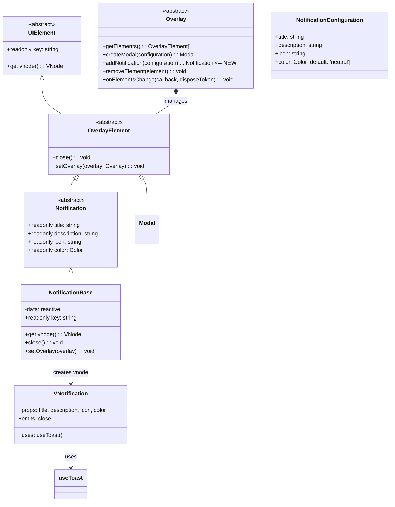
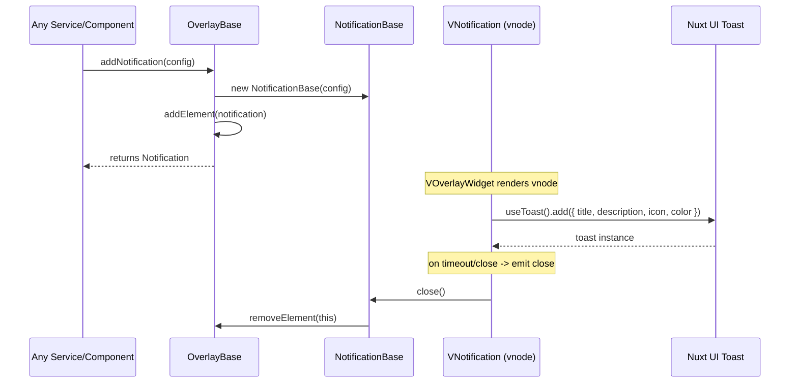

# Add Notifications to Overlay Module

## Overview

Add notification support to the overlay module. Notifications follow the same architectural pattern as modals — they are `OverlayElement` subclasses managed by the `Overlay` service, rendered via the existing `VOverlayWidget` component, and use Nuxt UI's `UToast` + `useToast` composable for the actual UI.

## Architecture



## Data Flow



## Files to Create

### 1. `app/modules/overlay/entities/notificationConfiguration.ts`

Type definition for notification configuration:

```typescript
import type { Color } from '@/modules/uikit/types/color';

export type NotificationConfiguration = {
    title: string;
    description: string;
    icon: string;
    color?: Color; // default: 'neutral'
};
```

### 2. `app/modules/overlay/entities/notification.ts`

Abstract `Notification` entity extending `OverlayElement`:

```typescript
import { OverlayElement } from './overlayElement';
import type { Color } from '@/modules/uikit/types/color';

export abstract class Notification extends OverlayElement {
    abstract readonly title: string;
    abstract readonly description: string;
    abstract readonly icon: string;
    abstract readonly color: Color;
}
```

### 3. `app/modules/overlay/entities/notificationBase.ts`

Concrete `NotificationBase` implementation (follows `ModalBase` pattern):

- Uses `shallowReactive` for title/description/icon/color data
- Defaults `color` to `'neutral'` if not provided in configuration
- Generates unique key via `getUniqueId('notification')`
- `vnode` getter creates `h(VNotification, { ...props })` with `onClose` callback
- `close()` calls `overlay?.removeElement(this)` then `[Symbol.dispose]()`
- `setOverlay()` stores overlay reference (same pattern as `ModalBase`)
- `[Symbol.dispose]()` disposes disposeToken

### 4. `app/modules/overlay/components/VNotification.vue`

Vue component that wraps Nuxt UI's `useToast`:

- Props: `title`, `description`, `icon`, `color`
- Emits: `close`
- On mount: calls `useToast().add({ title, description, icon, color })` — uses Nuxt UI's default duration
- The toast's `onClose` callback emits `close` which triggers `NotificationBase.close()`

## Files to Modify

### 5. `app/modules/overlay/entities/overlay.ts`

Add abstract method:

```typescript
abstract addNotification(configuration: NotificationConfiguration): Notification;
```

Add import for `NotificationConfiguration` and `Notification`.

### 6. `app/modules/overlay/entities/overlayBase.ts`

Implement `addNotification`:

```typescript
addNotification(configuration: NotificationConfiguration): Notification
{
    const notification = new NotificationBase(configuration);
    this.addElement(notification);
    return notification;
}
```

Add import for `NotificationBase` and `NotificationConfiguration`.

### 7. `app/modules/overlay/mocks/overlayMock.ts`

Add mock for `addNotification`:

```typescript
addNotification: vi.fn(),
```

### 8. `nuxt.config.ts`

Add `'UToast'` to the `ui.components.include` array.

## Implementation Order

1. Create `notificationConfiguration.ts` — no dependencies
2. Create `notification.ts` — depends on `OverlayElement`, `Color`
3. Create `VNotification.vue` — depends on `useToast` from Nuxt UI
4. Create `notificationBase.ts` — depends on `Notification`, `VNotification`, `NotificationConfiguration`
5. Modify `overlay.ts` — add abstract method
6. Modify `overlayBase.ts` — implement method, import `NotificationBase`
7. Modify `overlayMock.ts` — add mock
8. Modify `nuxt.config.ts` — add `UToast`

## Test Considerations

- `OverlayBase.addNotification()` should create a `Notification` and add it to elements
- `NotificationBase.close()` should remove itself from overlay
- `NotificationBase` should have readonly title/description/icon/color matching configuration
- `color` defaults to `'neutral'` when not provided
- Existing overlay tests should still pass