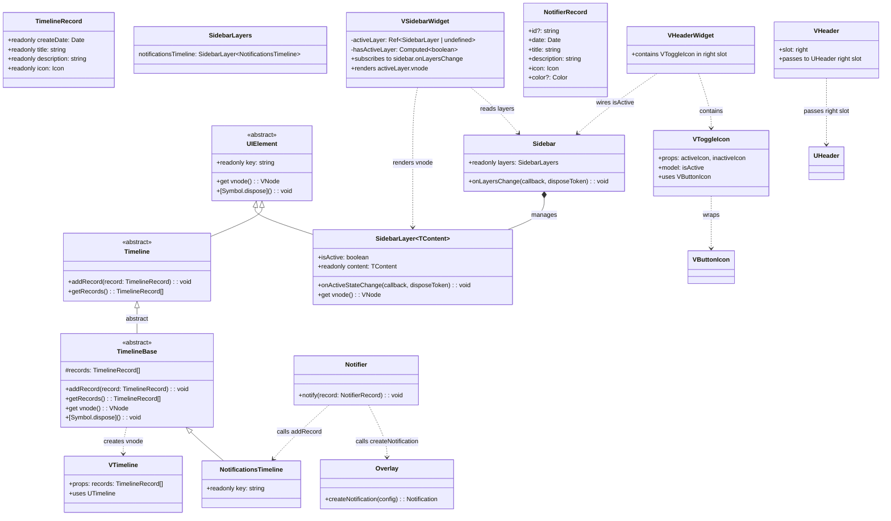
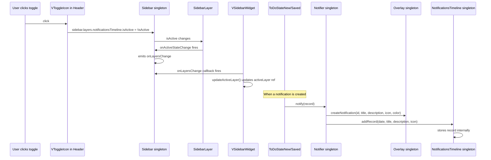

# Add Sidebar with Notifications Timeline

## Overview

Add a sidebar module with a notifications timeline. The sidebar is a singleton entity that manages layers (like `SidebarLayer<NotificationsTimeline>`). A `Notifier` class bridges the overlay notification system with the timeline, so when a notification is created, it also gets recorded in the timeline. The `VSidebarWidget` component replaces the static `USidebar` in `app.vue` and renders the active sidebar layer.

A `VToggleIcon` button is added to the header to toggle the notifications timeline sidebar layer.

## Module Structure

The implementation spans multiple modules:

- **`uikit`** — Timeline entities (TimelineRecord, Timeline, TimelineBase, NotificationsTimeline), VTimeline component, VToggleIcon component
- **`sidebar`** — SidebarLayer, Sidebar, SidebarBase, VSidebarWidget, useSidebarServices
- **`notifications`** — Notifier, NotifierBase, NotifierRecord
- **`layouts`** — VHeaderWidget (moved from uikit)
- **`todo`** — ToDoStateNew, ToDoStateSaved (modified to use Notifier)

## Architecture



## Data Flow



## File Structure

### New Files to Create

| # | File | Module | Description |
|---|------|--------|-------------|
| 1 | `app/modules/uikit/entities/timelineRecord.ts` | uikit | TimelineRecord entity |
| 2 | `app/modules/uikit/entities/timeline.ts` | uikit | Abstract Timeline entity |
| 3 | `app/modules/uikit/entities/timelineBase.ts` | uikit | TimelineBase with addRecord/getRecords/vnode/dispose |
| 4 | `app/modules/uikit/entities/notificationsTimeline.ts` | uikit | NotificationsTimeline extends TimelineBase, singleton |
| 5 | `app/modules/uikit/components/VTimeline.vue` | uikit | VTimeline component wraps UTimeline |
| 6 | `app/modules/uikit/components/VToggleIcon.vue` | uikit | VToggleIcon component wraps VButtonIcon |
| 7 | `app/modules/sidebar/entities/sidebarLayer.ts` | sidebar | SidebarLayer<TContent> generic class |
| 8 | `app/modules/sidebar/entities/sidebar.ts` | sidebar | Abstract Sidebar entity + SidebarLayers type |
| 9 | `app/modules/sidebar/entities/sidebarBase.ts` | sidebar | SidebarBase implementation |
| 10 | `app/modules/sidebar/widgets/VSidebarWidget.vue` | sidebar | VSidebarWidget component |
| 11 | `app/modules/sidebar/composables/useSidebarServices.ts` | sidebar | DI registration for sidebar module |
| 12 | `app/modules/notifications/entities/notifierRecord.ts` | notifications | NotifierRecord type |
| 13 | `app/modules/notifications/entities/notifier.ts` | notifications | Abstract Notifier entity |
| 14 | `app/modules/notifications/entities/notifierBase.ts` | notifications | NotifierBase implementation |
| 15 | `app/modules/notifications/composables/useNotificationsServices.ts` | notifications | DI registration for notifications module |
| 16 | `app/modules/layouts/composables/useLayoutsServices.ts` | layouts | DI registration for layouts module |
| 17 | `app/modules/sidebar/test/nuxt/sidebarLayer.test.ts` | sidebar | Tests for SidebarLayer |
| 18 | `app/modules/sidebar/test/nuxt/sidebarBase.test.ts` | sidebar | Tests for SidebarBase |
| 19 | `app/modules/uikit/test/nuxt/notificationsTimeline.test.ts` | uikit | Tests for NotificationsTimeline |
| 20 | `app/modules/notifications/test/nuxt/notifierBase.test.ts` | notifications | Tests for NotifierBase |

### Files to Modify

| # | File | Change |
|---|------|--------|
| 21 | `app/modules/uikit/components/VHeader.vue` | Add 'right' slot, pass to UHeader right slot |
| 22 | `app/modules/uikit/composables/useUIKitServices.ts` | Register NotificationsTimeline as singleton |
| 23 | `app/modules/uikit/enums/icons.ts` | Add bellInactive/bellActive icons |
| 24 | `app/modules/layouts/components/VHeaderWidget.vue` | MOVE from uikit to layouts, add VToggleIcon, wire to sidebar |
| 25 | `app/app.vue` | Replace USidebar with VSidebarWidget |
| 26 | `app/composables/useAppServices.ts` | Add useSidebarServices + useNotificationsServices + useLayoutsServices |
| 27 | `app/modules/todo/entities/todoStateNew.ts` | Use Notifier instead of overlay.createNotification |
| 28 | `app/modules/todo/entities/todoStateSaved.ts` | Use Notifier instead of overlay.createNotification |

## Detailed Implementation Steps

### Step 1: Add new icons to Icon enum

**File:** `app/modules/shared/enums/icons.ts`

Add two new icon entries:
```typescript
bellInactive = 'i-heroicons-bell',
bellActive = 'i-heroicons-bell-solid',
```

### Step 2: Create TimelineRecord entity

**File:** `app/modules/uikit/entities/timelineRecord.ts`

```typescript
import type { Icon } from '@/modules/shared/enums/icons';

export class TimelineRecord
{
    constructor(
        public readonly createDate: Date,
        public readonly title: string,
        public readonly description: string,
        public readonly icon: Icon,
    ) {}
}
```

### Step 3: Create Timeline entity

**File:** `app/modules/uikit/entities/timeline.ts`

```typescript
import { UIElement } from './uiElement';
import type { TimelineRecord } from './timelineRecord';

export abstract class Timeline extends UIElement
{
    abstract addRecord(record: TimelineRecord): void;
    abstract getRecords(): TimelineRecord[];
}
```

### Step 4: Create TimelineBase entity

**File:** `app/modules/uikit/entities/timelineBase.ts`

- Abstract class extending `Timeline`
- Stores records in an internal array
- `vnode` getter returns `h(VTimeline, { records: this.getRecords() })`
- `[Symbol.dispose]()` is empty (no cleanup needed)
- Does NOT have `key` — subclasses must provide it

```typescript
import { h } from 'vue';
import { Timeline } from './timeline';
import type { TimelineRecord } from './timelineRecord';
import VTimeline from '../components/VTimeline.vue';

export abstract class TimelineBase extends Timeline
{
    protected records: TimelineRecord[] = [];

    override addRecord(record: TimelineRecord): void
    {
        this.records.push(record);
    }

    override getRecords(): TimelineRecord[]
    {
        return this.records;
    }

    override get vnode()
    {
        return h(VTimeline, { records: this.records });
    }

    override [Symbol.dispose](): void
    {
        // no cleanup needed
    }
}
```

### Step 5: Create NotificationsTimeline entity

**File:** `app/modules/uikit/entities/notificationsTimeline.ts`

- Extends `TimelineBase`
- Overrides `key` with its own unique id
- Registered as singleton in DI

```typescript
import { TimelineBase } from './timelineBase';
import { getUniqueId } from '@/modules/shared/utils/getUniqueId';

export class NotificationsTimeline extends TimelineBase
{
    override readonly key = getUniqueId('notifications-timeline');
}
```

### Step 6: Create VTimeline component

**File:** `app/modules/uikit/components/VTimeline.vue`

- Accepts `records` prop of type `TimelineRecord[]`
- Maps records to `UTimeline` items format
- Uses `<UTimeline :items="..." />`

```vue
<template>
  <UTimeline :items="timelineItems" />
</template>

<script setup lang="ts">
import type { TimelineRecord } from '../entities/timelineRecord';

const props = defineProps<{
  records: TimelineRecord[];
}>();

const timelineItems = computed(() =>
  props.records.map(record => ({
    label: record.title,
    description: record.description,
    icon: record.icon,
    date: record.createDate,
  }))
);
</script>
```

### Step 7: Create VToggleIcon component

**File:** `app/modules/uikit/components/VToggleIcon.vue`

- Wraps `VButtonIcon` internally
- Props: `activeIcon: Icon`, `inactiveIcon: Icon`
- Uses `defineModel('isActive', boolean)` for v-model support
- When `isActive` is true, shows `activeIcon`; otherwise shows `inactiveIcon`

```vue
<script setup lang="ts">
import VButtonIcon from '@/modules/uikit/components/VButtonIcon.vue';
import { Icon } from '@/modules/shared/enums/icons';

type VToggleIconProps = {
  activeIcon: Icon;
  inactiveIcon: Icon;
};

const isActive = defineModel<boolean>('isActive', { default: false });
</script>

<template>
  <VButtonIcon
    :icon="isActive ? activeIcon : inactiveIcon"
    @click="isActive = !isActive"
  />
</template>
```

### Step 8: Create SidebarLayer generic class

**File:** `app/modules/sidebar/entities/sidebarLayer.ts`

- Generic class `SidebarLayer<TContent extends UIElement>`
- Extends `UIElement`
- Has writable `isActive` property (no `toggle()` method)
- Has `onActiveStateChange` method (immediate event, not deferred)
- `vnode` getter ALWAYS returns `content.vnode` (layer is not responsible for hiding content)
- Layer is NOT responsible for content disposal

```typescript
import { UIElement } from '@/modules/uikit/entities/uiElement';
import { EntityEvent } from '@/modules/shared/entities/entityEvent';
import type { Action } from '@/modules/shared/types/action';
import type { DisposeToken } from '@/modules/shared/entities/disposeToken';
import { getUniqueId } from '@/modules/shared/utils/getUniqueId';

export class SidebarLayer<TContent extends UIElement> extends UIElement
{
    private isActiveInternal = false;
    private activeStateChangeEvent = new EntityEvent<boolean>();
    readonly key = getUniqueId('sidebar-layer');

    constructor(
        public readonly content: TContent,
    )
    {
        super();
    }

    get isActive(): boolean
    {
        return this.isActiveInternal;
    }

    set isActive(value: boolean)
    {
        if (this.isActiveInternal !== value)
        {
            this.isActiveInternal = value;
            this.activeStateChangeEvent.emit(this.isActiveInternal);
        }
    }

    onActiveStateChange(callback: Action<[boolean]>, disposeToken?: DisposeToken): void
    {
        this.activeStateChangeEvent.on(callback, disposeToken);
    }

    override get vnode()
    {
        return this.content.vnode;
    }

    override [Symbol.dispose](): void
    {
        this.activeStateChangeEvent[Symbol.dispose]();
    }
}
```

### Step 9: Create Sidebar entity and SidebarLayers type

**File:** `app/modules/sidebar/entities/sidebar.ts`

- Abstract singleton entity
- Has readonly `layers` property with `notificationsTimeline` key
- Has `onLayersChange` method

```typescript
import type { SidebarLayer } from './sidebarLayer';
import type { NotificationsTimeline } from '@/modules/uikit/entities/notificationsTimeline';
import type { Action } from '@/modules/shared/types/action';
import type { DisposeToken } from '@/modules/shared/entities/disposeToken';

export type SidebarLayers = {
    notificationsTimeline: SidebarLayer<NotificationsTimeline>;
};

export abstract class Sidebar implements Disposable
{
    abstract readonly layers: SidebarLayers;

    abstract onLayersChange(callback: Action<[]>, disposeToken?: DisposeToken): void;
    abstract [Symbol.dispose](): void;
}
```

### Step 10: Create SidebarBase implementation

**File:** `app/modules/sidebar/entities/sidebarBase.ts`

- Implements `Sidebar`
- Creates `SidebarLayer<NotificationsTimeline>` in constructor
- Calls `setupLayersTracking()` private method to subscribe to all layers' `onActiveStateChange`
- Uses `EntityEvent` (immediate) for `onLayersChange`

```typescript
import { dependency } from '@/modules/shared/decorators/dependency';
import { Sidebar } from './sidebar';
import type { SidebarLayers } from './sidebar';
import { SidebarLayer } from './sidebarLayer';
import { NotificationsTimeline } from '@/modules/uikit/entities/notificationsTimeline';
import { EntityEvent } from '@/modules/shared/entities/entityEvent';
import type { Action } from '@/modules/shared/types/action';
import type { DisposeToken } from '@/modules/shared/entities/disposeToken';

@dependency(NotificationsTimeline)
export class SidebarBase extends Sidebar
{
    readonly layers: SidebarLayers;

    private layersChangeEvent = new EntityEvent();

    constructor(
        notificationsTimeline: NotificationsTimeline,
    )
    {
        super();

        const notificationsLayer = new SidebarLayer(notificationsTimeline);

        this.layers = {
            notificationsTimeline: notificationsLayer,
        };

        this.setupLayersTracking();
    }

    private setupLayersTracking(): void
    {
        for (const layer of Object.values(this.layers))
        {
            layer.onActiveStateChange(() =>
            {
                this.layersChangeEvent.emit();
            });
        }
    }

    override onLayersChange(callback: Action<[]>, disposeToken?: DisposeToken): void
    {
        this.layersChangeEvent.on(callback, disposeToken);
    }

    override [Symbol.dispose](): void
    {
        this.layersChangeEvent[Symbol.dispose]();

        for (const layer of Object.values(this.layers))
        {
            layer[Symbol.dispose]();
        }
    }
}
```

### Step 11: Create NotifierRecord type

**File:** `app/modules/notifications/entities/notifierRecord.ts`

```typescript
import type { Icon } from '@/modules/shared/enums/icons';
import type { Color } from '@/modules/uikit/types/color';

export type NotifierRecord = {
    id?: string;
    date: Date;
    title: string;
    description: string;
    icon: Icon;
    color?: Color;
};
```

### Step 12: Create Notifier entity

**File:** `app/modules/notifications/entities/notifier.ts`

```typescript
import type { NotifierRecord } from './notifierRecord';

export abstract class Notifier
{
    abstract notify(record: NotifierRecord): void;
}
```

### Step 13: Create NotifierBase

**File:** `app/modules/notifications/entities/notifierBase.ts`

- Calls `overlay.createNotification(...)` with id/title/description/icon/color
- Calls `notificationsTimeline.addRecord(...)` with date/title/description/icon

```typescript
import { dependency } from '@/modules/shared/decorators/dependency';
import { Notifier } from './notifier';
import type { NotifierRecord } from './notifierRecord';
import { Overlay } from '@/modules/overlay/entities/overlay';
import { NotificationsTimeline } from '@/modules/uikit/entities/notificationsTimeline';
import { TimelineRecord } from '@/modules/uikit/entities/timelineRecord';

@dependency(Overlay)
@dependency(NotificationsTimeline)
export class NotifierBase extends Notifier
{
    constructor(
        private overlay: Overlay,
        private notificationsTimeline: NotificationsTimeline,
    )
    {
        super();
    }

    override notify(record: NotifierRecord): void
    {
        this.overlay.createNotification({
            id: record.id,
            title: record.title,
            description: record.description,
            icon: record.icon,
            color: record.color,
        });

        this.notificationsTimeline.addRecord(
            new TimelineRecord(
                record.date,
                record.title,
                record.description,
                record.icon,
            )
        );
    }
}
```

### Step 14: Update VHeader to add 'right' slot

**File:** `app/modules/uikit/components/VHeader.vue`

```vue
<template>
  <UHeader :title="title">
    <template #right>
      <slot name="right" />
    </template>
  </UHeader>
</template>

<script setup lang="ts">
type Props = {
  title: string;
};

defineProps<Props>();
</script>
```

### Step 15: Move VHeaderWidget to layouts module and add VToggleIcon

**File:** `app/modules/layouts/components/VHeaderWidget.vue`

- Moved from `app/modules/uikit/components/VHeaderWidget.vue`
- Import and use `VToggleIcon` in the `right` slot of `VHeader`
- Wire `isActive` model to `sidebar.layers.notificationsTimeline.isActive`
- Use `Icon.bellInactive` / `Icon.bellActive` for toggle icons
- Since `sidebar.layers.notificationsTimeline.isActive` is not reactive, use `useEventDrivenRef` to create a reactive ref that syncs with the sidebar layer

```vue
<template>
  <VHeader :title="config.public.appTitle">
    <template #right>
      <VToggleIcon
        :activeIcon="Icon.bellActive"
        :inactiveIcon="Icon.bellInactive"
        v-model:isActive="isNotificationsTimelineActive"
      />
    </template>
  </VHeader>
</template>

<script setup lang="ts">
import VHeader from '@/modules/uikit/components/VHeader.vue';
import VToggleIcon from '@/modules/uikit/components/VToggleIcon.vue';
import { Icon } from '@/modules/shared/enums/icons';
import { useService } from '@/modules/shared/composables/useService';
import { useEventDrivenRef } from '@/modules/shared/composables/useEventDrivenRef';
import { Sidebar } from '@/modules/sidebar/entities/sidebar';

const config = useRuntimeConfig();
const sidebar = useService(Sidebar);

const notificationsLayer = sidebar.layers.notificationsTimeline;

const isNotificationsTimelineActive = useEventDrivenRef(
    () => notificationsLayer.isActive,
    (callback, disposeToken) => notificationsLayer.onActiveStateChange(callback, disposeToken),
);
</script>
```

### Step 16: Create VSidebarWidget component

**File:** `app/modules/sidebar/widgets/VSidebarWidget.vue`

- Uses `useService(Sidebar)` to get the sidebar singleton
- Uses `sidebar.onLayersChange` to track active layer changes
- Maintains `activeLayer` ref and `updateActiveLayer` function
- Has `hasActiveLayer` computed property
- `USidebar` v-if uses `hasActiveLayer`
- Renders `activeLayer.vnode` inside USidebar

```vue
<script setup lang="ts">
import { ref, computed } from 'vue';
import { useService } from '@/modules/shared/composables/useService';
import { Sidebar } from '../entities/sidebar';
import type { SidebarLayer } from '../entities/sidebarLayer';
import type { UIElement } from '@/modules/uikit/entities/uiElement';

const sidebar = useService(Sidebar);

const activeLayer = ref<SidebarLayer<UIElement> | undefined>(
    Object.values(sidebar.layers).find(layer => layer.isActive)
);

const hasActiveLayer = computed(() => activeLayer.value !== undefined);

function updateActiveLayer(): void
{
    activeLayer.value = Object.values(sidebar.layers).find(layer => layer.isActive);
}

sidebar.onLayersChange(updateActiveLayer);
</script>

<template>
  <USidebar
    v-if="hasActiveLayer"
    :open="true"
    side="right"
    :ui="{ container: 'h-full relative' }"
  >
    <component :is="activeLayer?.vnode" />
  </USidebar>
</template>
```

### Step 17: Create useSidebarServices composable

**File:** `app/modules/sidebar/composables/useSidebarServices.ts`

```typescript
import { useServiceRegistration } from '@/modules/shared/composables/useServiceRegistration';
import { Sidebar } from '../entities/sidebar';
import { SidebarBase } from '../entities/sidebarBase';

export function useSidebarServices(): void
{
    useServiceRegistration(Sidebar).to(SidebarBase).asSingleton();
}
```

### Step 18: Create useNotificationsServices composable

**File:** `app/modules/notifications/composables/useNotificationsServices.ts`

```typescript
import { useServiceRegistration } from '@/modules/shared/composables/useServiceRegistration';
import { Notifier } from '../entities/notifier';
import { NotifierBase } from '../entities/notifierBase';

export function useNotificationsServices(): void
{
    useServiceRegistration(Notifier).to(NotifierBase).asSingleton();
}
```

### Step 19: Create useLayoutsServices composable

**File:** `app/modules/layouts/composables/useLayoutsServices.ts`

```typescript
export function useLayoutsServices(): void
{
    // Layouts module has no DI registrations yet
}
```

### Step 20: Update useUIKitServices to register NotificationsTimeline

**File:** `app/modules/uikit/composables/useUIKitServices.ts`

```typescript
import { useServiceRegistration } from '@/modules/shared/composables/useServiceRegistration';
import { ButtonsFactory } from '../factories/buttonsFactory';
import { ButtonsFactoryImpl } from '../factories/buttonsFactoryImpl';
import { NotificationsTimeline } from '../entities/notificationsTimeline';

export function useUIKitServices(): void
{
    useServiceRegistration(ButtonsFactory).to(ButtonsFactoryImpl).asTransient();
    useServiceRegistration(NotificationsTimeline).toDynamicValue(() => new NotificationsTimeline()).asSingleton();
}
```

### Step 21: Update useAppServices

**File:** `app/composables/useAppServices.ts`

Add imports and calls for `useSidebarServices`, `useNotificationsServices`, `useLayoutsServices`.

### Step 22: Update app.vue

**File:** `app/app.vue`

- Replace `<USidebar>` with `<VSidebarWidget />`
- Remove the static navigation menu items and related imports
- Add import for `VSidebarWidget`

### Step 23: Update ToDoStateNew to use Notifier

**File:** `app/modules/todo/entities/todoStateNew.ts`

- Inject `Notifier` instead of `Overlay`
- Replace `this.overlay.createNotification(...)` with `this.notifier.notify(...)`
- The `notify` call should include the `date` field (use `new Date()`)

### Step 24: Update ToDoStateSaved to use Notifier

**File:** `app/modules/todo/entities/todoStateSaved.ts`

- Same changes as ToDoStateNew

### Step 25: Add tests for SidebarLayer

**File:** `app/modules/sidebar/test/nuxt/sidebarLayer.test.ts`

Test cases:
- `isActive` should be `false` by default
- Setting `isActive` to `true` should update value and emit via `onActiveStateChange`
- Setting `isActive` to same value should NOT emit
- `vnode` should return content.vnode regardless of isActive state
- `[Symbol.dispose]` should dispose the event

### Step 26: Add tests for SidebarBase

**File:** `app/modules/sidebar/test/nuxt/sidebarBase.test.ts`

Test cases:
- Should create layers with `notificationsTimeline` key
- `onLayersChange` should fire when a layer's isActive changes
- `onLayersChange` should NOT fire when isActive set to same value

### Step 27: Add tests for NotificationsTimeline

**File:** `app/modules/uikit/test/nuxt/notificationsTimeline.test.ts`

Test cases:
- `addRecord` should add record to internal list
- `getRecords` should return all added records
- `key` should be unique and prefixed with 'notifications-timeline'

### Step 28: Add tests for NotifierBase

**File:** `app/modules/notifications/test/nuxt/notifierBase.test.ts`

Test cases:
- `notify` should call `overlay.createNotification` with correct params
- `notify` should call `notificationsTimeline.addRecord` with correct params

## Implementation Order

1. Add `bellInactive`/`bellActive` icons to `Icon` enum
2. `timelineRecord.ts` — no dependencies
3. `timeline.ts` — depends on UIElement, TimelineRecord
4. `timelineBase.ts` — depends on Timeline, VTimeline
5. `notificationsTimeline.ts` — depends on TimelineBase
6. `VTimeline.vue` — depends on TimelineRecord, UTimeline
7. `VToggleIcon.vue` — depends on VButtonIcon
8. `sidebarLayer.ts` — depends on UIElement, EntityEvent
9. `sidebar.ts` — depends on SidebarLayer, NotificationsTimeline
10. `sidebarBase.ts` — depends on Sidebar, SidebarLayer, NotificationsTimeline
11. `notifierRecord.ts` — no dependencies
12. `notifier.ts` — depends on NotifierRecord
13. `notifierBase.ts` — depends on Notifier, Overlay, NotificationsTimeline
14. `VHeader.vue` — add right slot
15. Move `VHeaderWidget.vue` to layouts module, add VToggleIcon, wire to sidebar
16. `VSidebarWidget.vue` — depends on Sidebar, USidebar
17. `useSidebarServices.ts` — depends on Sidebar, SidebarBase
18. `useNotificationsServices.ts` — depends on Notifier, NotifierBase
19. `useLayoutsServices.ts` — no dependencies
20. Update `useUIKitServices.ts` — register NotificationsTimeline
21. Update `useAppServices.ts` — add new service registrations
22. Update `app.vue` — replace USidebar with VSidebarWidget
23. Update `todoStateNew.ts` — use Notifier
24. Update `todoStateSaved.ts` — use Notifier
25. Add tests for SidebarLayer
26. Add tests for SidebarBase
27. Add tests for NotificationsTimeline
28. Add tests for NotifierBase

## Test Considerations

- `SidebarLayer.isActive` setter should update value and emit via `onActiveStateChange`
- `SidebarLayer` should NOT emit when isActive set to same value
- `SidebarLayer` vnode should always return content.vnode
- `SidebarLayer` should NOT dispose content on its own dispose
- `SidebarBase` constructor should subscribe to all layers via `setupLayersTracking()`
- `SidebarBase.onLayersChange` should fire when any layer's isActive changes
- `TimelineBase.addRecord/getRecords` should work as a simple store
- `NotificationsTimeline` inherits all behavior from `TimelineBase`, has its own key
- `NotifierBase.notify()` should call both `overlay.createNotification` and `notificationsTimeline.addRecord`
- `VToggleIcon` should use `defineModel('isActive')` for v-model binding
- `VSidebarWidget` should only render when at least one layer is active
- `VSidebarWidget` should render the active layer's content
- `VHeader` should pass content from its `right` slot to `UHeader`'s `right` slot