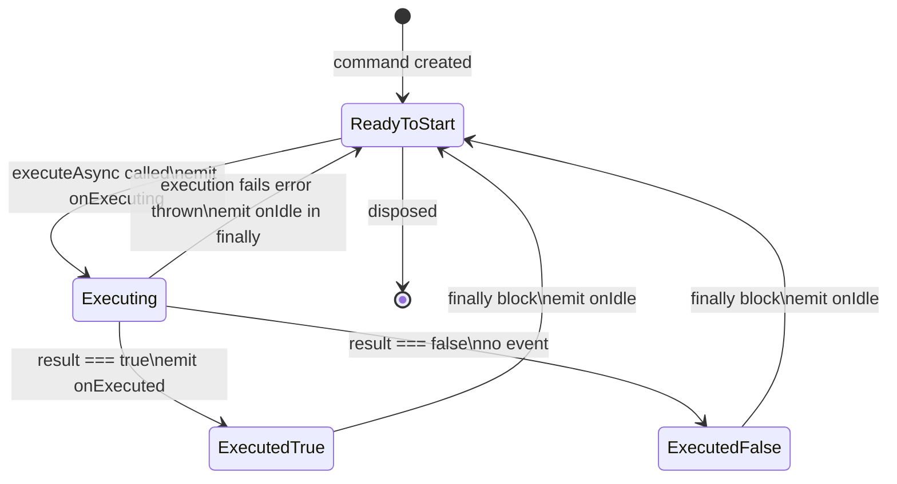

# AsyncCommand Event-Based Refactoring Plan

## Overview

Replace the current `CallbacksOwner` + `callbacksWrapper` pattern in `AsyncCommand` with an event-based architecture using a new `Event<T>` class and `DisposeToken` for subscription management.

## Current Architecture

```
AsyncCommand (abstract)
  └─ extends CallbacksOwner<AsyncCommandCallbacks>
       └─ on(callbacks: Partial<AsyncCommandCallbacks>): void  // one-time setter

AsyncCommandBase extends AsyncCommand
  └─ uses callbacksWrapper<AsyncCommandCallbacks>()  // single-assignment wrapper
  └─ executeAsync() calls callbacks.result(), callbacks.stateChange(), callbacks.error()

Consumers:
  - modalConfirmButtonConfiguratorBase.ts: command.on({ stateChange, result })
  - formBase.ts: creates AsyncCommandBase, uses via getSubmitCommand()
  - asyncCommandBase.test.ts: command.on({ result, stateChange })
```

## Target Architecture

```
AsyncCommand (abstract)
  └─ onIdle(handler: Action, token: DisposeToken): void
  └─ onExecuting(handler: Action, token: DisposeToken): void
  └─ onExecuted(handler: Action, token: DisposeToken): void
  └─ executeAsync(): Promise<boolean>

AsyncCommandBase extends AsyncCommand
  └─ private onIdleEvent = new Event<void>()
  └─ private onExecutingEvent = new Event<void>()
  └─ private onExecutedEvent = new Event<void>()  // fires only when result is true
  └─ onIdle → delegates to onIdleEvent.on()
  └─ onExecuting → delegates to onExecutingEvent.on()
  └─ onExecuted → delegates to onExecutedEvent.on()
  └─ executeAsync() emits events at lifecycle stages

Event<T> implements Disposable
  └─ on(handler: Action<[T]>, callbackDisposeToken: DisposeToken): void
  └─ emit(value: T): void
  └─ [Symbol.dispose](): void
```

## Mapping: Old Callbacks → New Events

| Old Callback | New Method | Trigger |
|---|---|---|
| `stateChange` with `CommandState.busy` | `onExecuting` | When execution starts |
| `result` with `true` | `onExecuted` | When execution completes successfully (result === true) |
| `stateChange` with `CommandState.readyToStart` | `onIdle` | When command returns to ready state |
| `result` with `false` | No event (command returns false silently) | When execution returns false |
| `error` callback | Removed (will be handled later) | N/A |

## Files to Create

### 1. `app/modules/shared/entities/event.ts` — New `Event<T>` class

```typescript
import type { Action } from '../types/action';
import { DisposeToken } from './disposeToken';

export class Event<T = never> implements Disposable
{
    private eventDisposeToken = new DisposeToken();
    private handlers = new Set<Action<[T]>>();

    on(handler: Action<[T]>, callbackDisposeToken: DisposeToken): void
    {
        this.eventDisposeToken.assertNotDisposed();
        callbackDisposeToken.assertNotDisposed();

        this.handlers.add(handler);

        callbackDisposeToken.onDispose(() => {
            this.handlers.delete(handler);
        });
    }

    emit(value: T): void
    {
        this.eventDisposeToken.assertNotDisposed();

        this.handlers.forEach(handler => {
            handler(value);
        });
    }

    [Symbol.dispose](): void
    {
        if (this.eventDisposeToken.isDisposed)
        {
            return;
        }

        this.handlers.clear();
        this.eventDisposeToken[Symbol.dispose]();
    }
}
```

## Files to Modify

### 2. `app/modules/shared/entities/asyncCommand.ts` — Refactored interface

- Remove `CallbacksOwner` import and inheritance
- Remove `AsyncCommandCallbacks` type
- Add `DisposeToken` import
- Add three abstract event subscription methods: `onIdle`, `onExecuting`, `onExecuted`
- Each method takes `handler: Action` and `token: DisposeToken`

### 3. `app/modules/shared/entities/asyncCommandBase.ts` — Refactored implementation

- Remove `callbacksWrapper` import and usage
- Remove `AsyncCommandCallbacks` import
- Add `Event` import
- Add three private `Event` properties:
  - `private onIdleEvent = new Event<void>()`
  - `private onExecutingEvent = new Event<void>()`
  - `private onExecutedEvent = new Event<void>()`  // fires only when result is true
- Implement `onIdle`, `onExecuting`, `onExecuted` by delegating to respective Event.on()
- Update `executeAsync()`:
  - Remove `catch` block entirely
  - Emit `onExecutingEvent.emit()` at start
  - Emit `onExecutedEvent.emit()` only when `result === true`
  - Emit `onIdleEvent.emit()` in `finally` block
- Implement `[Symbol.dispose]()` to dispose all events

### 4. `app/modules/overlay/entities/modalConfirmButtonConfiguratorBase.ts` — Update consumer

- Replace `command.on({ stateChange, result })` with:
  - `command.onExecuting(handler, token)`
  - `command.onExecuted(handler, token)`
  - `command.onIdle(handler, token)`
- Need to create/manage a `DisposeToken` for subscription cleanup
- The `result` handler that closes modal only runs when `onExecuted` fires (result === true), which matches current behavior

### 5. `app/modules/shared/test/unit/asyncCommandBase.test.ts` — Update tests

- Replace `command.on({ result: fn })` with `command.onExecuted(fn, token)`
- Replace `command.on({ stateChange: fn })` with `command.onExecuting(fn, token)` and `command.onIdle(fn, token)`
- Remove test for "throw if on is called twice" (no longer applicable)
- Remove test for "should not call result callback on rejection" (error handling removed)
- Update test: `onExecuted` should NOT fire when result is `false`
- Add test for `onIdle` being called after execution

### 6. `app/modules/forms/entities/formBase.ts` — Update consumer

- Currently uses `AsyncCommandBase` internally via `createSubmitCommand()`
- The `getSubmitCommand()` returns `AsyncCommand` — interface change is compatible
- No direct `on()` calls on the command here, so minimal changes needed
- However, if `callbacksWrapper` is removed from this file (it's used for `FormCallbacks`, not `AsyncCommandCallbacks`), keep it as-is

## Files to Remove (if no longer used elsewhere)

- `app/modules/shared/interfaces/callbacksOwner.ts` — Check if `Button` still uses it
- `app/modules/shared/entities/callbacksWrapper.ts` — Check if `buttonBase.ts` and `formBase.ts` still use it

## Execution Order

1. Create `Event<T>` class in `event.ts`
2. Refactor `AsyncCommand` interface in `asyncCommand.ts`
3. Refactor `AsyncCommandBase` implementation in `asyncCommandBase.ts`
4. Update `modalConfirmButtonConfiguratorBase.ts` consumer
5. Update `asyncCommandBase.test.ts` tests
6. Verify `formBase.ts` compatibility (likely no changes needed)
7. Clean up unused files if safe

## State Diagram



## Event Flow Diagram

```mermaid
sequenceDiagram
    participant Consumer
    participant AsyncCommandBase
    participant onExecutingEvent as onExecutingEvent: Event void
    participant onExecutedEvent as onExecutedEvent: Event void
    participant onIdleEvent as onIdleEvent: Event void

    Consumer->>AsyncCommandBase: onExecuting handler token
    AsyncCommandBase->>onExecutingEvent: on handler token

    Consumer->>AsyncCommandBase: onExecuted handler token
    AsyncCommandBase->>onExecutedEvent: on handler token

    Consumer->>AsyncCommandBase: onIdle handler token
    AsyncCommandBase->>onIdleEvent: on handler token

    Consumer->>AsyncCommandBase: executeAsync
    AsyncCommandBase->>onExecutingEvent: emit
    Note over Consumer: handler called e.g. show loader

    AsyncCommandBase->>AsyncCommandBase: await executeInternal

    alt result === true
        AsyncCommandBase->>onExecutedEvent: emit
        Note over Consumer: handler called e.g. close modal
    else result === false
        Note over Consumer: onExecuted NOT fired
    end

    AsyncCommandBase->>onIdleEvent: emit
    Note over Consumer: handler called e.g. hide loader