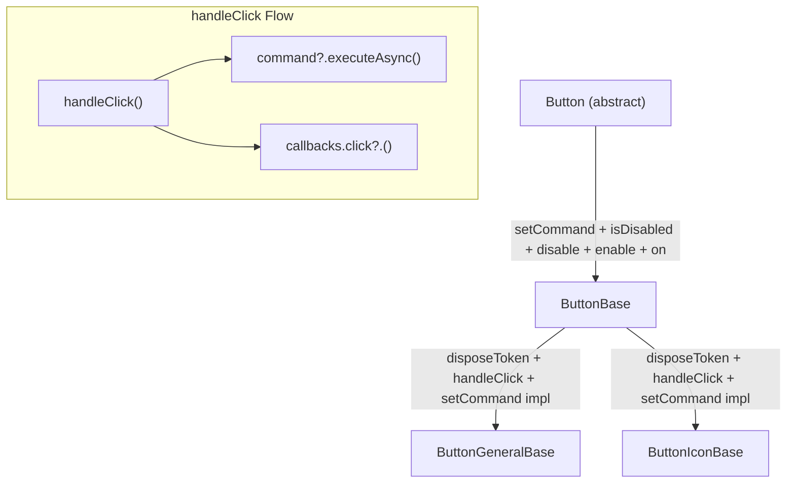

# Button Command Integration Plan

## Overview

Add command integration to the Button hierarchy so buttons can execute an `AsyncCommand` when clicked. The command is set once via `setCommand` (enforced by `InitializationOnlyException`), and the click flow in `ButtonBase` fires both command execution (fire-and-forget) and callback invocation at click time.

## Changes Summary

### 1. `app/modules/uikit/entities/buttons/button.ts` — Abstract `Button` class

**Add `setCommand` abstract method:**
```typescript
abstract setCommand(command: AsyncCommand): void;
```

- Takes an `AsyncCommand` instance.
- Can only be called once (enforced in `ButtonBase` via `InitializationOnlyException`).

**New import needed:**
```typescript
import type { AsyncCommand } from '@/modules/shared/entities/asyncCommand';
```

---

### 2. `app/modules/uikit/entities/buttons/buttonBase.ts` — `ButtonBase` abstract class

**Add `disposeToken` property:**
```typescript
protected disposeToken = new DisposeToken();
```
- Used for subscribing to command lifecycle events (future use) and general disposal.

**Add `command` private field + `setCommand` override:**
```typescript
private command: AsyncCommand | undefined;

override setCommand(command: AsyncCommand): void
{
    if (this.command !== undefined)
    {
        throw new InitializationOnlyException('command');
    }

    this.command = command;
}
```

**Add `handleClick` protected method:**
```typescript
protected handleClick(): void
{
    this.command?.executeAsync();
    this.callbacks.click?.();
}
```
- If a command is set, `executeAsync()` is called **without await** (fire-and-forget).
- `callbacks.click?.()` fires immediately at click time, regardless of command execution.

**New imports needed:**
```typescript
import { DisposeToken } from '@/modules/shared/entities/disposeToken';
import type { AsyncCommand } from '@/modules/shared/entities/asyncCommand';
import { InitializationOnlyException } from '@/modules/shared/exceptions/initializationOnlyException';
```

---

### 3. `app/modules/uikit/entities/buttons/buttonGeneralBase.ts` — `ButtonGeneralBase` class

**Update `onClickFn` to delegate to `handleClick`:**
```typescript
private onClickFn = () =>
{
    this.handleClick();
};
```
- Remove the direct `this.callbacks.click?.()` call.
- `handleClick` is inherited from `ButtonBase`.

---

### 4. `app/modules/uikit/entities/buttons/buttonIconBase.ts` — `ButtonIconBase` class

**Update `onClickFn` to delegate to `handleClick`:**
```typescript
private onClickFn = () =>
{
    this.handleClick();
};
```
- Same change as `ButtonGeneralBase`.

---

## Dependency Diagram



## Execution Order

1. **`button.ts`** — Add `setCommand` abstract method + import `AsyncCommand`.
2. **`buttonBase.ts`** — Add `disposeToken`, `command` field (`AsyncCommand | undefined`), `setCommand` override, `handleClick` method + imports.
3. **`buttonGeneralBase.ts`** — Update `onClickFn` to call `this.handleClick()`.
4. **`buttonIconBase.ts`** — Update `onClickFn` to call `this.handleClick()`.