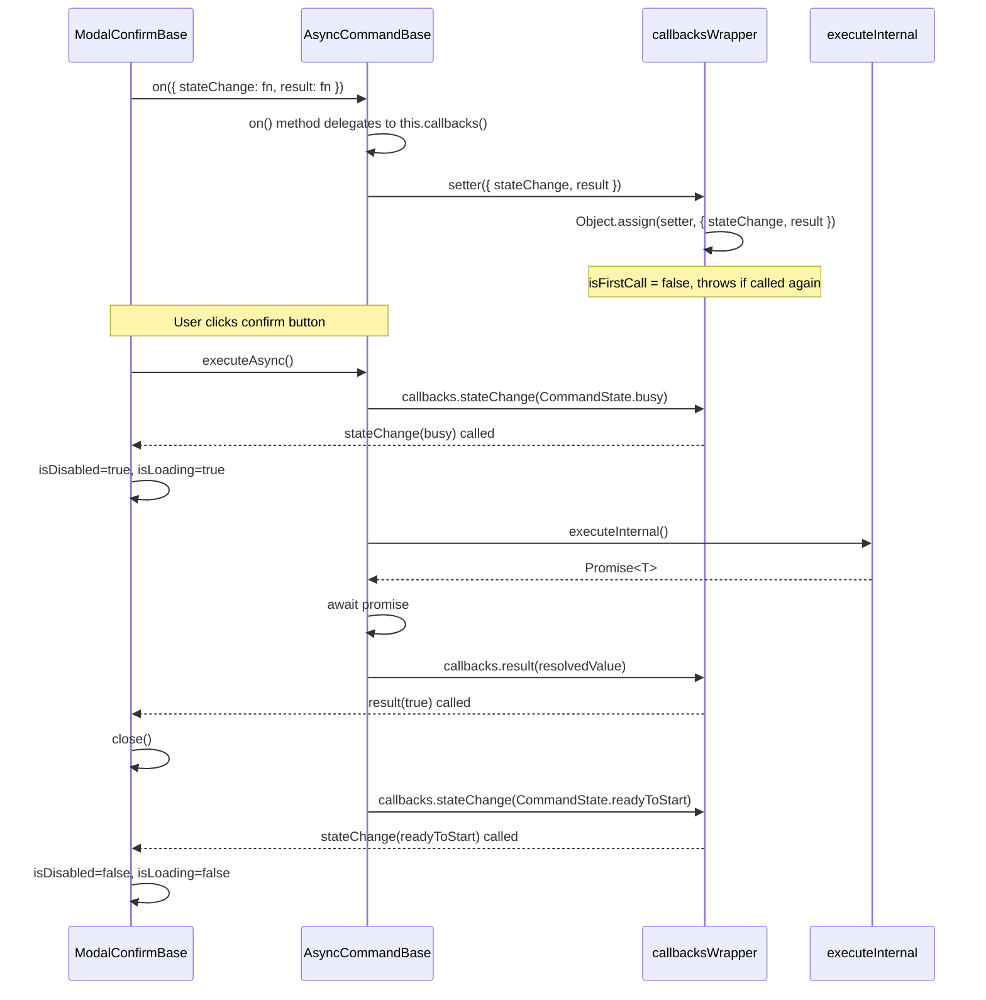

# CallbacksOwners Integration Plan

## Overview

Introduce a `CallbacksOwners` interface and a functional `callbacksWrapper` utility to replace the current `setExecutionHandler` pattern on `AsyncCommand` with a more flexible `on()` method that accepts typed callbacks objects.

---

## 1. New Files to Create

### 1.1 `app/modules/shared/interfaces/callbacksOwners.ts`

An abstract class (following the project convention — see `Destroyable`, `ValueMapper`) that declares a single method `on`:

```typescript
import type { Action } from '../types/action';

export abstract class CallbacksOwners<Callbacks extends Record<string, Action<any[]>>>
{
    abstract on(callbacks: Partial<Callbacks>): void;
}
```

**Design notes:**
- `Callbacks` is a generic constrained to `Record<string, Action<any[]>>` — each key maps to a function with some arguments.
- `on` accepts `Partial<Callbacks>` so the caller can subscribe to only the callbacks they care about.
- Using `abstract class` to match the project's interface pattern (see `Destroyable`, `ValueMapper`).

### 1.2 `app/modules/shared/enums/commandState.ts`

Extract `CommandState` into its own enum file:

```typescript
export enum CommandState
{
    readyToStart = 0,
    busy = 1,
}
```

### 1.3 `app/modules/shared/utils/callbacksWrapper.ts`

A functional utility (not a class) that creates a combined setter + callbacks object. The returned function doubles as both a setter (when called with arguments) and a container for the callbacks (properties on the function object):

```typescript
import type { Action } from '../types/action';

export function callbacksWrapper<Callbacks extends Record<string, Action<any[]>>>(): Action<[Partial<Callbacks>]> & Partial<Callbacks>
{
    let isFirstCall = true;

    function setter(newCallbacks: Partial<Callbacks>): void
    {
        if (!isFirstCall)
        {
            throw new Error('Callbacks already set');
        }

        isFirstCall = false;
        Object.assign(setter, newCallbacks);
    }

    return setter as Action<[Partial<Callbacks>]> & Partial<Callbacks>;
}
```

**Design notes:**
- Returns a single function that is both:
  - A **setter** (`Action<[Partial<Callbacks>]>`) — when called, merges callbacks onto itself via `Object.assign`. Throws if called more than once.
  - A **callbacks container** (`Partial<Callbacks>`) — after setting, the callbacks are accessible as properties on the function itself.
- No class, no `DestroyToken`, no separate `get()`/`invoke()` methods — the callbacks are invoked directly: `wrapper.result?.(value)`.
- The `isFirstCall` flag (closure) enforces the once-only rule.

### 1.4 `app/modules/shared/test/unit/callbacksWrapper.test.ts`

Unit tests for `callbacksWrapper`:

```typescript
import { describe, it, expect } from 'vitest';
import { callbacksWrapper } from '../../utils/callbacksWrapper';
import type { Action } from '../../types/action';

interface TestCallbacks extends Record<string, Action<any[]>>
{
    foo: Action<[string]>;
    bar: Action<[number, boolean]>;
}

describe('callbacksWrapper', () =>
{
    it('should set callbacks and invoke them', () =>
    {
        const wrapper = callbacksWrapper<TestCallbacks>();
        const fooFn = vi.fn();
        const barFn = vi.fn();

        wrapper({ foo: fooFn, bar: barFn });

        wrapper.foo?.('hello');
        wrapper.bar?.(42, true);

        expect(fooFn).toHaveBeenCalledWith('hello');
        expect(barFn).toHaveBeenCalledWith(42, true);
    });

    it('should throw if set more than once', () =>
    {
        const wrapper = callbacksWrapper<TestCallbacks>();

        wrapper({ foo: vi.fn(), bar: vi.fn() });

        expect(() => wrapper({ foo: vi.fn() })).toThrow('Callbacks already set');
    });

    it('should allow setting partial callbacks', () =>
    {
        const wrapper = callbacksWrapper<TestCallbacks>();
        const fooFn = vi.fn();

        wrapper({ foo: fooFn });

        wrapper.foo?.('test');
        expect(fooFn).toHaveBeenCalledWith('test');
        expect(wrapper.bar).toBeUndefined();
    });

    it('should not invoke any callback if never set', () =>
    {
        const wrapper = callbacksWrapper<TestCallbacks>();

        expect(wrapper.foo).toBeUndefined();
        expect(wrapper.bar).toBeUndefined();
    });
});
```

### 1.5 `app/modules/shared/test/unit/asyncCommandBase.test.ts`

Unit tests for `AsyncCommandBase`:

```typescript
import { describe, it, expect, vi } from 'vitest';
import { AsyncCommandBase } from '../../entities/asyncCommandBase';
import { CommandState } from '../../enums/commandState';

describe('AsyncCommandBase', () =>
{
    it('should execute and call result callback with resolved value', async () =>
    {
        const command = new AsyncCommandBase(() => Promise.resolve(42));
        const resultFn = vi.fn();

        command.on({ result: resultFn });

        const result = await command.executeAsync();

        expect(result).toBe(42);
        expect(resultFn).toHaveBeenCalledWith(42);
    });

    it('should call stateChange with busy then readyToStart', async () =>
    {
        const command = new AsyncCommandBase(() => Promise.resolve('done'));
        const stateChangeFn = vi.fn();

        command.on({ stateChange: stateChangeFn });

        await command.executeAsync();

        expect(stateChangeFn).toHaveBeenCalledTimes(2);
        expect(stateChangeFn).toHaveBeenNthCalledWith(1, CommandState.busy);
        expect(stateChangeFn).toHaveBeenNthCalledWith(2, CommandState.readyToStart);
    });

    it('should throw if on is called twice', () =>
    {
        const command = new AsyncCommandBase(() => Promise.resolve(0));

        command.on({ result: vi.fn() });

        expect(() => command.on({ result: vi.fn() })).toThrow('Callbacks already set');
    });

    it('should propagate rejection from executeInternal', async () =>
    {
        const error = new Error('test error');
        const command = new AsyncCommandBase(() => Promise.reject(error));

        await expect(command.executeAsync()).rejects.toThrow('test error');
    });

    it('should not call result callback on rejection', async () =>
    {
        const error = new Error('fail');
        const command = new AsyncCommandBase(() => Promise.reject(error));
        const resultFn = vi.fn();

        command.on({ result: resultFn });

        await expect(command.executeAsync()).rejects.toThrow('fail');

        expect(resultFn).not.toHaveBeenCalled();
    });
});
```

---

## 2. Changes to Existing Files

### 2.1 `app/modules/shared/entities/asyncCommand.ts`

Replace `setExecutionHandler` with `on`, import `CommandState` from its own enum file:

```typescript
import type { Action } from '../types/action';
import { CallbacksOwners } from '../interfaces/callbacksOwners';
import type { CommandState } from '../enums/commandState';

export interface AsyncCommandCallbacks<T>
{
    result: Action<[T]>;
    stateChange: Action<[CommandState]>;
    error: Action<[unknown]>;
}

export abstract class AsyncCommand<T> extends CallbacksOwners<AsyncCommandCallbacks<T>>
{
    abstract executeAsync(): Promise<T>;
}
```

**Changes:**
- `AsyncCommand` now extends `CallbacksOwners<AsyncCommandCallbacks<T>>` instead of declaring `setExecutionHandler` directly.
- `AsyncCommandCallbacks<T>` defines the available callbacks:
  - `result: Action<[T]>` — receives the **resolved value** (not the promise). Called after the promise resolves.
  - `stateChange: Action<[CommandState]>` — receives the new state.
  - `error: Action<[unknown]>` — receives the error if the promise rejects. Not wired into `ModalConfirmBase` yet.
- `CommandState` is imported from `app/modules/shared/enums/commandState`.
- `setExecutionHandler` abstract method removed.

### 2.2 `app/modules/shared/entities/asyncCommandBase.ts`

Replace the raw `executionHandler` field with the functional `callbacksWrapper`. The `on` method is defined as a proper method (not a property assignment):

```typescript
import type { Func } from '../types/func';
import { AsyncCommand } from './asyncCommand';
import type { AsyncCommandCallbacks } from './asyncCommand';
import { CommandState } from '../enums/commandState';
import { callbacksWrapper } from '../utils/callbacksWrapper';

export class AsyncCommandBase<T> extends AsyncCommand<T>
{
    private callbacks = callbacksWrapper<AsyncCommandCallbacks<T>>();

    constructor(
        private executeInternal: Func<Promise<T>>
    )
    {
        super();
    }

    override on(callbacks: Partial<AsyncCommandCallbacks<T>>): void
    {
        this.callbacks(callbacks);
    }

    async executeAsync(): Promise<T>
    {
        this.callbacks.stateChange?.(CommandState.busy);

        try
        {
            const result = await this.executeInternal();

            this.callbacks.result?.(result);

            return result;
        }
        catch (error)
        {
            this.callbacks.error?.(error);
            throw error;
        }
        finally
        {
            this.callbacks.stateChange?.(CommandState.readyToStart);
        }
    }
}
```

**Changes:**
- `executionHandler` field removed.
- `setExecutionHandler` method removed.
- `callbacks` field is the result of `callbacksWrapper<AsyncCommandCallbacks<T>>()` — a single function object that is both setter and callbacks container.
- `on()` is defined as a proper **method** that delegates to `this.callbacks(callbacks)` (the setter function).
- `executeAsync()` now:
  1. Fires `stateChange(CommandState.busy)` before execution.
  2. Awaits the internal execution to get the resolved value.
  3. On success: fires `result(result)` with the resolved value.
  4. On error: fires `error(error)` and re-throws.
  5. In the `finally` block, fires `stateChange(CommandState.readyToStart)`.
- No `destroy()` override needed — the functional wrapper has no destroy mechanism.

### 2.3 `app/modules/overlay/entities/modalConfirmBase.ts`

Update `setConfirmCommand` to use both `stateChange` and `result` callbacks:

```typescript
setConfirmCommand(command: AsyncCommand<boolean>): void
{
    this.confirmCommand = command;

    command.on({
        stateChange: (state) =>
        {
            this.isDisabled = state === CommandState.busy;
            this.buttonConfirm.isLoading = state === CommandState.busy;
        },
        result: (result) =>
        {
            if (result)
            {
                this.close();
            }
        }
    });
}
```

**Changes:**
- `command.setExecutionHandler(...)` → `command.on({ stateChange: ..., result: ... })`.
- `stateChange` callback manages `isDisabled` and `isLoading` based on `CommandState`:
  - When `busy` → disable and show loading.
  - When `readyToStart` → enable and hide loading.
- `result` callback handles the close logic when the result is `true`.
- No `async`/`await` needed in the callbacks — the promise is already resolved by the command.
- `error` callback is not wired here (available for future use).

---

## 3. Impact Analysis

### Files to Create (5)
| File | Description |
|------|-------------|
| `app/modules/shared/interfaces/callbacksOwners.ts` | `CallbacksOwners<Callbacks>` abstract class with `on()` method |
| `app/modules/shared/enums/commandState.ts` | `CommandState` enum extracted to its own file |
| `app/modules/shared/utils/callbacksWrapper.ts` | Functional utility — returns a combined setter + callbacks object |
| `app/modules/shared/test/unit/callbacksWrapper.test.ts` | Unit tests for `callbacksWrapper` |
| `app/modules/shared/test/unit/asyncCommandBase.test.ts` | Unit tests for `AsyncCommandBase` |

### Files to Modify (3)
| File | Change |
|------|--------|
| `app/modules/shared/entities/asyncCommand.ts` | Extend `CallbacksOwners`, add `AsyncCommandCallbacks<T>` interface with `result`, `stateChange`, `error`; import `CommandState` from enum; remove `setExecutionHandler` |
| `app/modules/shared/entities/asyncCommandBase.ts` | Replace `executionHandler` with functional `callbacksWrapper`, define `on()` as a method, await promise internally and fire `result` with resolved value, add `stateChange` and `error` invocations |
| `app/modules/overlay/entities/modalConfirmBase.ts` | Replace `command.setExecutionHandler(...)` with `command.on({ stateChange: ..., result: ... })` — modal manages UI state via `stateChange` and close logic via `result` |

### No Changes Needed
- `app/modules/forms/entities/form.ts` — only references `AsyncCommand` as a return type, no change needed.
- `app/modules/forms/entities/formBase.ts` — creates `AsyncCommandBase` but doesn't call `setExecutionHandler`, no change needed.
- `app/modules/todo/usecases/createToDoUseCaseImpl.ts` — doesn't call `setExecutionHandler`, no change needed.
- `app/modules/todo/usecases/editToDoUseCaseImpl.ts` — doesn't call `setExecutionHandler`, no change needed.

---

## 4. Sequence Diagram: New `on()` Flow



---

## 5. Execution Order

1. Create `app/modules/shared/interfaces/callbacksOwners.ts`
2. Create `app/modules/shared/enums/commandState.ts`
3. Create `app/modules/shared/utils/callbacksWrapper.ts`
4. Create `app/modules/shared/test/unit/callbacksWrapper.test.ts`
5. Modify `app/modules/shared/entities/asyncCommand.ts` — add `AsyncCommandCallbacks<T>` with `result`, `stateChange`, `error`; import `CommandState`; extend `CallbacksOwners`; remove `setExecutionHandler`
6. Modify `app/modules/shared/entities/asyncCommandBase.ts` — integrate functional `callbacksWrapper`, define `on()` as a method, await promise and fire `result` with resolved value, add `stateChange` and `error` invocations
7. Create `app/modules/shared/test/unit/asyncCommandBase.test.ts`
8. Modify `app/modules/overlay/entities/modalConfirmBase.ts` — use `command.on({ stateChange: ..., result: ... })`
9. Verify no remaining references to `setExecutionHandler`