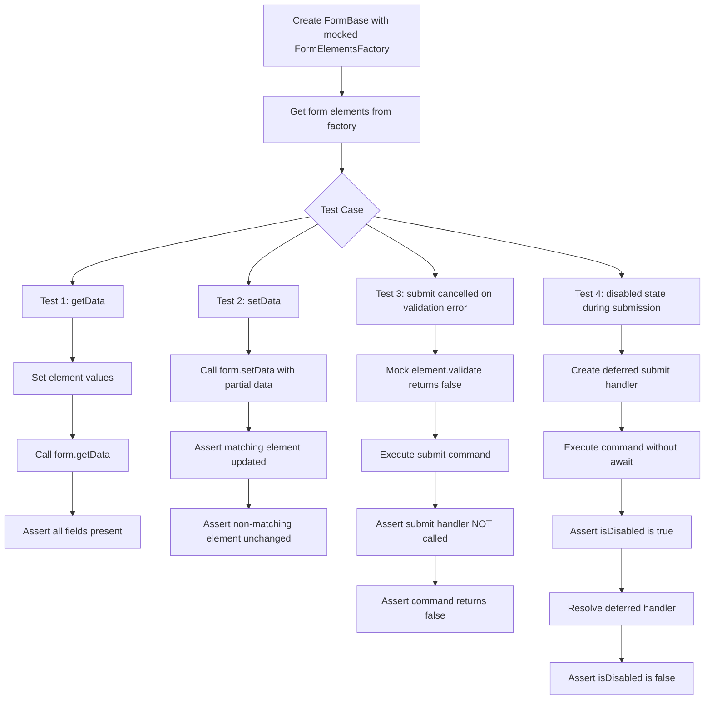

# FormBase Unit Tests & Interface Changes Plan

## Overview

This plan covers two related changes:
1. **Interface change**: Remove `submitAsync` from the public `Form` abstract class and completely remove the method from `FormBase`
2. **Unit tests**: Add 4 unit tests for `FormBase` covering `getData`, `setData`, validation-cancelled submit, and disabled state during submission

---

## Part 1: Interface Change — Remove `submitAsync` Entirely

### Rationale

Per the user's requirement: "by design submission is executed by external component." The `getSubmitCommand()` method already exposes an `AsyncCommand` that external components (like modal buttons) use to trigger submission. The `submitAsync()` method is redundant and should be completely removed — not just made private.

### Files to Change

#### 1. [`app/modules/forms/entities/form.ts`](app/modules/forms/entities/form.ts) — Remove abstract declaration

Remove line 22:
```typescript
abstract submitAsync(): Promise<void>;
```

The abstract class `Form` should no longer declare `submitAsync` as an abstract method.

#### 2. [`app/modules/forms/entities/formBase.ts`](app/modules/forms/entities/formBase.ts) — Remove method entirely

Remove the entire `submitAsync` method (lines 95-98):
```typescript
override async submitAsync(): Promise<void>
{
    await this.submitCommand.executeAsync();
}
```

This method is no longer needed since external components use `getSubmitCommand()` directly.

#### 3. [`app/modules/forms/mocks/formMock.ts`](app/modules/forms/mocks/formMock.ts) — Remove mock

Remove the `submitAsync: vi.fn()` line from the mock object, since it no longer exists on the `Form` interface.

---

## Part 2: Unit Tests for FormBase

### Test File Location

Create a new test file at:
[`app/modules/forms/test/nuxt/formBase.test.ts`](app/modules/forms/test/nuxt/formBase.test.ts)

**Rationale**: Since `FormBase` extends `UIElement` (via `Form`), tests should be placed in the `nuxt/` subdirectory, following the same convention as other `UIElement` tests like [`buttonGeneralBase.test.ts`](app/modules/uikit/test/nuxt/buttonGeneralBase.test.ts) and [`overlay.test.ts`](app/modules/overlay/test/nuxt/overlay.test.ts).

### Test Infrastructure

The tests will use **Vitest** (already configured in the project). The key challenge is that `FormBase` depends on:
- `FormElementsFactory` — to create form elements from a scheme
- `FormConfiguration` — provides the submit handler and entity scheme

For unit testing, we need to mock the `FormElementsFactory` to return controlled `FormElement` mocks.

### Mock Strategy

Create a helper that builds a `FormBase` instance with:
- A mock `FormElementsFactory` that returns controlled `FormElement` mocks
- A mock submit handler (`vi.fn()`)
- A simple entity scheme

**FormElement mock** needs to implement:
- `name: string`
- `value: any` (getter/setter)
- `validate(): boolean` — controllable per test
- `disable(): void` — spyable
- `enable(): void` — spyable
- `vnode: VNode`
- `key: string`
- `[Symbol.dispose](): void`

### Test Cases

#### Test 1: `getData` should contain all fields from scheme

**Scenario**: Create a form with a scheme containing multiple fields. Call `getData()` and verify all fields are present with their current values.

**Steps**:
1. Create a scheme with 2-3 fields (e.g., `title: string`, `description: string`)
2. Create mock form elements with known names and values
3. Create `FormBase` with these mocks
4. Call `form.getData()`
5. Assert the returned object contains all field names as keys with correct values

**Expected**: `getData()` returns `{ title: 'test-title', description: 'test-desc' }`

#### Test 2: `setData` should update value of matching form element

**Scenario**: Call `setData()` with partial data and verify only matching elements are updated.

**Steps**:
1. Create form elements with names `['title', 'description']` and initial values
2. Create `FormBase` with these mocks
3. Call `form.setData({ title: 'new-title' })`
4. Assert the `title` element's value was updated
5. Assert the `description` element's value was NOT changed

**Expected**: Only the `title` element's value changes; `description` remains unchanged.

#### Test 3: Submit is cancelled if form contains errors (validate returned false)

**Scenario**: When `validate()` returns `false` on any element, the submit handler should NOT be called.

**Steps**:
1. Create form elements where at least one returns `false` from `validate()`
2. Create `FormBase` with a mock submit handler (`vi.fn()`)
3. Execute the submit command via `form.getSubmitCommand().executeAsync()`
4. Assert the submit handler was NOT called
5. Assert the command returned `false`

**Expected**: Submit handler is not called; command returns `false`.

#### Test 4: During submission form is switched to disabled state

**Scenario**: When submission is in progress, `isDisabled` should return `true`. After completion, it should return `false`.

**Steps**:
1. Create form elements with `validate()` returning `true`
2. Create a submit handler that uses a `Promise` we can control (deferred)
3. Execute the submit command (don't await yet)
4. Assert `form.isDisabled` is `true` during execution
5. Resolve the deferred submit handler
6. Wait for completion
7. Assert `form.isDisabled` is `false` after completion

**Expected**: `isDisabled` is `true` during submission, `false` before and after.

### Test Structure Diagram



### Implementation Details

#### Helper: `createFormElementMock`

```typescript
function createFormElementMock(name: string, initialValue: any, validateResult: boolean = true): FormElement
{
    let value = initialValue;
    const disableFn = vi.fn();
    const enableFn = vi.fn();

    return {
        name,
        get value() { return value; },
        set value(v) { value = v; },
        validate: vi.fn(() => validateResult),
        disable: disableFn,
        enable: enableFn,
        key: getUniqueId('test-element'),
        vnode: {} as VNode,
        [Symbol.dispose]: vi.fn(),
    } as FormElement;
}
```

#### Helper: `createFormElementsFactoryMock`

```typescript
function createFormElementsFactoryMock(elements: FormElement[]): FormElementsFactory
{
    return {
        createElements: vi.fn(() => elements),
    } as FormElementsFactory;
}
```

#### Helper: `createFormBase`

```typescript
function createFormBase(
    elements: FormElement[],
    submitHandler: Func<Promise<void>, [Record<string, any>]> = vi.fn(async () => {})
): FormBase
{
    const factory = createFormElementsFactoryMock(elements);
    const scheme: EntityScheme<any> = {};
    
    for (const element of elements)
    {
        scheme[element.name] = { type: EntityFieldType.string };
    }

    return new FormBase(factory, {
        submit: submitHandler,
        scheme,
    });
}
```

---

## Summary of Changes

| File | Change |
|------|--------|
| `app/modules/forms/entities/form.ts` | Remove `abstract submitAsync()` declaration |
| `app/modules/forms/entities/formBase.ts` | Remove `submitAsync` method entirely |
| `app/modules/forms/mocks/formMock.ts` | Remove `submitAsync: vi.fn()` |
| `app/modules/forms/test/nuxt/formBase.test.ts` | New file with 4 unit tests |

## Execution Order

1. Update `form.ts` — remove abstract method
2. Update `formBase.ts` — remove method entirely
3. Update `formMock.ts` — remove mock entry
4. Create `formBase.test.ts` — add all 4 tests