# i18n Implementation Plan (v5)

## Overview

Add internationalization support using `@nuxtjs/i18n` module with a single Russian locale file (eager-loaded). All hardcoded strings are extracted into `locales/ru.json`. A `MessagesService` with **strongly typed overloads + JSDoc** provides the sole access point to i18n for classes (via DI). Vue components use `useService(MessagesService)` directly (no separate `useMessages` composable).

**Key change in v5**: The two error messages in `overlayBase.ts` (`'OverlayElement does not exist in Overlay'` and `'OverlayElement already added'`) are replaced with **custom exception classes** instead of being extracted into i18n. This means:
- `overlayBase.ts` no longer injects `MessagesService` — it throws custom exceptions
- `locales/ru.json` has no `overlay` section
- `MessagesService` has 15 overloads (no `overlay.error.*`)
- Two new exception files in `app/modules/overlay/exceptions/`
- `console.error` calls remain in `overlayBase.ts` (not inside exception constructors)

Exception classes are left unchanged (they are constructed directly, not via DI). The custom overlay exceptions follow the same pattern — pure `Error` subclasses with no side effects.

## Architecture

```mermaid
flowchart TD
    subgraph "Data Layer"
        L[locales/ru.json<br/>todo + button sections only]
    end

    subgraph "i18n Engine"
        I18N[@nuxtjs/i18n<br/>useI18n composable]
    end

    subgraph "Abstraction Layer"
        MS[MessagesService abstract class<br/>15 typed overloads]
        MSI[MessagesServiceImpl]
        MS -->|implements| MSI
        MSI -->|wraps t function| I18N
    end

    subgraph "DI Registration"
        US[useSharedServices]
        US -->|useI18n.t| MSI
        US -->|register singleton| MS
    end

    subgraph "Consumers"
        VC[Vue Components<br/>useService MessagesService]
        CL[Classes via DI<br/>@dependency decorator]
    end

    subgraph "Exceptions (no DI)"
        E1[OverlayElementNotFoundException]
        E2[OverlayElementAlreadyAddedException]
        OB[overlayBase.ts]
        OB -->|throws| E1
        OB -->|throws| E2
    end

    L --> I18N
    VC -->|useService| MS
    CL -->|constructor injection| MS
```

## MessagesService Design

The `MessagesService` will have **15 typed overloads** with JSDoc for every message key. Each overload includes:
- `@see` — clickable link to `locales/ru.json` with the exact key
- `@param` — documents required params for parameterized keys

```mermaid
flowchart LR
    subgraph "getMessage overloads (15 total)"
        O1["todo.field.title.label"]
        O2["todo.field.title.placeholder"]
        O3["todo.field.description.label"]
        O4["todo.field.description.placeholder"]
        O5["todo.field.completionDatePlanned.label"]
        O6["todo.card.completed"]
        O7["todo.card.completeBy"]
        O8["todo.notification.createError.title"]
        O9["todo.notification.updateError.title"]
        O10["todo.modal.create.title"]
        O11["todo.modal.edit.title"]
        O12["button.create"]
        O13["button.save"]
        O14["button.cancel"]
    end
```



### Example Usage

```ts
// In a class via DI
@dependency(MessagesService)
class SomeClass {
  constructor(private messagesService: MessagesService) {
    const label = this.messagesService.getMessage('todo.field.title.label');
  }
}

// In a Vue component
const messagesService = useService(MessagesService);
const completedLabel = messagesService.getMessage('todo.card.completed');
```

## Complete String Inventory

### 1. Todo Module - Field Schemes (`todoStateBase.ts`)

| Key | Current Value | Has Params |
|-----|--------------|------------|
| `todo.field.title.label` | `Название задачи` | No |
| `todo.field.title.placeholder` | `Введите название задачи` | No |
| `todo.field.description.label` | `Описание задачи` | No |
| `todo.field.description.placeholder` | `Введите описание задачи` | No |
| `todo.field.completionDatePlanned.label` | `Плановая дата выполнения` | No |

### 2. Todo Module - Modal/Notification Titles

| File | Key | Current Value | Has Params |
|------|-----|--------------|------------|
| `todoStateNew.ts` | `todo.notification.createError.title` | `Ошибка создания задания` | No |
| `todoStateNew.ts` | `todo.modal.create.title` | `Создать задачу` | No |
| `todoStateSaved.ts` | `todo.notification.updateError.title` | `Ошибка изменения задания` | No |
| `todoStateSaved.ts` | `todo.modal.edit.title` | `Изменить задачу` | No |

### 3. Todo Module - Card Labels (`VToDoCard.vue`)

| Key | Current Value | Has Params |
|-----|--------------|------------|
| `todo.card.completed` | `Выполнено` | No |
| `todo.card.completeBy` | `Выполнить до` | No |

### 4. Overlay Module - Button Titles

| File | Key | Current Value | Has Params |
|------|-----|--------------|------------|
| `modalButtonConfirmConfiguratorBase.ts` | `button.create` | `Добавить` | No |
| `modalButtonConfirmConfiguratorBase.ts` | `button.save` | `Сохранить` | No |
| `modalBase.ts` | `button.cancel` | `Отменить` | No |

### 5. Overlay Base - Error Messages (REMOVED from i18n, now custom exceptions)

| File | Old Key | Current Value | New Approach |
|------|---------|--------------|--------------|
| `overlayBase.ts` | ~~`overlay.error.elementNotFound`~~ | `OverlayElement does not exist in Overlay` | `throw new OverlayElementNotFoundException(element)` |
| `overlayBase.ts` | ~~`overlay.error.elementAlreadyAdded`~~ | `OverlayElement already added` | `throw new OverlayElementAlreadyAddedException(element)` |

## Implementation Steps

### Step 1: Install `@nuxtjs/i18n`

```bash
npx nuxi module add i18n
```

### Step 2: Create `locales/ru.json`

```json
{
  "todo": {
    "field": {
      "title": {
        "label": "Название задачи",
        "placeholder": "Введите название задачи"
      },
      "description": {
        "label": "Описание задачи",
        "placeholder": "Введите описание задачи"
      },
      "completionDatePlanned": {
        "label": "Плановая дата выполнения"
      }
    },
    "card": {
      "completed": "Выполнено",
      "completeBy": "Выполнить до"
    },
    "notification": {
      "createError": {
        "title": "Ошибка создания задания"
      },
      "updateError": {
        "title": "Ошибка изменения задания"
      }
    },
    "modal": {
      "create": {
        "title": "Создать задачу"
      },
      "edit": {
        "title": "Изменить задачу"
      }
    }
  },
  "button": {
    "create": "Добавить",
    "save": "Сохранить",
    "cancel": "Отменить"
  }
}
```

**Note**: No `overlay` section — those error messages are now custom exceptions.

### Step 3: Configure `nuxt.config.ts`

```ts
modules: [
  '@nuxt/test-utils/module',
  '@nuxt/ui',
  '@nuxt/eslint',
  '@nuxtjs/i18n',
],

i18n: {
  locales: [
    { code: 'ru', iso: 'ru-RU', file: 'ru.json' },
  ],
  defaultLocale: 'ru',
  lazy: false,
  langDir: 'locales',
},
```

### Step 4: Create `MessagesService` with Typed Overloads + JSDoc

**`app/modules/shared/services/messagesService.ts`** — 15 overloads (no `overlay.error.*`):

```ts
export abstract class MessagesService
{
  /**
   * Label for the task title input field.
   * @see {@link locales/ru.json} - key: `todo.field.title.label`
   */
  abstract getMessage(key: 'todo.field.title.label'): string;

  /**
   * Placeholder text for the task title input field.
   * @see {@link locales/ru.json} - key: `todo.field.title.placeholder`
   */
  abstract getMessage(key: 'todo.field.title.placeholder'): string;

  /**
   * Label for the task description input field.
   * @see {@link locales/ru.json} - key: `todo.field.description.label`
   */
  abstract getMessage(key: 'todo.field.description.label'): string;

  /**
   * Placeholder text for the task description input field.
   * @see {@link locales/ru.json} - key: `todo.field.description.placeholder`
   */
  abstract getMessage(key: 'todo.field.description.placeholder'): string;

  /**
   * Label for the planned completion date field.
   * @see {@link locales/ru.json} - key: `todo.field.completionDatePlanned.label`
   */
  abstract getMessage(key: 'todo.field.completionDatePlanned.label'): string;

  /**
   * Label for the completed date in the todo card.
   * @see {@link locales/ru.json} - key: `todo.card.completed`
   */
  abstract getMessage(key: 'todo.card.completed'): string;

  /**
   * Label for the complete by date in the todo card.
   * @see {@link locales/ru.json} - key: `todo.card.completeBy`
   */
  abstract getMessage(key: 'todo.card.completeBy'): string;

  /**
   * Title for the notification shown when task creation fails.
   * @see {@link locales/ru.json} - key: `todo.notification.createError.title`
   */
  abstract getMessage(key: 'todo.notification.createError.title'): string;

  /**
   * Title for the notification shown when task update fails.
   * @see {@link locales/ru.json} - key: `todo.notification.updateError.title`
   */
  abstract getMessage(key: 'todo.notification.updateError.title'): string;

  /**
   * Title for the create task modal dialog.
   * @see {@link locales/ru.json} - key: `todo.modal.create.title`
   */
  abstract getMessage(key: 'todo.modal.create.title'): string;

  /**
   * Title for the edit task modal dialog.
   * @see {@link locales/ru.json} - key: `todo.modal.edit.title`
   */
  abstract getMessage(key: 'todo.modal.edit.title'): string;

  /**
   * Label for the create (add) button.
   * @see {@link locales/ru.json} - key: `button.create`
   */
  abstract getMessage(key: 'button.create'): string;

  /**
   * Label for the save button.
   * @see {@link locales/ru.json} - key: `button.save`
   */
  abstract getMessage(key: 'button.save'): string;

  /**
   * Label for the cancel button.
   * @see {@link locales/ru.json} - key: `button.cancel`
   */
  abstract getMessage(key: 'button.cancel'): string;

  /**
   * Fallback overload for dynamic keys (used internally by the implementation).
   * @param key - The message key
   * @param params - Optional interpolation parameters
   */
  abstract getMessage(key: string, params?: Record<string, string | number>): string;
}
```

### Step 5: Create `MessagesServiceImpl`

**`app/modules/shared/services/messagesServiceImpl.ts`**:

```ts
import { MessagesService } from './messagesService';

export class MessagesServiceImpl extends MessagesService
{
  constructor(
    private t: (key: string, params?: Record<string, string | number>) => string,
  )
  {
    super();
  }

  override getMessage(key: string, params?: Record<string, string | number>): string
  {
    return this.t(key, params as Record<string, string | number>);
  }
}
```

### Step 6: Register in DI Container

In `useSharedServices.ts`, add:

```ts
import { MessagesService } from '@/modules/shared/services/messagesService';
import { MessagesServiceImpl } from '@/modules/shared/services/messagesServiceImpl';
import { useI18n } from '#imports';

const { t } = useI18n();

useServiceRegistration(MessagesService).toDynamicValue(() =>
{
  return new MessagesServiceImpl(t);
}).asSingleton();
```

### Step 7: Create Custom Exception Classes

The exceptions are pure `Error` subclasses — no side effects, no `console.error`. The `console.error` calls remain in `overlayBase.ts` where the exceptions are thrown.

**`app/modules/overlay/exceptions/overlayElementNotFoundException.ts`**:

```ts
import type { OverlayElement } from '../entities/overlayElement';

export class OverlayElementNotFoundException extends Error
{
    constructor(element: OverlayElement)
    {
        super('OverlayElement does not exist in Overlay');
    }
}
```

**`app/modules/overlay/exceptions/overlayElementAlreadyAddedException.ts`**:

```ts
import type { OverlayElement } from '../entities/overlayElement';

export class OverlayElementAlreadyAddedException extends Error
{
    constructor(element: OverlayElement)
    {
        super('OverlayElement already added');
    }
}
```

### Step 8: Update `overlayBase.ts`

- Remove `MessagesService` injection (no longer needed)
- Import and throw custom exceptions instead of `new Error(...)`
- Keep `console.error` calls in `overlayBase.ts` (not inside exception constructors)

```ts
import { OverlayElementNotFoundException } from '../exceptions/overlayElementNotFoundException';
import { OverlayElementAlreadyAddedException } from '../exceptions/overlayElementAlreadyAddedException';

// No @dependency(MessagesService) needed
// No MessagesService in constructor

private assertElementIsAdded(element: OverlayElement)
{
    if (!this.elements.includes(element))
    {
        console.error('OverlayElement does not exist in Overlay', element);
        throw new OverlayElementNotFoundException(element);
    }
}

private assertElementIsNotAdded(element: OverlayElement)
{
    if (this.elements.includes(element))
    {
        console.error('OverlayElement already added', element);
        throw new OverlayElementAlreadyAddedException(element);
    }
}
```

### Step 9: Update `todoStateBase.ts`

```ts
import { dependency } from '@/modules/shared/decorators/dependency';
import { MessagesService } from '@/modules/shared/services/messagesService';

@dependency(MessagesService)
export abstract class ToDoStateBase extends ToDoState
{
  protected scheme: EntityScheme<ToDoData>;

  constructor(
    protected todo: ToDoBase,
    protected messagesService: MessagesService,
  )
  {
    super();

    this.scheme = {
      id: { type: EntityFieldType.hidden },
      title: {
        type: EntityFieldType.string,
        label: this.messagesService.getMessage('todo.field.title.label'),
        placeholder: this.messagesService.getMessage('todo.field.title.placeholder'),
        isRequired: true,
      },
      description: {
        type: EntityFieldType.string,
        label: this.messagesService.getMessage('todo.field.description.label'),
        placeholder: this.messagesService.getMessage('todo.field.description.placeholder'),
        isLong: true,
      },
      completionDatePlanned: {
        type: EntityFieldType.datetime,
        label: this.messagesService.getMessage('todo.field.completionDatePlanned.label'),
      },
      completionDateActual: { type: EntityFieldType.hidden },
    };
  }
}
```

### Step 10: Update `todoStateNew.ts` and `todoStateSaved.ts`

```ts
import { dependency } from '@/modules/shared/decorators/dependency';
import { MessagesService } from '@/modules/shared/services/messagesService';

@dependency(MessagesService)
export class ToDoStateNew extends ToDoStateBase
{
  constructor(
    private overlay: Overlay,
    private formFactory: FormFactory,
    private messagesService: MessagesService,
    todo: ToDoBase,
  )
  {
    super(todo, messagesService);
  }

  showForm(): Modal<Form>
  {
    // ...
    form.onValidationError(error =>
    {
      this.overlay.createNotification({
        title: this.messagesService.getMessage('todo.notification.createError.title'),
        description: error.toString(),
        icon: 'i-heroicons-exclamation-triangle',
        color: 'error'
      });
    });

    return this.overlay.createModal({
      title: this.messagesService.getMessage('todo.modal.create.title'),
      // ...
    });
  }
}
```

### Step 11: Update `VToDoCard.vue`

```vue
<script setup lang="ts">
import { useService } from '@/modules/shared/composables/useService';
import { MessagesService } from '@/modules/shared/services/messagesService';

const messagesService = useService(MessagesService);

const completedLabel = messagesService.getMessage('todo.card.completed');
const completeByLabel = messagesService.getMessage('todo.card.completeBy');
</script>

<template>
  <VInfoRow v-if="formattedCompletionDateActual" :label="completedLabel">
    {{ formattedCompletionDateActual }}
  </VInfoRow>
  <VInfoRow v-if="formattedCompletionDatePlanned" :label="completeByLabel">
    {{ formattedCompletionDatePlanned }}
  </VInfoRow>
</template>
```

### Step 12: Update `modalButtonConfirmConfiguratorBase.ts`

```ts
@dependency(MessagesService)
export class ModalButtonConfirmConfiguratorBase extends ModalButtonConfirmConfigurator
{
  constructor(
    private button: ButtonGeneral,
    private messagesService: MessagesService,
  )
  {
    super();
  }

  override asCreateButton(): ButtonGeneral
  {
    this.setDefaultColor()
      .setTitle(this.messagesService.getMessage('button.create'));
    return this.button;
  }

  override asEditButton(): ButtonGeneral
  {
    this.setDefaultColor()
      .setTitle(this.messagesService.getMessage('button.save'));
    return this.button;
  }
}
```

### Step 13: Update `modalBase.ts`

```ts
@dependency(MessagesService)
export class ModalBase<Content extends UIElement> extends Modal<Content>
{
  constructor(
    private buttonsFactory: ButtonsFactory,
    private messagesService: MessagesService,
    configuration: ModalConfiguration<Content>,
  )
  // ...
  private createButtonCancel(isAllowed?: boolean): ButtonGeneral | undefined
  {
    // ...
    buttonCancel.title = this.messagesService.getMessage('button.cancel');
    // ...
  }
}
```

## Files to Create/Modify

### New Files (5)

| File | Purpose |
|------|---------|
| `locales/ru.json` | All extracted strings (todo + button sections only) |
| `app/modules/shared/services/messagesService.ts` | Abstract class with 15 typed overloads + JSDoc |
| `app/modules/shared/services/messagesServiceImpl.ts` | Implementation wrapping `@nuxtjs/i18n` `t` function |
| `app/modules/overlay/exceptions/overlayElementNotFoundException.ts` | Custom exception for missing overlay element |
| `app/modules/overlay/exceptions/overlayElementAlreadyAddedException.ts` | Custom exception for duplicate overlay element |

### Modified Files (8)

| # | File | Change |
|---|------|--------|
| 1 | `nuxt.config.ts` | Add `@nuxtjs/i18n` module + config |
| 2 | `app/modules/shared/composables/useSharedServices.ts` | Register `MessagesService` as singleton using `useI18n().t` |
| 3 | `app/modules/overlay/entities/overlayBase.ts` | Remove `MessagesService` injection; throw custom exceptions |
| 4 | `app/modules/todo/entities/todoStateBase.ts` | Inject `MessagesService`, use `getMessage()` |
| 5 | `app/modules/todo/entities/todoStateNew.ts` | Inject `MessagesService`, use `getMessage()` |
| 6 | `app/modules/todo/entities/todoStateSaved.ts` | Inject `MessagesService`, use `getMessage()` |
| 7 | `app/modules/todo/components/VToDoCard.vue` | Use `useService(MessagesService)`, local variables in script setup |
| 8 | `app/modules/overlay/entities/modalButtonConfirmConfiguratorBase.ts` | Inject `MessagesService`, use `getMessage()` |
| 9 | `app/modules/overlay/entities/modalBase.ts` | Inject `MessagesService`, use `getMessage()` |

### Unchanged Files (exceptions stay as-is)

| File | Reason |
|------|--------|
| `disposedException.ts` | Constructed directly, not via DI |
| `notInitializedException.ts` | Constructed directly, not via DI |
| `initializedException.ts` | Constructed directly, not via DI |
| `readonlyRefValueChangeException.ts` | Constructed directly, not via DI |
| `handlerAlreadySetException.ts` | Constructed directly, not via DI |
| `initializationOnlyException.ts` | Constructed directly, not via DI |
| `unknownErrorException.ts` | Constructed directly, not via DI |
| `formDisabledException.ts` | Constructed directly, not via DI |
| `notFoundException.ts` | Constructed directly, not via DI |

## Key Design Decisions

| Decision | Choice | Rationale |
|----------|--------|-----------|
| **Locale loading** | Eager (`lazy: false`) | Single locale, no benefit from lazy loading |
| **Locale file format** | JSON | Simple, widely supported |
| **Type safety** | Typed overloads on `getMessage()` | IDE auto-complete + compile-time safety per key |
| **JSDoc** | `@see` only | Hover IntelliSense shows locale key and clickable link to file |
| **DI integration** | `MessagesService` abstract class | Follows existing DI pattern with `@dependency` decorator |
| **Vue components** | `useService(MessagesService)` directly | No need for wrapper composable; `useService` already exists |
| **`MessagesServiceImpl` constructor** | Accepts `t` function directly | Simpler than wrapping an object |
| **`useI18n()` call** | At root of `useSharedServices` | Single call, registered once as singleton |
| **Exception messages** | Left as hardcoded English | Exceptions are constructed directly, not via DI |
| **Overlay error messages** | Custom exception classes | Better encapsulation; `console.error` inside exception constructor; no DI needed |
| **i18n access** | Only `MessagesServiceImpl` touches `@nuxtjs/i18n` | Clean separation; easy to swap i18n engine later |