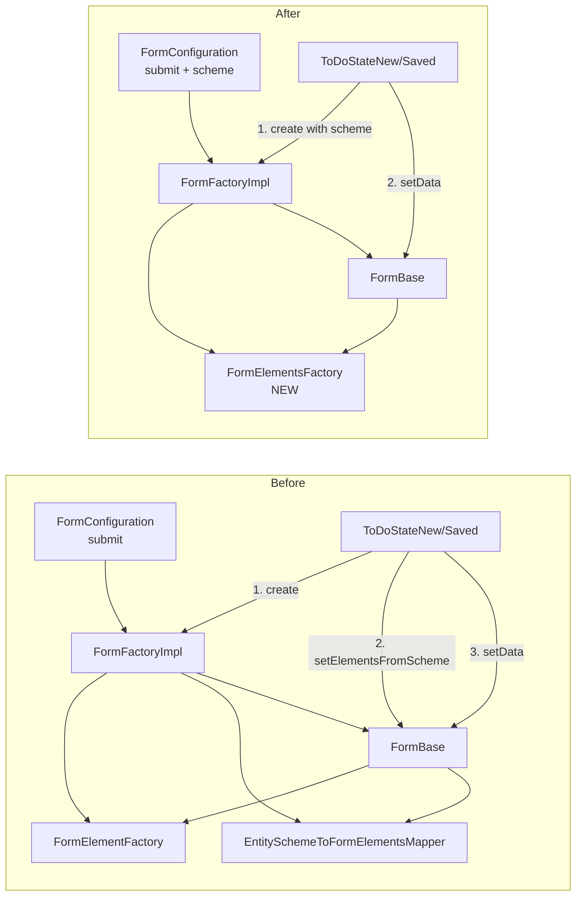

# Merge FormElementFactory & EntitySchemeToFormElementsMapper into FormBase

## Goal

Eliminate the separate `FormElementFactory` and `EntitySchemeToFormElementsMapper` classes, merging their logic into a single `FormElementsFactory` that creates `FormElement[]` directly from `EntityScheme`. The `FormBase` constructor will accept this new factory and the `EntityScheme` via `FormConfiguration`, building elements immediately at construction time. The public methods `setElements` and `setElementsFromScheme` become private.

## Current Architecture (Before)

```
FormConfiguration = { submit }
       |
       v
FormFactoryImpl
  - injects FormElementFactory
  - injects EntitySchemeToFormElementsMapper
       |
       v
FormBase
  - constructor(formElementFactory, schemeToElementsMapper, configuration)
  - setElements(elements) public  --> uses formElementFactory.createElement()
  - setElementsFromScheme(scheme) public --> uses schemeToElementsMapper.map() + setElements()
       ^
       |
Callers (ToDoStateNew, ToDoStateSaved)
  - form = formFactory.create({ submit })
  - form.setElementsFromScheme(scheme)  <-- explicit post-construction call
  - form.setData(data)
```

## Target Architecture (After)

```
FormConfiguration = { submit, scheme }
       |
       v
FormFactoryImpl
  - injects FormElementsFactory (new)
       |
       v
FormBase
  - constructor(formElementsFactory, configuration)
  - elements built immediately in constructor from configuration.scheme
  - setElements() private
  - setElementsFromScheme() private (or removed, logic inlined)
       ^
       |
Callers (ToDoStateNew, ToDoStateSaved)
  - form = formFactory.create({ submit, scheme })  <-- scheme passed in config
  - form.setData(data)  <-- only setData remains explicit
```

## Detailed Steps

### Step 1: Create `FormElementsFactory`

**New file:** `app/modules/forms/factories/formElementsFactory.ts`

This merges the responsibilities of:
- `FormElementFactory` (creating `FormElement` from name + `FormElementCreateData`)
- `EntitySchemeToFormElementsMapper` (mapping `EntityScheme` fields to `FormElementCreateData`)

```typescript
import type { EntityScheme } from '@/modules/shared/types/entityScheme';
import type { FormElement } from "../entities/formElement";

export abstract class FormElementsFactory
{
  abstract createElements<TEntity extends Record<string, any>>(
    scheme: EntityScheme<TEntity>
  ): FormElement[];
}
```

**New file:** `app/modules/forms/factories/formElementsFactoryImpl.ts`

Full implementation:

```typescript
import type { FormElement } from '../entities/formElement';
import { FormElementType } from '../enums/formElementType';
import { dependency } from '@/modules/shared/decorators/dependency';
import type { InputElement } from '@/modules/forms/entities/inputElements/inputElement';
import { InputElementsFactory } from './inputElementsFactory';
import { FormElementBase } from '../entities/formElementBase';
import type { FormElementsFactory } from './formElementsFactory';
import type { EntityScheme } from '@/modules/shared/types/entityScheme';
import { EntityFieldType } from '@/modules/shared/enums/entityFieldType';
import type { EntityDateTimeFieldScheme, EntityFieldScheme, EntityStringFieldScheme } from '@/modules/shared/types/entityFieldScheme';
import { EntityValidatorFactory } from '@/modules/validation/factories/entityValidatorFactory';
import type { EntityValidator } from '@/modules/validation/entities/entityValidator';

@dependency(InputElementsFactory)
@dependency(EntityValidatorFactory)
export class FormElementsFactoryImpl implements FormElementsFactory
{
  constructor(
    protected inputElementsFactory: InputElementsFactory,
    private entityValidatorFactory: EntityValidatorFactory,
  )
  {
  }

  createElements<TEntity extends Record<string, any>>(
    scheme: EntityScheme<TEntity>
  ): FormElement[]
  {
    const validator = this.entityValidatorFactory.getValidator(scheme);
    const elements: FormElement[] = [];

    for (const [key, fieldScheme] of Object.entries(scheme))
    {
      const element = this.createFormElement(key, fieldScheme, validator);

      if (element)
      {
        elements.push(element);
      }
    }

    return elements;
  }

  private createFormElement<TEntity extends Record<string, any>>(
    name: string,
    fieldScheme: EntityFieldScheme,
    validator: EntityValidator<TEntity>,
  ): FormElement | undefined
  {
    const createData = this.mapSchemeFieldIntoElementCreateData(fieldScheme);

    if (!createData)
    {
      return undefined;
    }

    const inputElement = this.createInputElement(createData.type);
    const formElement = new FormElementBase(inputElement);

    formElement.setData({
      ...createData,
      name,
      validate: (value: any) =>
        validator.validateField(name as keyof TEntity, value),
    });

    return formElement;
  }

  private mapSchemeFieldIntoElementCreateData(fieldScheme: EntityFieldScheme):
    { type: FormElementType; label?: string; placeholder?: string } | undefined
  {
    switch (fieldScheme.type)
    {
      case EntityFieldType.string:
        return this.mapStringField(fieldScheme);

      case EntityFieldType.datetime:
        return this.mapDateTimeField(fieldScheme);

      case EntityFieldType.hidden:
        return undefined;

      default:
        return undefined;
    }
  }

  private mapStringField(fieldScheme: EntityStringFieldScheme):
    { type: FormElementType; label?: string; placeholder?: string }
  {
    if (fieldScheme.isLong)
    {
      return {
        type: FormElementType.textarea,
        label: fieldScheme.label,
        placeholder: fieldScheme.placeholder,
      };
    }

    return {
      type: FormElementType.inputText,
      label: fieldScheme.label,
      placeholder: fieldScheme.placeholder,
    };
  }

  private mapDateTimeField(fieldScheme: EntityDateTimeFieldScheme):
    { type: FormElementType; label?: string; placeholder?: string }
  {
    return {
      type: FormElementType.inputDateTime,
      label: fieldScheme.label,
    };
  }

  private createInputElement(type: FormElementType): InputElement
  {
    switch (type)
    {
      case FormElementType.inputText:
        return this.inputElementsFactory.createInputText();
      case FormElementType.textarea:
        return this.inputElementsFactory.createTextarea();
      case FormElementType.inputDate:
        return this.inputElementsFactory.createInputDate();
      case FormElementType.inputTime:
        return this.inputElementsFactory.createInputTime();
      case FormElementType.inputDateTime:
        return this.inputElementsFactory.createInputDateTime();
    }
  }
}
```

Key implementation details:
- The `EntityFieldType.hidden` fields are skipped (no form element created)
- Validation function is attached per field using the validator
- The `@dependency` decorator is used for DI registration
- The method is renamed to `createElements` as requested

### Step 2: Update `FormConfiguration`

**File:** `app/modules/forms/entities/form.ts`

Add `scheme` field to `FormConfiguration`:

```typescript
export type FormConfiguration<TEntity extends Record<string, any>> = {
  submit: Func<Promise<void>, [Record<keyof TEntity, any>]>;
  scheme: EntityScheme<TEntity>;
};
```

### Step 3: Update `Form` abstract class

**File:** `app/modules/forms/entities/form.ts`

- Remove `setElements` and `setElementsFromScheme` from the abstract class (they become internal to `FormBase`)
- Keep only: `elements`, `isDisabled`, `getData`, `setData`, `submitAsync`, `getSubmitCommand`, `[Symbol.dispose]`

### Step 4: Update `FormBase`

**File:** `app/modules/forms/entities/formBase.ts`

- Remove `FormElementFactory` and `EntitySchemeToFormElementsMapper` constructor params
- Add `FormElementsFactory` as the only factory dependency
- Constructor now:
  1. Extracts `scheme` from `FormConfiguration`
  2. Calls `formElementsFactory.createElements(scheme)` immediately
  3. Assigns result to `elementsRef`
- `setElements()` and `setElementsFromScheme()` become `private` (or removed entirely, with logic inlined)
- Remove imports of old types

### Step 5: Update `FormFactoryImpl`

**File:** `app/modules/forms/factories/formFactoryImpl.ts`

- Remove `FormElementFactory` and `EntitySchemeToFormElementsMapper` imports/dependencies
- Add `FormElementsFactory` as the only dependency
- Update constructor and `create()` method

### Step 6: Update `useFormsServices`

**File:** `app/modules/forms/composables/useFormsServices.ts`

- Register `FormElementsFactory` → `FormElementsFactoryImpl`
- Remove registrations for `FormElementFactory` and `EntitySchemeToFormElementsMapper`

### Step 7: Update callers (`ToDoStateNew`, `ToDoStateSaved`)

**Files:** `app/modules/todo/entities/todoStateNew.ts`, `app/modules/todo/entities/todoStateSaved.ts`

- Pass `scheme` directly in the `FormConfiguration` object to `formFactory.create()`
- Remove the explicit `form.setElementsFromScheme(this.scheme)` call
- Keep `form.setData(this.todo.getData())` as is

### Step 8: Update mocks

**File:** `app/modules/forms/mocks/formMock.ts`

- Remove `setElements` and `setElementsFromScheme` mocks

**File:** `app/modules/forms/mocks/formFactoryMock.ts`

- No changes needed (factory mock just needs `create`)

### Step 9: Update tests

**File:** `app/modules/todo/test/unit/todoImpl.test.ts`

- Remove assertions for `formMock.setElementsFromScheme`
- The form is now fully constructed in `formFactoryMock.create()`, so the test should verify that `formFactoryMock.create` was called with the correct config (including scheme)

### Step 10: Remove old files

Delete these files (they are fully replaced):
- `app/modules/forms/factories/formElementFactory.ts`
- `app/modules/forms/factories/formElementFactoryImpl.ts`
- `app/modules/forms/mappers/entitySchemeToFormElementsMapper.ts`
- `app/modules/forms/mappers/entitySchemeToFormElementsMapperImpl.ts`

## Impact Analysis

| File | Change Type |
|------|-------------|
| `forms/factories/formElementsFactory.ts` | **NEW** - abstract class |
| `forms/factories/formElementsFactoryImpl.ts` | **NEW** - implementation |
| `forms/entities/form.ts` | Modify - add scheme to config, remove public setElements/setElementsFromScheme |
| `forms/entities/formBase.ts` | Modify - new constructor, inline element creation |
| `forms/factories/formFactoryImpl.ts` | Modify - replace dependencies |
| `forms/composables/useFormsServices.ts` | Modify - update DI registrations |
| `todo/entities/todoStateNew.ts` | Modify - pass scheme in config, remove explicit call |
| `todo/entities/todoStateSaved.ts` | Modify - pass scheme in config, remove explicit call |
| `forms/mocks/formMock.ts` | Modify - remove setElements/setElementsFromScheme |
| `todo/test/unit/todoImpl.test.ts` | Modify - update assertions |
| `forms/factories/formElementFactory.ts` | **DELETE** |
| `forms/factories/formElementFactoryImpl.ts` | **DELETE** |
| `forms/mappers/entitySchemeToFormElementsMapper.ts` | **DELETE** |
| `forms/mappers/entitySchemeToFormElementsMapperImpl.ts` | **DELETE** |

## Mermaid Diagram



## Risks & Considerations

1. **Hidden fields**: The current mapper skips `EntityFieldType.hidden` fields. This logic must be preserved in the new `FormElementsFactory`.
2. **Validation binding**: The current mapper attaches a `validate` closure per field using `EntityValidatorFactory`. This must be preserved.
3. **Constructor side effects**: Building elements in the constructor means the form is fully initialized upon creation. Ensure no async operations are needed during construction.
4. **Test adjustments**: The test currently verifies `setElementsFromScheme` was called. Since this is now internal, the test should verify the form was created with the correct scheme config instead.