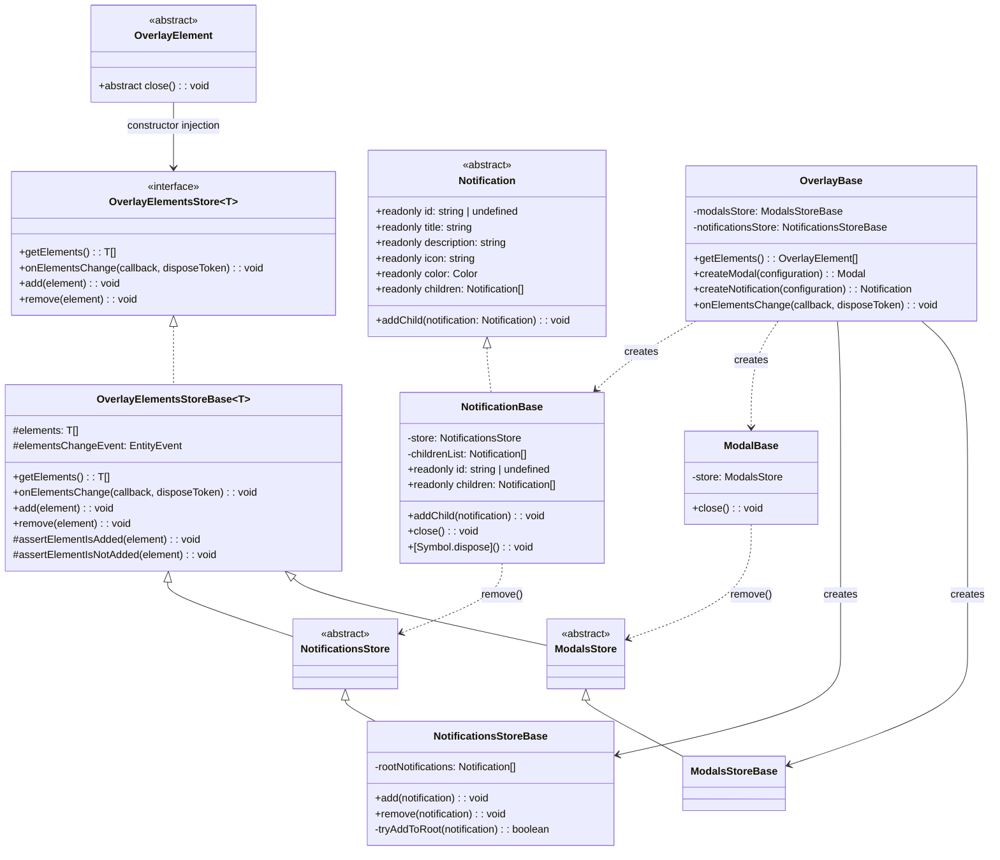
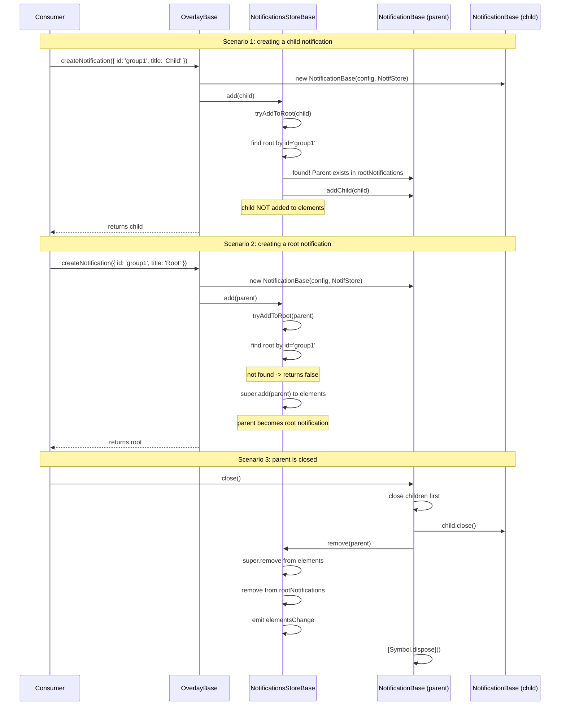

# Notification Parent-Child Disposal

## Problem

NuxtUI's `useToast` groups notifications by `id` — when multiple toasts share the same `id`, only one is shown at a time. However, the current `NotificationBase` implementation doesn't leverage this grouping for disposal. When a parent notification (with a given `id`) is closed, any child notifications sharing that `id` should also be closed.

## Solution

### Part 1: Parent-Child Notification Relationship

1. **`Notification`** abstract class gains:
   - `abstract readonly id: string | undefined` — exposes the notification's group id
   - `readonly children: Notification[]` — a list of child notifications
   - `addChild(notification: Notification): void` — registers a child

2. **`NotificationBase`** implements children storage and cascading close:
   - When `close()` is called on a parent, it iterates over `children` and closes each one
   - `[Symbol.dispose]()` also disposes children

3. **Key definitions:**
   - **Root notification** = any notification with an `id` that is directly in `elements` (the first one created for a given id)
   - **Child notification** = a notification with an `id` that was created after a root with the same `id` already exists; NOT added to `elements`
   - **Standalone notification** = a notification without an `id`; added directly to `elements`

4. **Child notifications are NOT added to `elements`** — only root notifications appear in the overlay elements list. Children are managed internally by the parent and are closed/disposed when the parent is closed.

### Part 2: Decompose OverlayBase into Store Abstract Classes and Implementations

Extract element storage management into reusable store classes with abstract class/implementation pattern. Stores handle only storage (add/remove/query) and root notification logic, not construction:

1. **`OverlayElementsStore<T>`** — interface with `getElements()`, `onElementsChange()`, `add()`, `remove()`
2. **`OverlayElementsStoreBase<T>`** — base implementation with typed `elements` array, `EntityEvent`, assertion methods
3. **`ModalsStore`** — abstract class extending `OverlayElementsStoreBase<Modal>` (no additional members — pure storage)
4. **`ModalsStoreBase`** — concrete implementation extending `ModalsStore`
5. **`NotificationsStore`** — abstract class extending `OverlayElementsStoreBase<Notification>` (no abstract methods — `NotificationsStoreBase` handles everything privately)
6. **`NotificationsStoreBase`** — concrete implementation extending `NotificationsStore`, overrides `add()` and `remove()` for parent-child logic

### Part 3: Pass Store via Constructor Instead of setOverlay/setStore

`OverlayBase` creates elements and passes the store directly to their constructors. This eliminates the need for `setOverlay`/`setStore` methods entirely. `NotificationsStoreBase` handles parent-child registration internally via overridden `add()`.

- `OverlayElement` — remove `abstract setOverlay()` entirely
- `ModalBase` constructor — takes `ModalsStore` as parameter, stores as `private store`, `close()` calls `this.store.remove(this)`
- `NotificationBase` constructor — takes `NotificationsStore` as parameter, stores as `private store`, `close()` calls `this.store.remove(this)`
- `OverlayBase.createModal()` — creates `ModalBase`, then calls `this.modalsStore.add(modal)`
- `OverlayBase.createNotification()` — creates `NotificationBase`, then calls `this.notificationsStore.add(notification)` which handles parent-child logic internally

### Part 4: Disposal Flow

1. `ModalBase.close()` — calls `this.store.remove(this)` then `[Symbol.dispose]()`
2. `NotificationBase.close()` — closes children, calls `this.store.remove(this)` then `[Symbol.dispose]()`
3. Store `remove()` — removes from array, emits change event
4. `NotificationsStoreBase.remove()` — also removes from `rootNotifications`

## Architecture



## Data Flow



## Files to Create

### 1. `app/modules/overlay/entities/overlayElementsStore.ts`

Interface:

```typescript
import type { OverlayElement } from './overlayElement';
import type { DisposeToken } from '@packages/shared';
import type { Action } from '@packages/shared';

export interface OverlayElementsStore<T extends OverlayElement>
{
    getElements(): T[];
    onElementsChange(callback: Action<[T[]]>, disposeToken?: DisposeToken): void;
    add(element: T): void;
    remove(element: T): void;
}
```

### 2. `app/modules/overlay/entities/overlayElementsStoreBase.ts`

Implementation:

```typescript
import type { OverlayElementsStore } from './overlayElementsStore';
import type { OverlayElement } from './overlayElement';
import { EntityEvent } from '@packages/shared';
import type { DisposeToken } from '@packages/shared';
import type { Action } from '@packages/shared';
import { removeFromArray } from '@packages/shared';
import { OverlayElementNotFoundException } from '../exceptions/overlayElementNotFoundException';
import { OverlayElementAlreadyAddedException } from '../exceptions/overlayElementAlreadyAddedException';

export abstract class OverlayElementsStoreBase<T extends OverlayElement> implements OverlayElementsStore<T>
{
    protected elements = new Array<T>();
    protected elementsChangeEvent = new EntityEvent<T[]>();

    getElements(): T[]
    {
        return this.elements;
    }

    onElementsChange(callback: Action<[T[]]>, disposeToken?: DisposeToken): void
    {
        this.elementsChangeEvent.on(callback, disposeToken);
    }

    add(element: T): void
    {
        this.assertElementIsNotAdded(element);

        this.elements.push(element);
        this.elementsChangeEvent.emit(this.elements);
    }

    remove(element: T): void
    {
        this.assertElementIsAdded(element);

        removeFromArray(this.elements, element);
        this.elementsChangeEvent.emit(this.elements);
    }

    protected assertElementIsAdded(element: T): void
    {
        if (!this.elements.includes(element))
        {
            const exception = new OverlayElementNotFoundException();
            console.error(exception.message, element);
            throw exception;
        }
    }

    protected assertElementIsNotAdded(element: T): void
    {
        if (this.elements.includes(element))
        {
            const exception = new OverlayElementAlreadyAddedException();
            console.error(exception.message, element);
            throw exception;
        }
    }
}
```

### 3. `app/modules/overlay/entities/modalsStore.ts`

Abstract class — pure storage, no additional members:

```typescript
import { OverlayElementsStoreBase } from './overlayElementsStoreBase';
import type { Modal } from './modal';
import type { UIElement } from '@/modules/uikit/entities/uiElement';

export abstract class ModalsStore extends OverlayElementsStoreBase<Modal<UIElement>>
{
}
```

### 4. `app/modules/overlay/entities/modalsStoreBase.ts`

Concrete implementation:

```typescript
import { ModalsStore } from './modalsStore';

export class ModalsStoreBase extends ModalsStore
{
}
```

### 5. `app/modules/overlay/entities/notificationsStore.ts`

Abstract class — no abstract methods, `NotificationsStoreBase` handles everything privately:

```typescript
import { OverlayElementsStoreBase } from './overlayElementsStoreBase';
import type { Notification } from './notification';

export abstract class NotificationsStore extends OverlayElementsStoreBase<Notification>
{
}
```

### 6. `app/modules/overlay/entities/notificationsStoreBase.ts`

Concrete implementation — overrides `add()` and `remove()` for parent-child logic:

```typescript
import { NotificationsStore } from './notificationsStore';
import type { Notification } from './notification';
import { removeFromArray } from '@packages/shared';

export class NotificationsStoreBase extends NotificationsStore
{
    private rootNotifications = new Array<Notification>();

    override remove(notification: Notification): void
    {
        super.remove(notification);
        removeFromArray(this.rootNotifications, notification);
    }

    override add(notification: Notification): void
    {
        if (!notification.id || !this.tryAddToRoot(notification))
        {
            super.add(notification);
        }
    }

    private tryAddToRoot(notification: Notification): boolean
    {
        const root = this.rootNotifications.find(x => x.id === notification.id);

        if (root)
        {
            root.addChild(notification);
            return true;
        }

        return false;
    }
}
```

## Files to Modify

### 7. `app/modules/overlay/entities/overlayElement.ts`

Remove `setOverlay` — store is now injected via constructor:

```typescript
import { UIElement } from '@/modules/uikit/entities/uiElement';

export abstract class OverlayElement extends UIElement
{
  abstract close(): void;
}
```

### 8. `app/modules/overlay/entities/notification.ts`

Add `id`, `children` and `addChild`:

```typescript
import { OverlayElement } from './overlayElement';
import type { Color } from '@/modules/uikit/types/color';

export abstract class Notification extends OverlayElement
{
    abstract readonly id: string | undefined;
    abstract readonly title: string;
    abstract readonly description: string;
    abstract readonly icon: string;
    abstract readonly color: Color;
    abstract readonly children: Notification[];
    abstract addChild(notification: Notification): void;
}
```

### 9. `app/modules/overlay/entities/notificationBase.ts`

Add `id` getter, children storage, `addChild`, accept store in constructor, modify `close()` to call `store.remove(this)`, and update `[Symbol.dispose]()`:

```typescript
import { h } from 'vue';
import { Notification } from './notification';
import type { NotificationConfiguration } from './notificationConfiguration';
import VNotification from '../components/VNotification.vue';
import { getUniqueId } from '@packages/shared';
import { DisposeToken } from '@packages/shared';
import type { NotificationsStore } from './notificationsStore';
import type { Color } from '@/modules/uikit/types/color';
import type { NotificationData } from '../types/notificationData';

export class NotificationBase extends Notification
{
    private store: NotificationsStore;
    private data: NotificationData;
    private disposeToken = new DisposeToken();
    private onCloseFn = () => this.close();
    private childrenList = new Array<Notification>();

    readonly key = getUniqueId('notification');

    readonly children: Notification[] = this.childrenList;

    constructor(
        configuration: NotificationConfiguration,
        store: NotificationsStore
    )
    {
        super();

        this.store = store;

        this.data = {
            id: configuration.id,
            title: configuration.title,
            description: configuration.description,
            icon: configuration.icon,
            color: configuration.color ?? 'neutral'
        };
    }

    get id(): string | undefined
    {
        return this.data.id;
    }

    override addChild(notification: Notification): void
    {
        this.childrenList.push(notification);
    }

    get title(): string { return this.data.title; }
    get description(): string { return this.data.description; }
    get icon(): string { return this.data.icon; }
    get color(): Color { return this.data.color; }

    get vnode()
    {
        return h(VNotification, {
            ...this.data,
            onClose: this.onCloseFn,
        });
    }

    override close()
    {
        // close all children first
        for (const child of this.childrenList)
        {
            child.close();
        }

        this.store.remove(this);
        this[Symbol.dispose]();
    }

    override[Symbol.dispose](): void
    {
        if (this.disposeToken.isDisposed)
        {
            return;
        }

        // dispose all children
        for (const child of this.childrenList)
        {
            child[Symbol.dispose]();
        }

        this.childrenList.length = 0;

        this.disposeToken[Symbol.dispose]();
    }
}
```

### 10. `app/modules/overlay/entities/modalBase.ts`

Accept store in constructor, modify `close()` to call `store.remove(this)`, remove `setOverlay`:

```typescript
// In imports, replace Overlay import with ModalsStore
import type { ModalsStore } from './modalsStore';

// Remove: import type { Overlay } from './overlay';
// Remove: import { InitializationOnlyException } from '@packages/shared';

// Change field:
private store: ModalsStore;

// Remove field:
// private overlay: Overlay | undefined;

// Change constructor to accept store:
constructor(
    private buttonsFactory: ButtonsFactory,
    private messagesService: MessagesService,
    configuration: ModalConfiguration<Content>,
    store: ModalsStore
)
{
    super();

    this.store = store;
    // ... rest of constructor unchanged
}

// Change close():
override close()
{
    this.store.remove(this);
    this[Symbol.dispose]();
}

// Remove setOverlay entirely
```

### 11. `app/modules/overlay/entities/overlay.ts`

Remove `removeElement` — elements now call `this.store.remove(this)` directly in their `close()` method:

```typescript
import type { OverlayElement } from './overlayElement';
import type { Modal, ModalConfiguration } from './modal';
import type { Notification } from './notification';
import type { NotificationConfiguration } from './notificationConfiguration';
import type { Action } from '@packages/shared';
import type { DisposeToken } from '@packages/shared';
import type { UIElement } from '@/modules/uikit/entities/uiElement';

export abstract class Overlay implements Disposable
{
  abstract getElements(): OverlayElement[];
  abstract createModal<Content extends UIElement>(configuration: ModalConfiguration<Content>): Modal<Content>;
  abstract createNotification(configuration: NotificationConfiguration): Notification;
  abstract onElementsChange(callback: Action<[OverlayElement[]]>, disposeToken?: DisposeToken): void;
  abstract [Symbol.dispose](): void;
}
```

### 12. `app/modules/overlay/entities/overlayBase.ts`

Refactored to use `ModalsStoreBase` and `NotificationsStoreBase`. `OverlayBase` creates elements directly and passes the store to their constructors. `removeElement` is removed — elements call `this.store.remove(this)` directly in their `close()`:

```typescript
import { dependency } from '@packages/di';
import { ButtonsFactory } from '@/modules/uikit/factories/buttonsFactory';
import { MessagesService } from '@packages/shared';
import { Overlay } from './overlay';
import { ModalBase } from './modalBase';
import { NotificationBase } from './notificationBase';
import { ModalsStoreBase } from './modalsStoreBase';
import { NotificationsStoreBase } from './notificationsStoreBase';
import type { OverlayElement } from './overlayElement';
import type { Modal, ModalConfiguration } from './modal';
import type { Notification } from './notification';
import type { NotificationConfiguration } from './notificationConfiguration';
import type { DisposeToken } from '@packages/shared';
import type { Action } from '@packages/shared';
import type { UIElement } from '@/modules/uikit/entities/uiElement';

@dependency(ButtonsFactory)
@dependency(MessagesService)
export class OverlayBase extends Overlay
{
    private modalsStore = new ModalsStoreBase();
    private notificationsStore = new NotificationsStoreBase();

    constructor(
        private buttonsFactory: ButtonsFactory,
        private messagesService: MessagesService
    )
    {
        super();
    }

    getElements(): OverlayElement[]
    {
        return [
            ...this.modalsStore.getElements(),
            ...this.notificationsStore.getElements(),
        ];
    }

    onElementsChange(callback: Action<[OverlayElement[]]>, disposeToken?: DisposeToken): void
    {
        const combinedCallback = () => callback(this.getElements());

        this.modalsStore.onElementsChange(combinedCallback, disposeToken);
        this.notificationsStore.onElementsChange(combinedCallback, disposeToken);
    }

    createModal<Content extends UIElement>(configuration: ModalConfiguration<Content>): Modal<Content>
    {
        const modal = new ModalBase(this.buttonsFactory, this.messagesService, configuration, this.modalsStore);
        this.modalsStore.add(modal);

        return modal;
    }

    createNotification(configuration: NotificationConfiguration): Notification
    {
        const notification = new NotificationBase(configuration, this.notificationsStore);
        this.notificationsStore.add(notification);

        return notification;
    }

    override[Symbol.dispose](): void
    {
        // Dispose stores
    }
}
```

### 13. `app/modules/overlay/mocks/overlayMock.ts`

Remove `removeElement` — it no longer exists on the `Overlay` interface:

```typescript
import { vi } from 'vitest';
import type { Overlay } from '../entities/overlay';

export const overlayMock = {
    getElements: vi.fn(),
    createModal: vi.fn(),
    createNotification: vi.fn(),
    onElementsChange: vi.fn(),
    [Symbol.dispose]: vi.fn(),
} satisfies Overlay;
```

### 14. `app/modules/overlay/mocks/modalMock.ts`

Remove `setOverlay` — store is now injected via constructor:

```typescript
import { vi } from 'vitest';
import type { Modal } from '@/modules/overlay/entities/modal';
import type { UIElement } from '@/modules/uikit/entities/uiElement';
import { createButtonGeneralMock } from '@/modules/uikit/mocks/buttonGeneralMock';

export const modalMock = {
    key: '',
    title: '',
    description: '',
    vnode: {} as VNode,
    buttonConfirm: createButtonGeneralMock(),
    buttonCancel: createButtonGeneralMock(),

    content: {
        key: '',
        vnode: {} as VNode,
        [Symbol.dispose]: vi.fn(),
    },

    enable: vi.fn(),
    disable: vi.fn(),
    close: vi.fn(),
    [Symbol.dispose]: vi.fn(),
} satisfies Modal<UIElement>;
```

### 15. Tests

**New unit tests for stores:**

`app/modules/overlay/test/nuxt/modalsStoreBase.test.ts`:
- `add()` should add modal to elements
- `add()` should throw if element already added
- `remove()` should remove modal from elements
- `remove()` should throw if element not present
- `getElements()` should return stored elements
- `onElementsChange()` should emit on add/remove

`app/modules/overlay/test/nuxt/notificationsStoreBase.test.ts`:
- `add()` should add notification to elements (standalone, no id)
- `add()` with new id should add as root notification
- `add()` with existing id should register as child (not in elements)
- `remove()` should remove from elements and rootNotifications
- `tryAddToRoot()` with existing root should register as child
- `tryAddToRoot()` without root should return false

**Updated overlay tests:**

`app/modules/overlay/test/nuxt/overlay.test.ts`:
- `getElements()` should combine modals and notifications
- `createModal()` should create modal, add to store, and pass store to constructor
- `createNotification()` without id should add to elements
- `createNotification()` with new id should add as root notification
- `createNotification()` with existing id should register as child (not in elements)
- Remove `removeElement` tests (method no longer exists on `Overlay`)
- Update `onElementsChange` removal test — removal now happens via `element.close()` which calls `store.remove()`

## Implementation Order

1. Create `OverlayElementsStore` interface
2. Create `OverlayElementsStoreBase` implementation
3. Create `ModalsStore` abstract class
4. Create `ModalsStoreBase` concrete class
5. Create `NotificationsStore` abstract class
6. Create `NotificationsStoreBase` concrete class (with overridden `add()` + `tryAddToRoot()`)
7. Modify `OverlayElement` — remove `setOverlay` entirely
8. Modify `Notification` — add `id`, `children`, `addChild`
9. Modify `NotificationBase` — accept store in constructor, implement `id`/`children`/`addChild`, cascading close/dispose
10. Modify `ModalBase` — accept store in constructor, update `close()`, remove `setOverlay`
11. Modify `Overlay` — remove `removeElement` abstract method
12. Modify `OverlayBase` — create elements directly, use stores for storage, remove `removeElement`
13. Update `overlayMock` — remove `removeElement`
14. Update `modalMock` — remove `setOverlay`
15. Add store unit tests (`modalsStoreBase.test.ts`, `notificationsStoreBase.test.ts`)
16. Update overlay tests (`overlay.test.ts`)