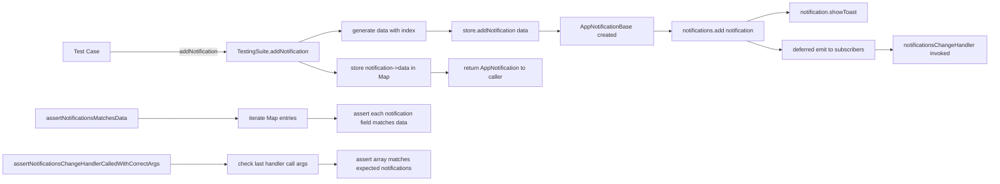

# NotificationsStoreBase Testing Suite Plan (Revised)

## Overview

Create a `NotificationsStoreBaseTestingSuite` class (following the same pattern as `NotificationBaseTestingSuite`) that encapsulates test helpers and assertions for `AppNotificationsStoreBase`. The suite will be used in the existing `notificationsStoreBase.test.ts` file, replacing the inline test logic with a reusable, fluent-API testing suite.

## Key Design Decisions

1. **Fluent API (method chaining)** — Each assertion/action method returns `this`, matching the `NotificationBaseTestingSuite` pattern.
2. **Internal data generation** — The suite generates notification data internally (with an incrementing index embedded in title/description), so callers don't pass data in.
3. **Internal data collection** — The suite maintains a `Map<AppNotification, AppNotificationData>` to track created notifications and their source data.
4. **Callback tracking** — The suite attaches a `vi.fn()` mock (named `notificationsChangeHandler`) to `store.notifications.on()` and tracks invocation count and arguments.
5. **Deferred emission awareness** — `ObservableArrayBase` uses `deferred: true`, so callbacks fire asynchronously. The suite provides `awaitNotifications()` to flush microtasks.
6. **`reset()` method** — Restores the suite to a clean state for `beforeEach`, avoiding shared mutable state across tests.
7. **`disposeStore()` method** — Disposes the store without performing assertions (separate from `publicAPIThrowsDisposedException`).

## Architecture

```
┌──────────────────────────────────────────────────────────┐
│              NotificationsStoreBaseTestingSuite            │
├──────────────────────────────────────────────────────────┤
│ - store: AppNotificationsStoreBase                        │
│ - dataCollection: Map<AppNotification, AppNotificationData>│
│ - notificationsChangeHandler: Mock                        │
│ - notificationIndex: number                               │
│                                                           │
│ + addNotification(): AppNotification                      │
│ + assertNotificationsCount(expected): this                │
│ + assertNotificationsMatchesData(): this                  │
│ + attachNotificationsChangeHandler(): this                │
│ + assertNotificationsChangeHandlerCalledTimes(n): this    │
│ + assertNotificationsChangeHandlerCalledWithCorrectArgs(  │
│       notifications: AppNotification[]): this             │
│ + awaitNotifications(): Promise<void>                     │
│ + publicAPIThrowsDisposedException(apiCall): void         │
│ + disposeStore(): this                                    │
│ + reset(): this                                           │
└──────────────────────────────────────────────────────────┘
```

## Detailed Method Specifications

### 1. `addNotification(): AppNotification`

- Increments `this.notificationIndex`
- Creates an `AppNotificationData` with:
  - `date`: `new Date()` (current time)
  - `title`: `` `Test Title ${index}` ``
  - `description`: `` `Test Description ${index}` ``
  - `icon`: `Icon.bellInactive`
- Calls `store.addNotification(data)`
- Retrieves the last notification from `store.notifications.value`
- Stores the mapping `notification -> data` in `dataCollection`
- **Returns the created `AppNotification`** (so callers can collect them for assertions)

### 2. `assertNotificationsCount(expected: number): this`

- Asserts `store.notifications.value.length === expected`
- Also asserts `dataCollection.size === expected` (internal consistency check)
- Returns `this` for chaining

### 3. `assertNotificationsMatchesData(): this`

- Iterates over all entries in `dataCollection`
- For each `[notification, data]` pair, asserts:
  - `notification.title === data.title`
  - `notification.description === data.description`
  - `notification.icon === data.icon`
  - `notification.date === data.date` (or `toEqual` for Date objects)
- Returns `this` for chaining

### 4. `attachNotificationsChangeHandler(): this`

- Creates `notificationsChangeHandler = vi.fn()`
- Subscribes via `store.notifications.on(notificationsChangeHandler)`
- Returns `this` for chaining

### 5. `assertNotificationsChangeHandlerCalledTimes(expected: number): this`

- Asserts `notificationsChangeHandler.mock.calls.length === expected`
- Returns `this` for chaining

### 6. `assertNotificationsChangeHandlerCalledWithCorrectArguments(notifications: AppNotification[]): this`

- The callback receives `readonly AppNotification[]` (the full array state)
- For each call to the handler, we need to verify the array passed contains exactly the expected notifications
- Since each `addNotification` triggers one call with the growing array, the last call should contain all `notifications`
- Asserts the last call's argument array matches the provided `notifications` array (same elements, same order)
- Returns `this` for chaining

### 7. `awaitNotifications(): Promise<void>`

- Calls and returns `awaitMicrotasks()`
- Needed because `ObservableArrayBase` uses `deferred: true` for its event emitter
- Returns a Promise for `await`-ability

### 8. `publicAPIThrowsDisposedException(apiCall: () => void): void`

- **Does NOT mutate store state** — the caller is responsible for disposing first
- Simply wraps the `apiCall` in `expect(() => { apiCall(); }).toThrow(DisposedException)`
- Returns `void` (not `this`) since it's a terminal assertion

### 9. `disposeStore(): this`

- Calls `store[Symbol.dispose]()`
- Returns `this` for chaining

### 10. `reset(): this`

- Calls `vi.resetAllMocks()`
- Creates a fresh `new AppNotificationsStoreBase(overlayMock)`
- Resets `dataCollection` to a new empty Map
- Resets `notificationIndex` to `0`
- Resets `notificationsChangeHandler` to `undefined`
- Returns `this` for chaining

## Test Scenarios

The suite will be used to test the following scenarios:

### `addNotification`

| Test | Steps | Assertions |
|------|-------|------------|
| Creates notification and adds to list | `addNotification()` | `assertNotificationsCount(1)`, `assertNotificationsMatchesData()` |
| Emits on notification added | `attachNotificationsChangeHandler()`, `addNotification()`, `awaitNotifications()` | `assertNotificationsChangeHandlerCalledTimes(1)` |
| Multiple notifications | `addNotification()`, `addNotification()` | `assertNotificationsCount(2)`, `assertNotificationsMatchesData()` |

### `notifications`

| Test | Steps | Assertions |
|------|-------|------------|
| Returns all added notifications | `addNotification()`, `addNotification()` | `assertNotificationsCount(2)` |
| Returns empty array when none added | (no setup) | `assertNotificationsCount(0)` |

### `[Symbol.dispose]`

| Test | Steps | Assertions |
|------|-------|------------|
| Throws DisposedException on addNotification after disposal | `disposeStore()`, then `publicAPIThrowsDisposedException(() => store.addNotification(...))` | Exception thrown |
| Throws DisposedException on subscribe after disposal | `disposeStore()`, then `publicAPIThrowsDisposedException(() => store.notifications.on(() => {}))` | Exception thrown |

## Data Flow Diagram



## File Changes

### Modified: `app/modules/notifications/test/nuxt/notificationsStoreBase.test.ts`

The file will be restructured to:
1. Define `NotificationsStoreBaseTestingSuite` class (before the `describe` block)
2. Use the suite in all test cases via `beforeEach(suite.reset)`
3. Remove inline test logic duplication

### Imports needed

```typescript
import { describe, it, expect, vi, beforeEach } from 'vitest';
import { AppNotificationsStoreBase } from '../../entities/appNotificationsStoreBase';
import { Icon } from '@packages/shared';
import { overlayMock } from '@/modules/overlay/mocks/overlayMock';
import { DisposedException } from '@packages/shared';
import type { AppNotificationData } from '../../types/appNotificationData';
import type { AppNotification } from '../../entities/appNotification';
import { awaitMicrotasks } from '@packages/shared';
```

## Implementation Order

1. Define the `NotificationsStoreBaseTestingSuite` class with all methods
2. Replace the `describe('NotificationsStoreBase')` block to use the suite
3. Verify all tests pass

## Edge Cases & Considerations

- **Deferred emission:** The `ObservableArrayBase` uses `deferred: true`, meaning callbacks are scheduled via `queueMicrotask`. The `awaitNotifications()` method must be called before asserting callback state.
- **Multiple notifications:** When adding multiple notifications, the callback fires once per addition (not once with all items). Each call receives the full current array state.
- **Disposal state:** After disposal, the `DisposeToken` prevents any further operations. `publicAPIThrowsDisposedException` is a pure assertion helper — it does NOT dispose the store itself.
- **`reset()` vs `beforeEach`:** The `reset()` method is designed to be called in `beforeEach`, ensuring each test starts with a fresh suite state. This replaces the current `beforeEach` that manually creates a new store.
- **`addNotification()` return value:** Returns the created `AppNotification` so callers can collect references for later assertions (e.g., passing to `assertNotificationsChangeHandlerCalledWithCorrectArguments`).