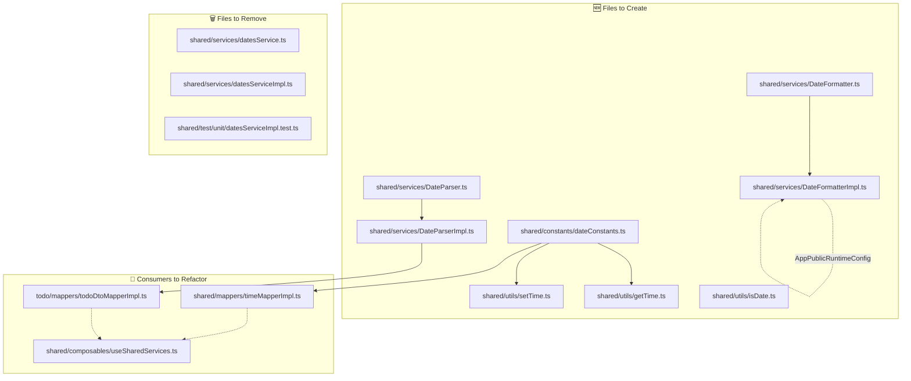

# Refactoring Plan: DatesService → DateFormatter + DateParser Services + Standalone Utils

## Overview

Split the `DatesService`/`DatesServiceImpl` class pair into two separate DI-registered service classes (`DateFormatter`, `DateParser`) and three standalone utility functions (`setTime`, `getTime`, `isDate`). Time constants are extracted to `shared/constants/dateConstants.ts`.

---

## New File Structure

```
app/modules/shared/
├── constants/
│   └── dateConstants.ts              # Time constants (second, minute, hour, day in ms)
├── services/
│   ├── DateFormatter.ts              # Abstract service: formatDate, formatDateOptional
│   ├── DateFormatterImpl.ts          # Implementation (depends on AppPublicRuntimeConfig)
│   ├── DateParser.ts                 # Abstract service: fromString, fromStringOptional
│   └── DateParserImpl.ts             # Implementation (no extra deps)
├── utils/
│   ├── setTime.ts                    # Standalone util
│   ├── getTime.ts                    # Standalone util
│   └── isDate.ts                     # Standalone util
└── test/unit/
    ├── DateFormatterImpl.test.ts     # Tests for formatting
    ├── DateParserImpl.test.ts        # Tests for parsing
    ├── setTime.test.ts               # Tests for setTime
    ├── getTime.test.ts               # Tests for getTime
    └── isDate.test.ts                # Tests for isDate
```

---

## Phase 1: Create New Files

### 1.1 `shared/constants/dateConstants.ts`

Extract time constants from `DatesServiceImpl`:

```ts
export const secondInMilliseconds = 1000;
export const minuteInMilliseconds = 60 * secondInMilliseconds;
export const hourInMilliseconds = 60 * minuteInMilliseconds;
export const dayInMilliseconds = 24 * hourInMilliseconds;
```

### 1.2 `shared/services/DateParser.ts` — Abstract Service

```ts
export abstract class DateParser {
  abstract fromString(dateString: string): Date;
  abstract fromStringOptional(dateString?: string): Date | undefined;
}
```

### 1.3 `shared/services/DateParserImpl.ts` — Implementation

```ts
import { DateTime } from 'luxon';
import { DateParser } from './DateParser';

export class DateParserImpl extends DateParser {
  fromString(dateString: string): Date {
    const dateTime = DateTime.fromISO(dateString);
    if (!dateTime.isValid) {
      throw new Error(`Date(${dateString}) parsing error`);
    }
    return dateTime.toJSDate();
  }

  fromStringOptional(dateString?: string): Date | undefined {
    if (!dateString) {
      return undefined;
    }
    return this.fromString(dateString);
  }
}
```

### 1.4 `shared/services/DateFormatter.ts` — Abstract Service

```ts
export abstract class DateFormatter {
  abstract formatDate(date: Date, options?: Intl.DateTimeFormatOptions): string;
  abstract formatDateOptional(date?: Date, options?: Intl.DateTimeFormatOptions): string;
}
```

### 1.5 `shared/services/DateFormatterImpl.ts` — Implementation

```ts
import { DateTime } from 'luxon';
import { DateFormatter } from './DateFormatter';
import { AppPublicRuntimeConfig } from "../interfaces/appPublicRuntimeConfig";
import { dependency } from '../decorators/dependency';

@dependency(AppPublicRuntimeConfig)
export class DateFormatterImpl extends DateFormatter {
  constructor(private config: AppPublicRuntimeConfig) {
    super();
  }

  formatDate(date: Date, options = DateTime.DATETIME_SHORT): string {
    const dateTime = DateTime.fromJSDate(date);
    if (!dateTime.isValid) {
      throw new Error(`Invalid date(${date.toString()})`);
    }
    const result = dateTime
      .setLocale(this.config.locale)
      .toLocaleString(options);
    if (!result) {
      throw new Error(`Date(${date.toString()}) formatting error`);
    }
    return result;
  }

  formatDateOptional(date?: Date, options?: Intl.DateTimeFormatOptions): string {
    if (!date) {
      return '';
    }
    return this.formatDate(date, options);
  }
}
```

### 1.6 `shared/utils/setTime.ts`

```ts
import { DateTime, Duration } from 'luxon';
import { dayInMilliseconds } from '../constants/dateConstants';

export function setTime(date: Date, milliseconds: number): Date {
  if (milliseconds < 0) {
    throw new Error('Milliseconds cannot be negative');
  }
  if (milliseconds > dayInMilliseconds) {
    throw new Error('Milliseconds cannot exceed 24 hours');
  }
  const datetime = DateTime.fromJSDate(date);
  const time = Duration.fromMillis(milliseconds);
  const result = datetime.set({
    hour: time.hours,
    minute: time.minutes,
    second: time.seconds,
    millisecond: time.milliseconds
  });
  return result.toJSDate();
}
```

### 1.7 `shared/utils/getTime.ts`

```ts
import { DateTime } from 'luxon';
import { dayInMilliseconds } from '../constants/dateConstants';

export function getTime(date: Date): number {
  const datetime = DateTime.fromJSDate(date);
  const startOfDay = datetime.startOf('day');
  const diff = datetime.diff(startOfDay, 'milliseconds').milliseconds;
  if (diff < 0 || diff > dayInMilliseconds) {
    throw new Error('Time value is out of valid range (0-24 hours)');
  }
  return diff;
}
```

### 1.8 `shared/utils/isDate.ts`

```ts
export function isDate(value: any): value is Date {
  return value instanceof Date;
}
```

---

## Phase 2: Create New Test Files

### 2.1 `shared/test/unit/DateParserImpl.test.ts`

Migrate `fromString` and `fromStringOptional` describe blocks from `datesServiceImpl.test.ts`. No config needed — `DateParserImpl` has no DI deps.

### 2.2 `shared/test/unit/DateFormatterImpl.test.ts`

Migrate `formatDate` and `formatDateOptional` describe blocks from `datesServiceImpl.test.ts`. Needs `AppPublicRuntimeConfig` mock with `locale: 'ru'`.

### 2.3 `shared/test/unit/setTime.test.ts`

Migrate `setTime` describe block from `datesServiceImpl.test.ts`.

### 2.4 `shared/test/unit/getTime.test.ts`

Migrate `getTime` describe block from `datesServiceImpl.test.ts`.

### 2.5 `shared/test/unit/isDate.test.ts`

Migrate `isDate` describe block from `datesServiceImpl.test.ts`.

---

## Phase 3: Refactor Consumers

### 3.1 `shared/mappers/timeMapperImpl.ts`

- Remove `@dependency(DatesService)` decorator
- Remove `DatesService` import and constructor injection
- Import `hourInMilliseconds`, `minuteInMilliseconds`, `secondInMilliseconds` from `../constants/dateConstants`
- Use constants directly instead of `this.datesService.*`

### 3.2 `todo/mappers/todoDtoMapperImpl.ts`

- Replace `@dependency(DatesService)` with `@dependency(DateParser)`
- Replace `DatesService` import with `DateParser` import from `@/modules/shared/services/DateParser`
- Replace `private datesService: DatesService` with `private dateParser: DateParser` in constructor
- Replace `this.datesService.fromStringOptional(...)` with `this.dateParser.fromStringOptional(...)`

### 3.3 `shared/composables/useSharedServices.ts`

- Remove imports of `DatesService` and `DatesServiceImpl`
- Add imports of `DateParser`, `DateParserImpl`, `DateFormatter`, `DateFormatterImpl`
- Replace `useServiceRegistration(DatesService).to(DatesServiceImpl).asTransient()` with two registrations:
  - `useServiceRegistration(DateParser).to(DateParserImpl).asTransient()`
  - `useServiceRegistration(DateFormatter).to(DateFormatterImpl).asTransient()`

---

## Phase 4: Remove Old Files

### 4.1 Delete `shared/services/datesService.ts`
### 4.2 Delete `shared/services/datesServiceImpl.ts`
### 4.3 Delete `shared/test/unit/datesServiceImpl.test.ts`

---

## Dependency Graph



---

## Execution Order

The refactoring must be done in this exact order to avoid broken intermediate states:

1. **Phase 1** — Create all new files (constants, services, utils) — no existing code breaks
2. **Phase 2** — Create new test files for all extracted modules
3. **Phase 3** — Refactor consumers one by one
4. **Phase 4** — Delete old service files and old test file (only after all consumers are migrated)