# Refactoring Plan: Split DatesService & StringsService into Standalone Utility Functions

## Overview

Remove the `DatesService`/`DatesServiceImpl` and `StringsService`/`StringsServiceImpl` service classes and their DI registrations. Replace them with standalone utility functions (one per file) under `shared/utils/` and constants under `shared/constants/`. All consumers will import these utilities directly.

---

## Phase 1: Create New Files

### 1.1 Create `shared/constants/dateConstants.ts`

Extract the time constants from `DatesServiceImpl`:

```ts
// app/modules/shared/constants/dateConstants.ts
export const secondInMilliseconds = 1000;
export const minuteInMilliseconds = 60 * secondInMilliseconds;
export const hourInMilliseconds = 60 * minuteInMilliseconds;
export const dayInMilliseconds = 24 * hourInMilliseconds;
```

### 1.2 Create `shared/constants/localeConstants.ts`

Extract the default locale from `nuxt.config.ts`:

```ts
// app/modules/shared/constants/localeConstants.ts
export const defaultLocale = 'ru';
```

### 1.3 Create `shared/utils/getDateFromString.ts`

```ts
// app/modules/shared/utils/getDateFromString.ts
import { DateTime } from 'luxon';

export function getDateFromString(dateString: string): Date
{
    const dateTime = DateTime.fromISO(dateString);

    if (!dateTime.isValid)
    {
        throw new Error(`Date(${dateString}) parsing error`);
    }

    return dateTime.toJSDate();
}
```

### 1.4 Create `shared/utils/getDateFromStringOptional.ts`

```ts
// app/modules/shared/utils/getDateFromStringOptional.ts
import { getDateFromString } from './getDateFromString';

export function getDateFromStringOptional(dateString?: string): Date | undefined
{
    if (!dateString)
    {
        return undefined;
    }

    return getDateFromString(dateString);
}
```

### 1.5 Create `shared/utils/formatDate.ts`

```ts
// app/modules/shared/utils/formatDate.ts
import { DateTime } from 'luxon';
import { defaultLocale } from '../constants/localeConstants';

export function formatDate(date: Date, options = DateTime.DATETIME_SHORT, locale = defaultLocale): string
{
    const dateTime = DateTime.fromJSDate(date);

    if (!dateTime.isValid)
    {
        throw new Error(`Invalid date(${date.toString()})`);
    }

    const result = dateTime
        .setLocale(locale)
        .toLocaleString(options);

    if (!result)
    {
        throw new Error(`Date(${date.toString()}) formatting error`);
    }

    return result;
}
```

### 1.6 Create `shared/utils/formatDateOptional.ts`

```ts
// app/modules/shared/utils/formatDateOptional.ts
import { formatDate } from './formatDate';

export function formatDateOptional(date?: Date, options?: Intl.DateTimeFormatOptions, locale?: string): string
{
    if (!date)
    {
        return '';
    }

    return formatDate(date, options, locale);
}
```

### 1.7 Create `shared/utils/setTime.ts`

```ts
// app/modules/shared/utils/setTime.ts
import { DateTime, Duration } from 'luxon';
import { dayInMilliseconds } from '../constants/dateConstants';

export function setTime(date: Date, milliseconds: number): Date
{
    if (milliseconds < 0)
    {
        throw new Error('Milliseconds cannot be negative');
    }

    if (milliseconds > dayInMilliseconds)
    {
        throw new Error('Milliseconds cannot exceed 24 hours');
    }

    const datetime = DateTime.fromJSDate(date);
    const time = Duration.fromMillis(milliseconds);

    const result = datetime.set({
        hour: time.hours,
        minute: time.minutes,
        second: time.seconds,
        millisecond: time.milliseconds
    });

    return result.toJSDate();
}
```

### 1.8 Create `shared/utils/getTime.ts`

```ts
// app/modules/shared/utils/getTime.ts
import { DateTime } from 'luxon';
import { dayInMilliseconds } from '../constants/dateConstants';

export function getTime(date: Date): number
{
    const datetime = DateTime.fromJSDate(date);
    const startOfDay = datetime.startOf('day');
    const diff = datetime.diff(startOfDay, 'milliseconds').milliseconds;

    if (diff < 0 || diff > dayInMilliseconds)
    {
        throw new Error('Time value is out of valid range (0-24 hours)');
    }

    return diff;
}
```

### 1.9 Create `shared/utils/isDate.ts`

```ts
// app/modules/shared/utils/isDate.ts
export function isDate(value: any): value is Date
{
    return value instanceof Date;
}
```

### 1.10 Create `shared/utils/isStringEmpty.ts`

```ts
// app/modules/shared/utils/isStringEmpty.ts
export function isStringEmpty(str: string | null | undefined): boolean
{
    if (!str)
    {
        return true;
    }

    const trimmedStr = str.trim();

    return trimmedStr.length === 0;
}
```

### 1.11 Create `shared/utils/postfixNotEmptyString.ts`

```ts
// app/modules/shared/utils/postfixNotEmptyString.ts
import { isStringEmpty } from './isStringEmpty';

export function postfixNotEmptyString(str: string | undefined, postfix: string, separator?: string): string | undefined;
export function postfixNotEmptyString(str: string, postfix: string, separator?: string): string;
export function postfixNotEmptyString(str: string | undefined, postfix: string, separator = '-'): string | undefined
{
    if (isStringEmpty(str))
    {
        return str;
    }

    return str + separator + postfix;
}
```

---

## Phase 2: Refactor Consumers

### 2.1 `shared/mappers/internal/timeMapperImpl.ts`

- Remove `@dependency(DatesService)` decorator
- Remove `DatesService` import and constructor injection
- Import `hourInMilliseconds`, `minuteInMilliseconds`, `secondInMilliseconds` from `../constants/dateConstants`
- Use constants directly instead of `this.datesService.*`

### 2.2 `todo/mappers/todoDtoMapperImpl.ts`

- Remove `@dependency(DatesService)` decorator
- Remove `DatesService` import and constructor injection
- Import `getDateFromStringOptional` from `@/modules/shared/utils/getDateFromStringOptional`
- Call `getDateFromStringOptional(...)` directly

### 2.3 `todo/entities/todoBase.ts`

- Remove `StringsService` import and constructor injection
- Import `isStringEmpty` from `@/modules/shared/utils/isStringEmpty`
- Change `isNew` getter to call `isStringEmpty(this.id)` directly
- Remove `stringsService` parameter from constructor
- Update `clone()` to not pass `stringsService`

### 2.4 `todo/factories/todoFactoryImpl.ts`

- Remove `@dependency(StringsService)` decorator
- Remove `StringsService` import and constructor injection
- Update `create()` to call `new ToDoBase()` without `stringsService`

### 2.5 `uikit/viewmodels/infoRowViewmodelImpl.ts`

- Remove `StringsService` import and constructor injection
- Import `isStringEmpty` from `@/modules/shared/utils/isStringEmpty`
- Change `isEmpty` getter to call `isStringEmpty(this.content.value)` directly

### 2.6 `uikit/viewmodels/infoBlockViewmodelImpl.ts`

- Remove `StringsService` import and constructor injection
- Update `createRow()` to call `new InfoRowViewmodelImpl()` without `stringsService`

### 2.7 `uikit/viewmodels/cardViewmodelImpl.ts`

- Remove `StringsService` import and `useService(StringsService)` call
- Import `isStringEmpty` from `@/modules/shared/utils/isStringEmpty`
- Use `isStringEmpty(...)` directly in the computed

### 2.8 `shared/composables/useSharedServices.ts`

- Remove imports of `DatesService`, `StringsService`, `DatesServiceImpl`, `StringsServiceImpl`
- Remove the two `useServiceRegistration(...)` lines for DatesService and StringsService

---

## Phase 3: Remove Old Files

### 3.1 Delete `shared/services/datesServiceImpl.ts`
### 3.2 Delete `shared/services/stringsServiceImpl.ts`
### 3.3 Delete `shared/interfaces/datesService.ts`
### 3.4 Delete `shared/interfaces/stringsService.ts`

---

## Phase 4: Update Tests

### 4.1 Create `shared/test/unit/getDateFromString.test.ts`
### 4.2 Create `shared/test/unit/getDateFromStringOptional.test.ts`
### 4.3 Create `shared/test/unit/formatDate.test.ts`
### 4.4 Create `shared/test/unit/formatDateOptional.test.ts`
### 4.5 Create `shared/test/unit/setTime.test.ts`
### 4.6 Create `shared/test/unit/getTime.test.ts`
### 4.7 Create `shared/test/unit/isDate.test.ts`
### 4.8 Create `shared/test/unit/isStringEmpty.test.ts`
### 4.9 Create `shared/test/unit/postfixNotEmptyString.test.ts`
### 4.10 Update `shared/test/unit/datesServiceImpl.test.ts` → delete (replaced by individual tests)
### 4.11 Update `shared/test/unit/stringsServiceImpl.test.ts` → delete (replaced by individual tests)
### 4.12 Update `todo/test/unit/todoImpl.test.ts` — remove `StringsServiceImpl` import, use `isStringEmpty` directly or remove the import

---

## Dependency Graph / Impact Map

```mermaid
flowchart TD
    subgraph REMOVED["🗑️ Files to Remove"]
        DS[shared/interfaces/datesService.ts]
        SS[shared/interfaces/stringsService.ts]
        DSI[shared/services/datesServiceImpl.ts]
        SSI[shared/services/stringsServiceImpl.ts]
    end

    subgraph CREATED["🆕 Files to Create"]
        DC[shared/constants/dateConstants.ts]
        LC[shared/constants/localeConstants.ts]
        FS[shared/utils/getDateFromString.ts]
        FSO[shared/utils/getDateFromStringOptional.ts]
        FD[shared/utils/formatDate.ts]
        FDO[shared/utils/formatDateOptional.ts]
        ST[shared/utils/setTime.ts]
        GT[shared/utils/getTime.ts]
        ID[shared/utils/isDate.ts]
        ISE[shared/utils/isStringEmpty.ts]
        PNE[shared/utils/postfixNotEmptyString.ts]
    end

    subgraph CONSUMERS["🔧 Consumers to Refactor"]
        TMI[shared/mappers/internal/timeMapperImpl.ts]
        TDMI[todo/mappers/todoDtoMapperImpl.ts]
        TB[todo/entities/todoBase.ts]
        TFI[todo/factories/todoFactoryImpl.ts]
        IRVI[uikit/viewmodels/infoRowViewmodelImpl.ts]
        IBVI[uikit/viewmodels/infoBlockViewmodelImpl.ts]
        CVI[uikit/viewmodels/cardViewmodelImpl.ts]
        USS[shared/composables/useSharedServices.ts]
    end

    DC --> TMI
    LC --> FD
    LC --> FDO
    FS --> FSO
    FS --> TDMI
    FSO --> TDMI
    FD --> FDO
    ISE --> PNE
    ISE --> TB
    ISE --> IRVI
    ISE --> CVI
    ST -.-> TMI
    GT -.-> TMI
```



---

## Execution Order

The refactoring should be done in this exact order to avoid broken intermediate states:

1. **Phase 1** — Create all new utility files and constants (no existing code breaks)
2. **Phase 4 (tests first)** — Create new test files for utilities
3. **Phase 2** — Refactor all consumers one by one
4. **Phase 3** — Delete old service files (only after all consumers are migrated)
5. **Final cleanup** — Delete old test files for services