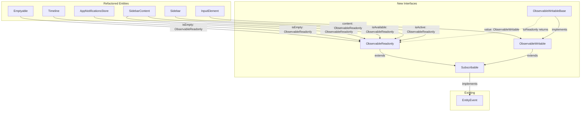

# Refactor Event Subscriptions to Observable Pattern

## Goal

Replace the current pattern of paired `readonly property` + `on*Change(handler, disposeToken?)` methods with a unified `ObservableReadonly<T>` / `ObservableWritable<T>` interface pattern, backed by a reusable `ObservableWritableBase<T>` implementation.

## Current Pattern

Currently, many entities have this pattern:

```typescript
// Interface
abstract class Foo {
    abstract readonly isEmpty: boolean;
    abstract onEmptyStateChange(handler: Action<[boolean]>, disposeToken?: DisposeToken): void;
}

// Implementation
class FooBase extends Foo {
    private emptyStateChangeEvent = new EntityEvent<boolean>();
    
    get isEmpty() { return this.internalValue; }
    
    override onEmptyStateChange(handler, disposeToken?) {
        this.emptyStateChangeEvent.on(handler, disposeToken);
    }
    
    private setEmpty(value: boolean) {
        this.internalValue = value;
        this.emptyStateChangeEvent.emit(value);
    }
}
```

## Target Pattern

```typescript
// Interface
abstract class Foo {
    abstract isEmpty: ObservableReadonly<boolean>;
}

// Implementation
class FooBase extends Foo {
    readonly isEmpty = new ObservableWritableBase<boolean>(false);
    
    // Directly assign to isEmpty.value instead of a private setter
    // this.isEmpty.value = newValue;
}
```

## New Interfaces & Classes

### `Subscribable<T>` (interface)

```typescript
export interface Subscribable<T> {
    on(handler: Action<[T]>, disposeToken?: DisposeToken): void;
}
```

### `ObservableReadonly<T>` (interface)

```typescript
export interface ObservableReadonly<T> extends Subscribable<T> {
    readonly value: T;
}
```

### `isObservable` guard function

```typescript
export function isObservable<T>(value: unknown): value is ObservableReadonly<T>
{
    return typeof value === 'object'
        && value !== null
        && 'value' in value
        && 'on' in value
        && typeof (value as ObservableReadonly<T>).on === 'function';
}
```

This guard is placed in the same file as `ObservableReadonly` and is used by `isEmptyable` to check if a property is an `ObservableReadonly`.

### `ObservableWritable<T>` (interface)

```typescript
export interface ObservableWritable<T> extends Subscribable<T> {
    value: T;
}
```

### `ObservableWritableConfiguration` (type)

```typescript
export type ObservableWritableConfiguration = {
    deferred?: boolean;
    skipEmitOnSameValue?: boolean;
};
```

This is a separate type from `EntityEventConfiguration` even though it has the same shape, to avoid coupling the observable layer to the internal event implementation details.

### `ObservableWritableBase<T>` (class)

```typescript
export class ObservableWritableBase<T> implements ObservableWritable<T> {
    private event = new EntityEvent<T>(configuration);
    private valueInternal: T;
    
    constructor(
        defaultValue: T,
        configuration?: ObservableWritableConfiguration
    ) {
        this.valueInternal = defaultValue;
    }
    
    get value(): T { return this.valueInternal; }
    set value(value: T) {
        if (this.valueInternal !== value) {
            this.valueInternal = value;
            this.event.emit(value);
        }
    }
    
    on(handler: Action<[T]>, disposeToken?: DisposeToken): void {
        this.event.on(handler, disposeToken);
    }
    
    toReadonly(): ObservableReadonly<T> {
        return this; // same instance, but typed as readonly
    }
    
    [Symbol.dispose](): void {
        this.event[Symbol.dispose]();
    }
}
```

The `configuration` parameter is passed directly to the internal `EntityEvent` constructor.

### `EntityEvent` implements `Subscribable<T>`

`EntityEvent<T>` already has an `on` method with the same signature. We just add `implements Subscribable<T>` to the class declaration.

## Files to Create

| # | File | Description |
|---|------|-------------|
| 1 | `app/modules/shared/interfaces/subscribable.ts` | `Subscribable<T>` interface |
| 2 | `app/modules/shared/interfaces/observableReadonly.ts` | `ObservableReadonly<T>` interface |
| 3 | `app/modules/shared/interfaces/observableWritable.ts` | `ObservableWritable<T>` interface |
| 4 | `app/modules/shared/types/observableWritableConfiguration.ts` | `ObservableWritableConfiguration` type |
| 5 | `app/modules/shared/entities/observableWritableBase.ts` | `ObservableWritableBase<T>` implementation |

## Files to Modify

### Step 2: EntityEvent implements Subscribable

| File | Change |
|------|--------|
| `app/modules/shared/entities/entityEvent.ts` | Add `implements Subscribable<T>` to class declaration |

### Step 3: Emptyable

| File | Change |
|------|--------|
| `app/modules/shared/interfaces/emptyable.ts` | Replace `readonly isEmpty: boolean` + `onEmptyStateChange` with `isEmpty: ObservableReadonly<boolean>` |
| `app/modules/shared/interfaces/emptyable.ts` | Update `isEmptyable()` guard to check for `ObservableReadonly` shape |

### Step 4: Timeline

| File | Change |
|------|--------|
| `app/modules/notifications/entities/timeline.ts` | Replace `readonly isEmpty: boolean` + `onEmptyStateChange` with `isEmpty: ObservableReadonly<boolean>` |
| `app/modules/notifications/entities/timelineBase.ts` | Use `ObservableWritableBase<boolean>` for `isEmpty` |

### Step 5: AppNotificationsStore

| File | Change |
|------|--------|
| `app/modules/notifications/entities/appNotificationsStore.ts` | Replace `readonly isEmpty: boolean` + `onEmptyStateChange` with `isEmpty: ObservableReadonly<boolean>` |
| `app/modules/notifications/entities/appNotificationsStoreBase.ts` | Use `ObservableWritableBase<boolean>` for `isEmpty` |

### Step 6: SidebarContent.isActive

| File | Change |
|------|--------|
| `app/modules/sidebar/entities/sidebarContent.ts` | Replace `readonly isActive: boolean` + `onActiveStateChange` with `isActive: ObservableReadonly<boolean>` |
| `app/modules/sidebar/entities/sidebarContentBase.ts` | Use `ObservableWritableBase<boolean>` for `isActive` |

### Step 7: SidebarContent.isAvailable

| File | Change |
|------|--------|
| `app/modules/sidebar/entities/sidebarContent.ts` | Replace `readonly isAvailable: boolean` + `onAvailabilityChange` with `isAvailable: ObservableReadonly<boolean>` |
| `app/modules/sidebar/entities/sidebarContentBase.ts` | Use `ObservableWritableBase<boolean>` for `isAvailable` |

### Step 8: Sidebar.content

| File | Change |
|------|--------|
| `app/modules/sidebar/entities/sidebar.ts` | Replace `readonly content: SidebarContent \| undefined` + `onContentChange` with `content: ObservableReadonly<SidebarContent \| undefined>` |
| `app/modules/sidebar/entities/sidebarBase.ts` | Use `ObservableWritableBase<SidebarContent \| undefined>` for `content` |

### Step 9: Update consumers

| File | Change |
|------|--------|
| `app/modules/notifications/entities/timelineBase.ts` | Update `isEmpty` to return `ObservableReadonly<boolean>` from store |
| `app/modules/sidebar/entities/sidebarContentBase.ts` | Update `isEmptyable` guard and `content.onEmptyStateChange(...)` to `content.isEmpty.on(...)` |
| `app/modules/sidebar/entities/sidebarBase.ts` | Update `this.contentInternal` usage |

### Step 10: Update mocks and tests

| File | Change |
|------|--------|
| `app/modules/notifications/mocks/appNotificationsStoreMock.ts` | Update mock shape |
| `app/modules/uikit/mocks/timelineMock.ts` | Update mock shape |
| `app/modules/notifications/test/nuxt/notificationBase.test.ts` | Update test assertions |
| `app/modules/notifications/test/nuxt/notificationsStoreBase.test.skip.ts` | Update test assertions |
| `app/modules/uikit/test/nuxt/timelineBase.test.skip.ts` | Update test assertions |

## Detailed Refactoring per Entity

### Emptyable (`app/modules/shared/interfaces/emptyable.ts`)

**Before:**
```typescript
export abstract class Emptyable {
    abstract readonly isEmpty: boolean;
    abstract onEmptyStateChange(handler: Action<[isEmpty: boolean]>, disposeToken?: DisposeToken): void;
}
```

**After:**
```typescript
export abstract class Emptyable {
    abstract isEmpty: ObservableReadonly<boolean>;
}
```

The `isEmptyable()` guard function now uses `isObservable` to check the `isEmpty` property:
```typescript
export function isEmptyable(value: unknown): value is Emptyable {
    return typeof value === 'object'
        && value !== null
        && 'isEmpty' in value
        && isObservable<boolean>((value as Emptyable).isEmpty);
}
```

### Timeline (`app/modules/notifications/entities/timeline.ts`)

**Before:**
```typescript
export abstract class Timeline extends UIElement implements Emptyable {
    abstract readonly isEmpty: boolean;
    abstract onEmptyStateChange(handler: Action<[isEmpty: boolean]>, diposeToken?: DisposeToken): void;
}
```

**After:**
```typescript
export abstract class Timeline extends UIElement implements Emptyable {
    abstract isEmpty: ObservableReadonly<boolean>;
}
```

### TimelineBase (`app/modules/notifications/entities/timelineBase.ts`)

**Before:**
```typescript
override get isEmpty(): boolean {
    return this.notificationStore.isEmpty;
}

override onEmptyStateChange(handler: Action<[isEmpty: boolean]>, disposeToken?: DisposeToken): void {
    this.notificationStore.onEmptyStateChange(handler, disposeToken);
}
```

**After:**
```typescript
override get isEmpty(): ObservableReadonly<boolean> {
    return this.notificationStore.isEmpty;
}
```

`TimelineBase` simply delegates to the store's `isEmpty` observable directly, without creating its own `ObservableWritableBase`.

### AppNotificationsStore (`app/modules/notifications/entities/appNotificationsStore.ts`)

**Before:**
```typescript
export abstract class AppNotificationsStore implements Disposable, Emptyable {
    abstract readonly isEmpty: boolean;
    abstract onEmptyStateChange(handler: Action<[isEmpty: boolean]>, diposeToken?: DisposeToken): void;
}
```

**After:**
```typescript
export abstract class AppNotificationsStore implements Disposable, Emptyable {
    abstract isEmpty: ObservableReadonly<boolean>;
}
```

### AppNotificationsStoreBase (`app/modules/notifications/entities/appNotificationsStoreBase.ts`)

**Before:**
```typescript
private emptyStateChangeEvent = new EntityEvent<boolean>();

get isEmpty() {
    return this.notifications.length === 0;
}

override onEmptyStateChange(handler: Action<[isEmpty: boolean]>, disposeToken?: DisposeToken): void {
    this.emptyStateChangeEvent.on(handler, disposeToken);
}
```

**After:**
```typescript
readonly isEmpty = new ObservableWritableBase<boolean>(true);

// In addNotification:
if (this.notifications.length === 1) {
    this.isEmpty.value = false;
}
```

### SidebarContent (`app/modules/sidebar/entities/sidebarContent.ts`)

**Before:**
```typescript
export abstract class SidebarContent extends UIElement implements Disposable {
    abstract readonly isActive: boolean;
    abstract readonly isAvailable: boolean;
    abstract onActiveStateChange(callback: Action<[boolean]>, disposeToken?: DisposeToken): void;
    abstract onAvailabilityChange(callback: Action<[boolean]>, disposeToken?: DisposeToken): void;
}
```

**After:**
```typescript
export abstract class SidebarContent extends UIElement implements Disposable {
    abstract isActive: ObservableReadonly<boolean>;
    abstract isAvailable: ObservableReadonly<boolean>;
}
```

### SidebarContentBase (`app/modules/sidebar/entities/sidebarContentBase.ts`)

**Before:**
```typescript
private isActiveInternal = false;
private isAvailableInternal = false;
private activeStateChangeEvent = new EntityEvent<boolean>();
private availabilityChangeEvent = new EntityEvent<boolean>();

get isActive(): boolean { return this.isActiveInternal; }
get isAvailable(): boolean { return this.isAvailableInternal; }

override onActiveStateChange(callback, disposeToken?) {
    this.activeStateChangeEvent.on(callback, disposeToken);
}
override onAvailabilityChange(callback, disposeToken?) {
    this.availabilityChangeEvent.on(callback, disposeToken);
}

private setActivity(isActive: boolean): void {
    if (this.isActiveInternal !== isActive) {
        this.isActiveInternal = isActive;
        this.activeStateChangeEvent.emit(this.isActiveInternal);
    }
}
```

**After:**
```typescript
readonly isActive = new ObservableWritableBase<boolean>(false);
readonly isAvailable = new ObservableWritableBase<boolean>(false);

private setActivity(isActive: boolean): void {
    this.isActive.value = isActive; // ObservableWritableBase handles change detection
}
```

### Sidebar (`app/modules/sidebar/entities/sidebar.ts`)

**Before:**
```typescript
export abstract class Sidebar implements Disposable {
    abstract readonly content: SidebarContent | undefined;
    abstract readonly timeline: SidebarContent;
    abstract onContentChange(callback: Action<[SidebarContent | undefined]>, disposeToken?: DisposeToken): void;
}
```

**After:**
```typescript
export abstract class Sidebar implements Disposable {
    abstract readonly content: ObservableReadonly<SidebarContent | undefined>;
    abstract readonly timeline: SidebarContent;
}
```

### SidebarBase (`app/modules/sidebar/entities/sidebarBase.ts`)

**Before:**
```typescript
private contentInternal: SidebarContent | undefined;
private contentChangeEvent = new EntityEvent<SidebarContent | undefined>({ deferred: true });

get content() { return this.contentInternal; }

override onContentChange(callback, disposeToken?) {
    this.contentChangeEvent.on(callback, disposeToken);
}

activateContent(content: SidebarContent): void {
    if (this.contentInternal != content) {
        if (this.contentInternal != undefined) {
            this.contentInternal.deactivate();
        }
        this.contentInternal = content;
        this.contentChangeEvent.emit(content);
    }
}
```

**After:**
```typescript
readonly content = new ObservableWritableBase<SidebarContent | undefined>(undefined);

activateContent(content: SidebarContent): void {
    if (this.content.value !== content) {
        if (this.content.value != undefined) {
            this.content.value.deactivate();
        }
        this.content.value = content;
    }
}
```

### sidebarContentBase.ts (setupContent)

**Before:**
```typescript
if (isEmptyable(content)) {
    this.setAvailability(!content.isEmpty);
    content.onEmptyStateChange(isEmpty => {
        this.setAvailability(!isEmpty);
    });
}
```

**After:**
```typescript
if (isEmptyable(content)) {
    this.setAvailability(!content.isEmpty.value);
    content.isEmpty.on(isEmpty => {
        this.setAvailability(!isEmpty);
    });
}
```

## Mermaid Diagram



## Execution Order

The refactoring should be done in this order to avoid compilation errors:

1. **Create new interfaces and class** (`Subscribable`, `ObservableReadonly`, `ObservableWritable`, `ObservableWritableBase`, `ObservableWritableConfiguration`)
2. **Update `EntityEvent`** to implement `Subscribable<T>`
3. **Refactor `Emptyable`** (foundation interface used by others)
4. **Refactor `AppNotificationsStore`** and `Timeline` (depend on `Emptyable`)
5. **Refactor `SidebarContent`** and `Sidebar`
6. **Update all Base implementations**
7. **Update all consumers** (sidebarContentBase, sidebarBase, etc.)
8. **Update mocks and tests**
9. **Verify build**