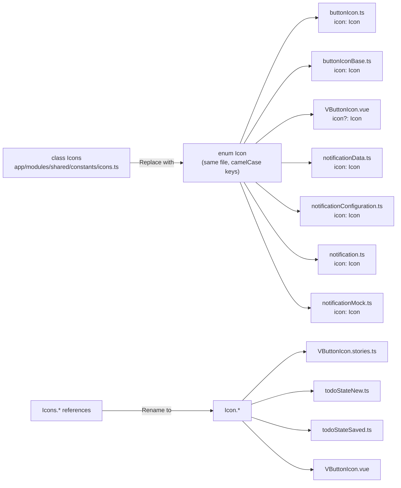

# Plan: Refactor `Icons` Class into `Icon` Enum and Replace `string` Icon References

## Goal

Refactor the existing `Icons` static class into a TypeScript `enum` (named `Icon`), and replace all `icon: string` type annotations with `icon: Icon` for type safety — while keeping the convenience of named references.

## Design Decision: Enum over Union Type

Using a TypeScript `enum` gives us **both** benefits:

| Aspect | Union type only | Enum |
|--------|----------------|------|
| Type safety (compile-time validation) | ✅ | ✅ |
| Named references (`Icon.pencilSquare`) | ❌ (must use raw strings) | ✅ |
| IDE autocompletion on values | ✅ | ✅ |
| IDE autocompletion on named refs | ❌ | ✅ |
| Refactoring-friendly (rename propagates) | ❌ | ✅ |
| Single source of truth | ✅ | ✅ |

## Current State

### Current `Icons` class (`app/modules/shared/constants/icons.ts`)
```typescript
export class Icons
{
    static readonly pencilSquare = 'i-heroicons-pencil-square';
    static readonly trash = 'i-heroicons-trash';
    // ... etc
}
```

### Current `Color` type (`app/modules/uikit/types/color.ts`) — reference pattern
```typescript
export type Color = 'primary' | 'secondary' | 'success' | 'info' | 'warning' | 'error' | 'neutral';
```

## Proposed `Icon` Enum

```typescript
export enum Icon
{
    pencilSquare = 'i-heroicons-pencil-square',
    trash = 'i-heroicons-trash',
    plus = 'i-heroicons-plus',
    check = 'i-heroicons-check',
    xMark = 'i-heroicons-x-mark',
    heart = 'i-heroicons-heart',
    star = 'i-heroicons-star',
    cog = 'i-heroicons-cog',
    bell = 'i-heroicons-bell',
    home = 'i-heroicons-home',
    questionMarkCircle = 'i-heroicons-question-mark-circle',
    exclamationTriangle = 'i-heroicons-exclamation-triangle',
}
```

**Naming convention:** camelCase enum members (matching the existing `Icons` class property names).

## Files to Modify

### File 1: `app/modules/shared/constants/icons.ts` — Replace class with enum

- Replace `class Icons` with `enum Icon`
- Keep all member names the same (camelCase)
- Keep the file in the same location to minimize import changes

### File 2: `app/modules/uikit/entities/buttons/buttonIcon.ts`

- Change `abstract icon: string` → `abstract icon: Icon`
- Change import: `import { Icons }` → `import { Icon }`

### File 3: `app/modules/uikit/entities/buttons/buttonIconBase.ts`

- Change `get icon(): string` → `get icon(): Icon`
- Change `set icon(value: string)` → `set icon(value: Icon)`
- Change `icon: ''` default → `icon: Icon.questionMarkCircle`
- Change import: `import { Icons }` → `import { Icon }`

### File 4: `app/modules/uikit/components/VButtonIcon.vue`

- Change `icon?: string` → `icon?: Icon`
- Replace `Icons.questionMarkCircle` → `Icon.questionMarkCircle`
- Change import: `import { Icons }` → `import { Icon }`

### File 5: `app/modules/overlay/types/notificationData.ts`

- Change `icon: string` → `icon: Icon`
- Add import: `import type { Icon } from '@/modules/shared/constants/icons'`

### File 6: `app/modules/overlay/entities/notificationConfiguration.ts`

- Change `icon: string` → `icon: Icon`
- Add import: `import type { Icon } from '@/modules/shared/constants/icons'`

### File 7: `app/modules/overlay/entities/notification.ts`

- Change `icon: string` in the type → `icon: Icon`
- Change `abstract readonly icon: string` → `abstract readonly icon: Icon`
- Add import: `import type { Icon } from '@/modules/shared/constants/icons'`

### File 8: `app/modules/overlay/mocks/notificationMock.ts`

- Change `icon: 'info'` → `icon: Icon.questionMarkCircle`
- Add import: `import { Icon } from '@/modules/shared/constants/icons'`

### File 9: `app/modules/uikit/stories/VButtonIcon.stories.ts`

- Replace all `Icons.pencilSquare` → `Icon.pencilSquare` (and similarly for all others)
- Change import: `import { Icons }` → `import { Icon }`

### File 10: `app/modules/todo/entities/todoStateNew.ts`

- Replace `Icons.exclamationTriangle` → `Icon.exclamationTriangle`
- Change import: `import { Icons }` → `import { Icon }`

### File 11: `app/modules/todo/entities/todoStateSaved.ts`

- Replace `Icons.exclamationTriangle` → `Icon.exclamationTriangle`
- Change import: `import { Icons }` → `import { Icon }`

## Migration Diagram



## Type Safety Benefits

- **Compile-time validation:** passing an invalid icon string causes a TypeScript error
- **IDE autocompletion:** both for enum members (`Icon.`) and for the type
- **Refactoring-safe:** renaming an enum member updates all references
- **Named references:** `Icon.exclamationTriangle` is more readable than `'i-heroicons-exclamation-triangle'`
- **Single source of truth:** the enum definition is the canonical list of all available icons