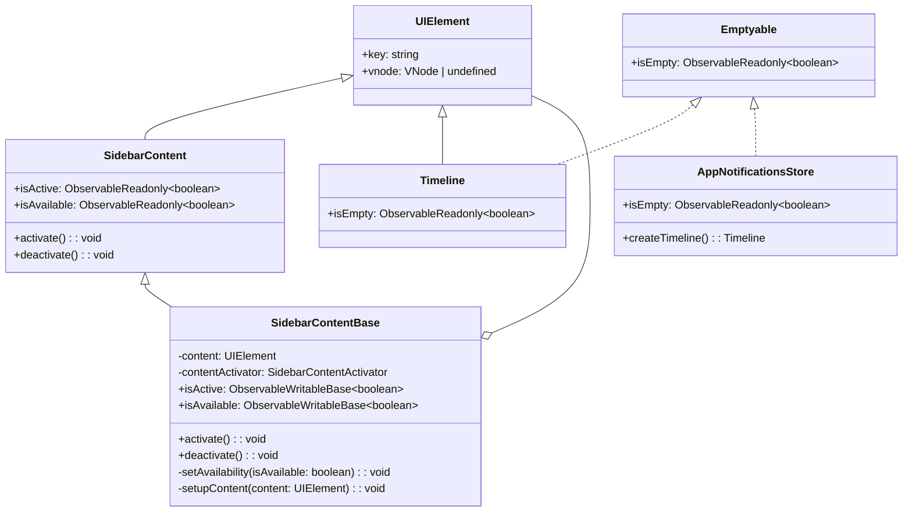
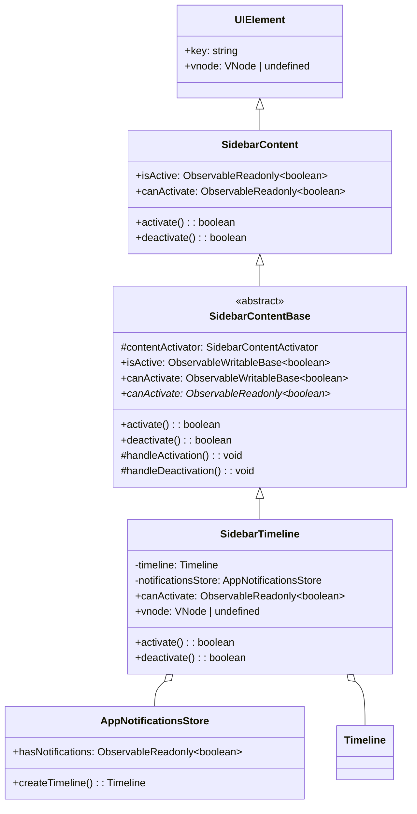

# Refactor Sidebar Content Architecture

## Overview

This plan refactors the sidebar content system to replace the generic `UIElement`-based content with a dedicated `SidebarTimeline` class, remove the `Emptyable` interface, rename properties, and make `SidebarContentBase` abstract with `canActivate` implemented in derived classes.

## Current Architecture



## Target Architecture



## Step-by-step Plan

### Step 1: Rename `AppNotificationsStore.isEmpty` → `hasNotifications`

**File:** [`app/modules/notifications/entities/appNotificationsStore.ts`](app/modules/notifications/entities/appNotificationsStore.ts)

- Remove `Emptyable` import and `implements Emptyable`
- Rename `isEmpty: ObservableReadonly<boolean>` → `hasNotifications: ObservableReadonly<boolean>`

**File:** [`app/modules/notifications/entities/appNotificationsStoreBase.ts`](app/modules/notifications/entities/appNotificationsStoreBase.ts)

- Rename `isEmpty = new ObservableWritableBase<boolean>(true)` → `hasNotifications = new ObservableWritableBase<boolean>(false)`
- Update `this.isEmpty[Symbol.dispose]()` → `this.hasNotifications[Symbol.dispose]()`
- Update `this.isEmpty.value = false` → `this.hasNotifications.value = true`
- Invert the logic: `hasNotifications` starts as `false`, becomes `true` when first notification is added

### Step 2: Remove `Timeline.isEmpty`

**File:** [`app/modules/notifications/entities/timeline.ts`](app/modules/notifications/entities/timeline.ts)

- Remove `Emptyable` import and `implements Emptyable`
- Remove `abstract isEmpty: ObservableReadonly<boolean>`

**File:** [`app/modules/notifications/entities/timelineBase.ts`](app/modules/notifications/entities/timelineBase.ts)

- Remove the `isEmpty` getter override

### Step 3: Remove `Emptyable` interface

**File:** [`app/modules/shared/interfaces/emptyable.ts`](app/modules/shared/interfaces/emptyable.ts)

- Delete the entire file (both `Emptyable` class and `isEmptyable` function)

### Step 4: Rename `SidebarContent.isAvailable` → `canActivate`

**File:** [`app/modules/sidebar/entities/sidebarContent.ts`](app/modules/sidebar/entities/sidebarContent.ts)

- Rename `isAvailable: ObservableReadonly<boolean>` → `canActivate: ObservableReadonly<boolean>`
- Change `activate(): void` → `activate(): boolean`
- Change `deactivate(): void` → `deactivate(): boolean`

### Step 5: Refactor `SidebarContentBase` to abstract with `canActivate`

**File:** [`app/modules/sidebar/entities/sidebarContentBase.ts`](app/modules/sidebar/entities/sidebarContentBase.ts)

- Make class `abstract`
- Remove `content: UIElement` constructor parameter
- Remove `isEmptyable` import and `setupContent` method
- Remove `setAvailability` method
- Rename `isAvailable` → `canActivate` (as `ObservableWritableBase<boolean>`)
- Add abstract `canActivate` getter that returns `ObservableReadonly<boolean>` (derived classes implement this)
- Add `protected handleActivation(): void` — empty virtual method, called after guards pass but before `contentActivator.activateContent(this)`
- Add `protected handleDeactivation(): void` — empty virtual method, called after guards pass but before `contentActivator.deactivateContent(this)`
- Change `activate()` to return `boolean`:
  - Return `false` if `canActivate.value` is `false` or `isActive.value` is already `true`
  - Otherwise call `this.handleActivation()`, then `contentActivator.activateContent(this)`, set `isActive.value = true`, return `true`
- Change `deactivate()` to return `boolean`:
  - Return `false` if `isActive.value` is `false`
  - Otherwise call `this.handleDeactivation()`, then `contentActivator.deactivateContent(this)`, set `isActive.value = false`, return `true`
- Remove `vnode` getter (will be implemented in derived classes)

### Step 6: Create `SidebarTimeline` class

**File:** [`app/modules/sidebar/entities/sidebarTimeline.ts`](app/modules/sidebar/entities/sidebarTimeline.ts) (new file)

- Extends `SidebarContentBase`
- Constructor accepts `AppNotificationsStore` and `SidebarContentActivator`
- Stores a private `timeline: Timeline | undefined` field
- `get canActivate()` returns `this.notificationsStore.hasNotifications`
- `override handleActivation()`:
  - Create `this.timeline = this.notificationsStore.createTimeline()`
- `override handleDeactivation()`:
  - Dispose `this.timeline`, set to `undefined`
- `get vnode()` returns `this.timeline?.vnode`
- Implements `[Symbol.dispose]()` to clean up timeline and dispose token

### Step 7: Update `SidebarBase` to use `SidebarTimeline`

**File:** [`app/modules/sidebar/entities/sidebarBase.ts`](app/modules/sidebar/entities/sidebarBase.ts)

- Replace `SidebarContentBase` import with `SidebarTimeline`
- Change constructor:
  ```typescript
  this.timeline = new SidebarTimeline(this, notificationsStore);
  ```

### Step 8: Update `Sidebar` abstract class

**File:** [`app/modules/sidebar/entities/sidebar.ts`](app/modules/sidebar/entities/sidebar.ts)

- No changes needed — `timeline` is already typed as `SidebarContent`, and `SidebarTimeline` extends `SidebarContentBase` which extends `SidebarContent`

## Files to Modify

| # | File | Action |
|---|------|--------|
| 1 | `app/modules/shared/interfaces/emptyable.ts` | **Delete** |
| 2 | `app/modules/notifications/entities/appNotificationsStore.ts` | Rename `isEmpty` → `hasNotifications`, remove `Emptyable` |
| 3 | `app/modules/notifications/entities/appNotificationsStoreBase.ts` | Rename `isEmpty` → `hasNotifications`, invert logic |
| 4 | `app/modules/notifications/entities/timeline.ts` | Remove `isEmpty`, remove `Emptyable` |
| 5 | `app/modules/notifications/entities/timelineBase.ts` | Remove `isEmpty` getter |
| 6 | `app/modules/sidebar/entities/sidebarContent.ts` | Rename `isAvailable` → `canActivate`, return `boolean` from activate/deactivate |
| 7 | `app/modules/sidebar/entities/sidebarContentBase.ts` | Make abstract, remove content/setupContent/setAvailability, rename isAvailable→canActivate, activate/deactivate return boolean |
| 8 | `app/modules/sidebar/entities/sidebarTimeline.ts` | **New file** — extends SidebarContentBase |
| 9 | `app/modules/sidebar/entities/sidebarBase.ts` | Use SidebarTimeline instead of SidebarContentBase |

## Implementation Order

1. Delete `emptyable.ts`
2. Update `AppNotificationsStore` (rename `isEmpty` → `hasNotifications`)
3. Update `AppNotificationsStoreBase` (rename + invert logic)
4. Update `Timeline` (remove `isEmpty`)
5. Update `TimelineBase` (remove `isEmpty` getter)
6. Update `SidebarContent` (rename `isAvailable` → `canActivate`, return types)
7. Refactor `SidebarContentBase` (abstract, remove content, return boolean)
8. Create `SidebarTimeline`
9. Update `SidebarBase` (use `SidebarTimeline`)