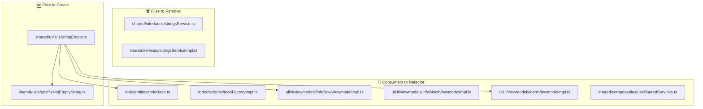

# Refactoring Plan: Split StringsService into Standalone Utility Functions

## Overview

Remove the `StringsService`/`StringsServiceImpl` service class and its DI registration. Replace them with standalone utility functions (one per file) under `shared/utils/`. All consumers will import these utilities directly.

`DatesService`/`DatesServiceImpl` will remain unchanged.

---

## Phase 1: Create New Files

### 1.1 Create `shared/utils/isStringEmpty.ts`

```ts
// app/modules/shared/utils/isStringEmpty.ts
export function isStringEmpty(str: string | null | undefined): boolean
{
    if (!str)
    {
        return true;
    }

    const trimmedStr = str.trim();

    return trimmedStr.length === 0;
}
```

### 1.2 Create `shared/utils/postfixNotEmptyString.ts`

```ts
// app/modules/shared/utils/postfixNotEmptyString.ts
import { isStringEmpty } from './isStringEmpty';

export function postfixNotEmptyString(str: string | undefined, postfix: string, separator?: string): string | undefined;
export function postfixNotEmptyString(str: string, postfix: string, separator?: string): string;
export function postfixNotEmptyString(str: string | undefined, postfix: string, separator = '-'): string | undefined
{
    if (isStringEmpty(str))
    {
        return str;
    }

    return str + separator + postfix;
}
```

---

## Phase 2: Refactor Consumers

### 2.1 `todo/entities/todoBase.ts`

- Remove `StringsService` import and constructor injection
- Import `isStringEmpty` from `@/modules/shared/utils/isStringEmpty`
- Change `isNew` getter to call `isStringEmpty(this.id)` directly
- Remove `stringsService` parameter from constructor
- Update `clone()` to not pass `stringsService`

### 2.2 `todo/factories/todoFactoryImpl.ts`

- Remove `@dependency(StringsService)` decorator
- Remove `StringsService` import and constructor injection
- Update `create()` to call `new ToDoBase()` without `stringsService`

### 2.3 `uikit/viewmodels/infoRowViewmodelImpl.ts`

- Remove `StringsService` import and constructor injection
- Import `isStringEmpty` from `@/modules/shared/utils/isStringEmpty`
- Change `isEmpty` getter to call `isStringEmpty(this.content.value)` directly

### 2.4 `uikit/viewmodels/infoBlockViewmodelImpl.ts`

- Remove `StringsService` import and constructor injection
- Update `createRow()` to call `new InfoRowViewmodelImpl()` without `stringsService`

### 2.5 `uikit/viewmodels/cardViewmodelImpl.ts`

- Remove `StringsService` import and `useService(StringsService)` call
- Import `isStringEmpty` from `@/modules/shared/utils/isStringEmpty`
- Use `isStringEmpty(...)` directly in the computed

### 2.6 `shared/composables/useSharedServices.ts`

- Remove imports of `StringsService`, `StringsServiceImpl`
- Remove the `useServiceRegistration(StringsService).to(StringsServiceImpl).asTransient()` line

---

## Phase 3: Remove Old Files

### 3.1 Delete `shared/services/stringsServiceImpl.ts`
### 3.2 Delete `shared/interfaces/stringsService.ts`

---

## Phase 4: Update Tests

### 4.1 Create `shared/test/unit/isStringEmpty.test.ts`
### 4.2 Create `shared/test/unit/postfixNotEmptyString.test.ts`
### 4.3 Delete `shared/test/unit/stringsServiceImpl.test.ts`
### 4.4 Update `todo/test/unit/todoImpl.test.ts` — remove `StringsServiceImpl` import, use `isStringEmpty` directly or remove the import

---

## Dependency Graph / Impact Map



---

## Execution Order

The refactoring should be done in this exact order to avoid broken intermediate states:

1. **Phase 1** — Create both new utility files (no existing code breaks)
2. **Phase 4 (tests first)** — Create new test files for utilities
3. **Phase 2** — Refactor all consumers one by one
4. **Phase 3** — Delete old service files (only after all consumers are migrated)
5. **Final cleanup** — Delete old test file for service