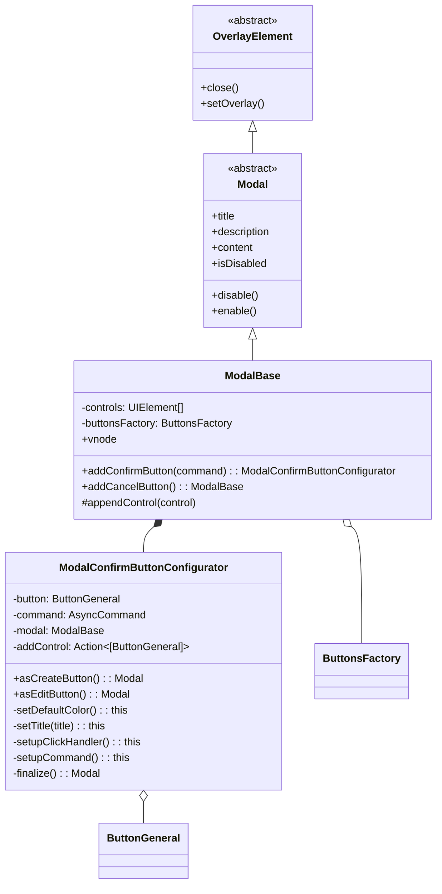
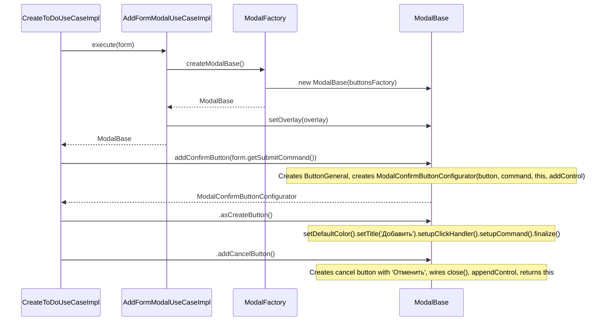

# Plan: Remove ModalConfirm Class, Move Controls to ModalBase with Fluent API

## Analysis

### Current Architecture

The current hierarchy is:

```
OverlayElement
  └── Modal (abstract)
        └── ModalBase (concrete, has controls array, appendControl)
              └── ModalConfirmBase (concrete, adds confirm + cancel buttons)
                    └── ModalConfirm (abstract interface)
```

**ModalBase** ([`app/modules/overlay/entities/modalBase.ts`](app/modules/overlay/entities/modalBase.ts)):
- Has a `controls` array of `UIElement`
- Has `appendControl(control)` method — **protected**
- Renders controls in `vnode` getter

**ModalConfirmBase** ([`app/modules/overlay/entities/modalConfirmBase.ts`](app/modules/overlay/entities/modalConfirmBase.ts)):
- Extends `ModalBase`
- Creates confirm + cancel buttons in constructor
- Has `setConfirmCommand(command)` method
- Has `toAddMode()` / `toEditMode()` methods to change confirm button title
- Has `disable()` / `enable()` overrides that also toggle buttons

**ModalConfirm** ([`app/modules/overlay/entities/modalConfirm.ts`](app/modules/overlay/entities/modalConfirm.ts)):
- Abstract interface declaring `toAddMode()`, `toEditMode()`, `setConfirmCommand()`

### Consumers

1. **`AddFormModalUseCase`** ([`app/modules/overlay/usecases/addFormModalUseCase.ts`](app/modules/overlay/usecases/addFormModalUseCase.ts)) - returns `ModalConfirm<Form>`
2. **`AddFormModalUseCaseImpl`** ([`app/modules/overlay/usecases/addFormModalUseCaseImpl.ts`](app/modules/overlay/usecases/addFormModalUseCaseImpl.ts)) - creates via `ModalFactory.createModalConfirm()`
3. **`ModalFactory`** ([`app/modules/overlay/factories/modalFactory.ts`](app/modules/overlay/factories/modalFactory.ts)) - has `createModalConfirm()` method
4. **`CreateToDoUseCaseImpl`** ([`app/modules/todo/usecases/createToDoUseCaseImpl.ts`](app/modules/todo/usecases/createToDoUseCaseImpl.ts)) - calls `modal.setConfirmCommand(...)` + `modal.toAddMode()`
5. **`EditToDoUseCaseImpl`** ([`app/modules/todo/usecases/editToDoUseCaseImpl.ts`](app/modules/todo/usecases/editToDoUseCaseImpl.ts)) - calls `modal.setConfirmCommand(...)` + `modal.toEditMode()`
6. **`modalConfirmMock`** ([`app/modules/overlay/mocks/modalConfirmMock.ts`](app/modules/overlay/mocks/modalConfirmMock.ts)) - mock for tests

### Goal

Remove `ModalConfirm` and `ModalConfirmBase` entirely. Move confirm/cancel button construction into `ModalBase` via a fluent API:

```typescript
modal
    .addConfirmButton(form.getSubmitCommand()).asCreateButton()
    .addCancelButton();
```

## Design Decisions (Confirmed with User)

1. **`ModalConfirmButtonConfigurator`** has two terminal methods:
   - `asCreateButton(): Modal` — constructs the confirm button with 'Добавить' title
   - `asEditButton(): Modal` — constructs the confirm button with 'Сохранить' title
   - No `withTitle()` method — only two invariants are supported

2. **Button is created by `ModalBase.addConfirmButton()`** and passed to the configurator. The configurator's role is purely configuration — it doesn't create the button.

3. **`ModalConfirmButtonConfigurator` dependencies:**
   - `button: ButtonGeneral` — the pre-created button instance
   - `command: AsyncCommand` — the command to wire up
   - `modal: ModalBase` — the modal instance (for `disable()`, `enable()`, `close()`)
   - `addControl: Action<[ButtonGeneral]>` — callback to append button to controls

4. **`asCreateButton()` / `asEditButton()` are composed from private methods** that operate on `this.button`. Each private method returns `this` for internal fluent chaining:
   - `setDefaultColor()` — sets color to 'primary'
   - `setTitle(title: string)` — sets the button title
   - `setupClickHandler()` — wires click to `command.executeAsync()`
   - `setupCommand()` — subscribes to command `stateChange` and `result` events

5. **`ButtonsFactory`** becomes a constructor dependency of `ModalBase`.

6. **`addCancelButton()`** returns `ModalBase` directly (no configurator needed — only one invariant).

7. **Chaining**: `asCreateButton()` / `asEditButton()` return `Modal` so you can chain `.addCancelButton()`:
   ```typescript
   modal.addConfirmButton(cmd).asCreateButton().addCancelButton();
   ```

## Proposed Design

### New Types

#### `ModalConfirmButtonConfigurator`
A fluent builder returned by `addConfirmButton()`:

```typescript
class ModalConfirmButtonConfigurator
{
    constructor(
        private button: ButtonGeneral,
        private command: AsyncCommand,
        private modal: ModalBase,
        private addControl: Action<[ButtonGeneral]>
    );

    asCreateButton(): Modal;
    asEditButton(): Modal;

    // Private fluent helpers (all return this):
    private setDefaultColor(): this;
    private setTitle(title: string): this;
    private setupClickHandler(): this;
    private setupCommand(): this;
}
```

### Changes to `ModalBase`

- Add constructor parameter: `buttonsFactory: ButtonsFactory`
- Add `addConfirmButton(command: AsyncCommand): ModalConfirmButtonConfigurator` method
- Add `addCancelButton(): ModalBase` method
- Wire up cancel button to call `this.close()`
- Store buttons in the existing `controls` array via `appendControl()`

### Changes to `Modal` (abstract)

- No changes needed — stays clean with existing abstract members

### Files to Remove

- `app/modules/overlay/entities/modalConfirm.ts`
- `app/modules/overlay/entities/modalConfirmBase.ts`
- `app/modules/overlay/mocks/modalConfirmMock.ts`

### Files to Modify

| File | Changes |
|------|---------|
| [`app/modules/overlay/entities/modalBase.ts`](app/modules/overlay/entities/modalBase.ts) | Add `ButtonsFactory` constructor param. Add `addConfirmButton()`, `addCancelButton()`, `ModalConfirmButtonConfigurator` class. |
| [`app/modules/overlay/factories/modalFactory.ts`](app/modules/overlay/factories/modalFactory.ts) | Remove `createModalConfirm()`. Update `createModalBase()` to pass `ButtonsFactory`. |
| [`app/modules/overlay/usecases/addFormModalUseCase.ts`](app/modules/overlay/usecases/addFormModalUseCase.ts) | Change return type from `ModalConfirm<Form>` to `Modal<Form>`. |
| [`app/modules/overlay/usecases/addFormModalUseCaseImpl.ts`](app/modules/overlay/usecases/addFormModalUseCaseImpl.ts) | Use `createModalBase()` instead of `createModalConfirm()`. |
| [`app/modules/todo/usecases/createToDoUseCaseImpl.ts`](app/modules/todo/usecases/createToDoUseCaseImpl.ts) | Replace with fluent API: `.addConfirmButton(cmd).asCreateButton().addCancelButton()`. |
| [`app/modules/todo/usecases/editToDoUseCaseImpl.ts`](app/modules/todo/usecases/editToDoUseCaseImpl.ts) | Replace with fluent API: `.addConfirmButton(cmd).asEditButton().addCancelButton()`. |
| [`app/modules/overlay/mocks/addFormModalUseCaseMock.ts`](app/modules/overlay/mocks/addFormModalUseCaseMock.ts) | Change type from `ModalConfirm` to `Modal`. |

## Detailed Step-by-Step Implementation Plan

### Step 1: Modify `ModalBase` — Add `ButtonsFactory` dependency and fluent methods

**File:** [`app/modules/overlay/entities/modalBase.ts`](app/modules/overlay/entities/modalBase.ts)

Changes:
1. Add imports: `ButtonsFactory`, `ButtonGeneral`, `AsyncCommand`, `CommandState`, `Action`
2. Add `buttonsFactory: ButtonsFactory` as constructor parameter
3. Add `addConfirmButton(command: AsyncCommand): ModalConfirmButtonConfigurator` method
4. Add `addCancelButton(): ModalBase` method
5. Add `ModalConfirmButtonConfigurator` class (can be in same file)

**`ModalConfirmButtonConfigurator` implementation:**
```typescript
class ModalConfirmButtonConfigurator
{
    constructor(
        private button: ButtonGeneral,
        private command: AsyncCommand,
        private modal: ModalBase,
        private addControl: Action<[ButtonGeneral]>
    );

    asCreateButton(): Modal
    {
        return this
            .setDefaultColor()
            .setTitle('Добавить')
            .setupClickHandler()
            .setupCommand()
            .finalize();
    }

    asEditButton(): Modal
    {
        return this
            .setDefaultColor()
            .setTitle('Сохранить')
            .setupClickHandler()
            .setupCommand()
            .finalize();
    }

    private setDefaultColor(): this
    {
        this.button.color = 'primary';
        return this;
    }

    private setTitle(title: string): this
    {
        this.button.title = title;
        return this;
    }

    private setupClickHandler(): this
    {
        this.button.on({
            click: () => this.command.executeAsync()
        });
        return this;
    }

    private setupCommand(): this
    {
        this.command.on({
            stateChange: (state) =>
            {
                const isBusy = state === CommandState.busy;
                if (isBusy)
                {
                    this.modal.disable();
                    this.button.showLoader();
                }
                else
                {
                    this.modal.enable();
                    this.button.hideLoader();
                }
            },
            result: (result) =>
            {
                if (result)
                {
                    this.modal.close();
                }
            }
        });
        return this;
    }

    private finalize(): Modal
    {
        this.addControl(this.button);
        return this.modal;
    }
}
```

**`addConfirmButton` in ModalBase:**
```typescript
addConfirmButton(command: AsyncCommand): ModalConfirmButtonConfigurator
{
    const button = this.buttonsFactory.createButtonGeneral();

    return new ModalConfirmButtonConfigurator(
        button,
        command,
        this,
        (btn) => this.appendControl(btn)
    );
}
```

**`addCancelButton` in ModalBase:**
```typescript
addCancelButton(): ModalBase
{
    const button = this.buttonsFactory.createButtonGeneral();
    button.title = 'Отменить';
    button.on({
        click: () => this.close()
    });
    this.appendControl(button);
    return this;
}
```

### Step 2: Update `ModalFactory`

**File:** [`app/modules/overlay/factories/modalFactory.ts`](app/modules/overlay/factories/modalFactory.ts)

Changes:
1. Remove `createModalConfirm()` method entirely
2. Update `createModalBase()` to pass `this.buttonsFactory` to `ModalBase` constructor:
   ```typescript
   createModalBase(): Modal
   {
       return new ModalBase(this.buttonsFactory);
   }
   ```
3. Remove imports of `ModalConfirm` and `ModalConfirmBase`

### Step 3: Update `AddFormModalUseCase` and `AddFormModalUseCaseImpl`

**File:** [`app/modules/overlay/usecases/addFormModalUseCase.ts`](app/modules/overlay/usecases/addFormModalUseCase.ts)
- Change return type from `ModalConfirm<Form>` to `Modal<Form>`
- Remove import of `ModalConfirm`

**File:** [`app/modules/overlay/usecases/addFormModalUseCaseImpl.ts`](app/modules/overlay/usecases/addFormModalUseCaseImpl.ts)
- Change `execute()` to use `this.modalFactory.createModalBase()` instead of `createModalConfirm()`
- Update return type from `ModalConfirm<Form>` to `Modal<Form>`
- Remove import of `ModalConfirm`

### Step 4: Update Use Case Consumers

**File:** [`app/modules/todo/usecases/createToDoUseCaseImpl.ts`](app/modules/todo/usecases/createToDoUseCaseImpl.ts)
Replace:
```typescript
const modal = this.addFormModalUseCase.execute(form);
modal.setConfirmCommand(form.getSubmitCommand());
modal.toAddMode();
```
With:
```typescript
const modal = this.addFormModalUseCase.execute(form);
modal.addConfirmButton(form.getSubmitCommand()).asCreateButton();
modal.addCancelButton();
```

**File:** [`app/modules/todo/usecases/editToDoUseCaseImpl.ts`](app/modules/todo/usecases/editToDoUseCaseImpl.ts)
Replace:
```typescript
const modal = this.addFormModalUseCase.execute(form);
modal.setConfirmCommand(form.getSubmitCommand());
modal.toEditMode();
```
With:
```typescript
const modal = this.addFormModalUseCase.execute(form);
modal.addConfirmButton(form.getSubmitCommand()).asEditButton();
modal.addCancelButton();
```

### Step 5: Remove Obsolete Files

- Delete [`app/modules/overlay/entities/modalConfirm.ts`](app/modules/overlay/entities/modalConfirm.ts)
- Delete [`app/modules/overlay/entities/modalConfirmBase.ts`](app/modules/overlay/entities/modalConfirmBase.ts)
- Delete [`app/modules/overlay/mocks/modalConfirmMock.ts`](app/modules/overlay/mocks/modalConfirmMock.ts)

### Step 6: Update Mock and Verify

**File:** [`app/modules/overlay/mocks/addFormModalUseCaseMock.ts`](app/modules/overlay/mocks/addFormModalUseCaseMock.ts)
- Change type from `ModalConfirm` to `Modal`

Search for any remaining references to `ModalConfirm`, `ModalConfirmBase`, `modalConfirmMock` and fix them.

Run TypeScript compiler to verify no type errors.

## Architecture Diagram



## Usage Flow



## Todo List for Implementation

1. Modify [`app/modules/overlay/entities/modalBase.ts`](app/modules/overlay/entities/modalBase.ts):
   - Add `ButtonsFactory` constructor parameter
   - Add `ModalConfirmButtonConfigurator` class with private fluent helpers
   - Add `addConfirmButton()` method
   - Add `addCancelButton()` method

2. Update [`app/modules/overlay/factories/modalFactory.ts`](app/modules/overlay/factories/modalFactory.ts):
   - Remove `createModalConfirm()`
   - Update `createModalBase()` to pass `ButtonsFactory`

3. Update [`app/modules/overlay/usecases/addFormModalUseCase.ts`](app/modules/overlay/usecases/addFormModalUseCase.ts):
   - Change return type to `Modal<Form>`

4. Update [`app/modules/overlay/usecases/addFormModalUseCaseImpl.ts`](app/modules/overlay/usecases/addFormModalUseCaseImpl.ts):
   - Use `createModalBase()` instead of `createModalConfirm()`

5. Update [`app/modules/todo/usecases/createToDoUseCaseImpl.ts`](app/modules/todo/usecases/createToDoUseCaseImpl.ts):
   - Replace with fluent API

6. Update [`app/modules/todo/usecases/editToDoUseCaseImpl.ts`](app/modules/todo/usecases/editToDoUseCaseImpl.ts):
   - Replace with fluent API

7. Delete obsolete files:
   - `app/modules/overlay/entities/modalConfirm.ts`
   - `app/modules/overlay/entities/modalConfirmBase.ts`
   - `app/modules/overlay/mocks/modalConfirmMock.ts`

8. Update [`app/modules/overlay/mocks/addFormModalUseCaseMock.ts`](app/modules/overlay/mocks/addFormModalUseCaseMock.ts):
   - Change type from `ModalConfirm` to `Modal`

9. Verify no broken references and run TypeScript compilation