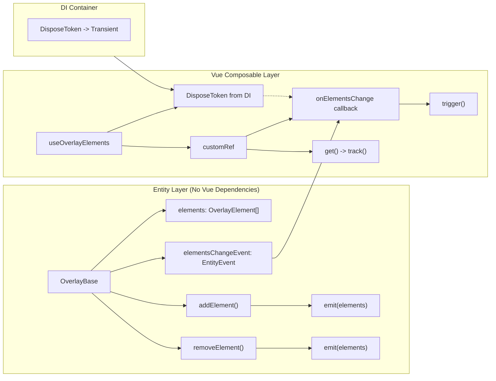

# Remove Vue Dependencies from Overlay

## Objective

Remove Vue reactivity (`shallowReactive`, `computed`, `Ref`) from the Overlay entity layer, making it framework-agnostic. The reactivity will be handled at the composable layer (`useOverlayElements`) using `customRef` and `EntityEvent`/`DisposeToken`.

## Current Architecture

```
Overlay (abstract)
  └── getElements(): OverlayElement[]  ← returns reactive array

OverlayBase (concrete)
  └── elements = shallowReactive(new Array<OverlayElement>())  ← Vue reactive
  └── getElements(): OverlayElement[]  ← returns shallowReactive proxy
  └── addElement(element)  ← pushes to reactive array
  └── removeElement(element)  ← removes from reactive array

useOverlayElements (composable)
  └── overlayElements = computed(() => overlay.getElements())  ← Vue computed
  └── returns { overlayElements: Ref<OverlayElement[]> }
```

## Target Architecture

```
Overlay (abstract) implements Disposable
  └── getElements(): OverlayElement[]  ← returns plain array
  └── onElementsChange(callback, disposeToken): void  ← new abstract method
  └── [Symbol.dispose](): void  ← abstract

OverlayBase (concrete)
  └── elements: OverlayElement[]  ← plain regular array (NO shallowReactive)
  └── elementsChangeEvent = new EntityEvent<OverlayElement[]>()  ← event-driven
  └── getElements(): OverlayElement[]  ← returns plain array
  └── onElementsChange(callback, disposeToken): void  ← subscribes to event
  └── addElement(element)  ← pushes + emits event
  └── removeElement(element)  ← removes + emits event
  └── [Symbol.dispose](): void  ← disposes elementsChangeEvent

useOverlayElements (composable)
  └── overlayElements = customRef(...)  ← manually tracks changes
  └── uses onElementsChange with DisposeToken to update ref
  └── returns { overlayElements: Ref<OverlayElement[]> }
```

## Detailed Steps

### Step 1: Convert `OverlayBase.elements` from `shallowReactive` to regular array

**File:** [`app/modules/overlay/entities/overlayBase.ts`](app/modules/overlay/entities/overlayBase.ts:12)

- Remove `import { shallowReactive } from 'vue'` (or wherever it's imported from)
- Change:
  ```ts
  private elements = shallowReactive(new Array<OverlayElement>());
  ```
  to:
  ```ts
  private elements = new Array<OverlayElement>();
  ```

### Step 2: Add `elementsChangeEvent` private field to `OverlayBase`

**File:** [`app/modules/overlay/entities/overlayBase.ts`](app/modules/overlay/entities/overlayBase.ts)

- Add import for `EntityEvent`:
  ```ts
  import { EntityEvent } from '@/modules/shared/entities/entityEvent';
  ```
- Add private field:
  ```ts
  private elementsChangeEvent = new EntityEvent<OverlayElement[]>();
  ```

### Step 3: Add `onElementsChange` method to `OverlayBase`

**File:** [`app/modules/overlay/entities/overlayBase.ts`](app/modules/overlay/entities/overlayBase.ts)

- Add import for `DisposeToken`:
  ```ts
  import { DisposeToken } from '@/modules/shared/entities/disposeToken';
  ```
- Add import for `Action`:
  ```ts
  import type { Action } from '@/modules/shared/types/action';
  ```
- Add public method:
  ```ts
  onElementsChange(callback: Action<[OverlayElement[]]>, disposeToken: DisposeToken): void
  {
      this.elementsChangeEvent.on(callback, disposeToken);
  }
  ```

### Step 4: Call `elementsChangeEvent.emit()` on array modifications

**File:** [`app/modules/overlay/entities/overlayBase.ts`](app/modules/overlay/entities/overlayBase.ts)

- In `addElement()`, after `this.elements.push(element)`, add:
  ```ts
  this.elementsChangeEvent.emit(this.elements);
  ```
- In `removeElement()`, after `removeFromArray(this.elements, element)`, add:
  ```ts
  this.elementsChangeEvent.emit(this.elements);
  ```

### Step 4b: Add `[Symbol.dispose]()` to `OverlayBase` to dispose `elementsChangeEvent`

**File:** [`app/modules/overlay/entities/overlayBase.ts`](app/modules/overlay/entities/overlayBase.ts)

- Add `[Symbol.dispose]()` method to `OverlayBase`:
  ```ts
  override [Symbol.dispose](): void
  {
      this.elementsChangeEvent[Symbol.dispose]();
  }
  ```
- This ensures the `EntityEvent` is properly disposed when the `OverlayBase` singleton is cleaned up by the DI container.

### Step 5: Make `Overlay` abstract class implement `Disposable` and add new abstract methods

**File:** [`app/modules/overlay/entities/overlay.ts`](app/modules/overlay/entities/overlay.ts)

- Add imports:
  ```ts
  import type { Action } from '@/modules/shared/types/action';
  import type { DisposeToken } from '@/modules/shared/entities/disposeToken';
  ```
- Make the class implement `Disposable`:
  ```ts
  export abstract class Overlay implements Disposable
  ```
- Add abstract `onElementsChange` method:
  ```ts
  abstract onElementsChange(callback: Action<[OverlayElement[]]>, disposeToken: DisposeToken): void;
  ```
- Add abstract `[Symbol.dispose]` method:
  ```ts
  abstract [Symbol.dispose](): void;
  ```

### Step 6: Register `DisposeToken` in DI container as transient

**File:** [`app/modules/shared/composables/useSharedServices.ts`](app/modules/shared/composables/useSharedServices.ts)

- Add import:
  ```ts
  import { DisposeToken } from '@/modules/shared/entities/disposeToken';
  ```
- Add registration:
  ```ts
  useServiceRegistration(DisposeToken).to(DisposeToken).asTransient();
  ```

### Step 7: Update `useOverlayElements` composable

**File:** [`app/modules/overlay/composables/useOverlayElements.ts`](app/modules/overlay/composables/useOverlayElements.ts)

- Remove `computed` import from `vue`
- Add `customRef` import from `vue`
- Add import for `DisposeToken`:
  ```ts
  import { DisposeToken } from '@/modules/shared/entities/disposeToken';
  ```
- Add import for `useService`:
  ```ts
  import { useService } from '@/modules/shared/composables/useService';
  ```
- Rewrite the composable to:
  ```ts
  import { customRef } from 'vue';
  import { useService } from '@/modules/shared/composables/useService';
  import { Overlay } from '../entities/overlay';
  import { DisposeToken } from '@/modules/shared/entities/disposeToken';
  import type { OverlayElement } from '../entities/overlayElement';
  import type { Ref } from 'vue';

  export function useOverlayElements(): { overlayElements: Ref<OverlayElement[]>; }
  {
      const overlay = useService(Overlay);
      const disposeToken = useService(DisposeToken);

      const overlayElements = customRef<OverlayElement[]>((track, trigger) =>
      {
          overlay.onElementsChange(() =>
          {
              trigger();
          }, disposeToken);

          return {
              get()
              {
                  track();
                  return overlay.getElements();
              },
          };
      });

      return { overlayElements };
  }
  ```

### Step 8: Update `overlay.test.ts`

**File:** [`app/modules/overlay/test/nuxt/overlay.test.ts`](app/modules/overlay/test/nuxt/overlay.test.ts)

- The tests currently check that `getElements()` returns an observable/array. Since `getElements()` now returns a plain array, the tests should still pass as-is because they only check array contents. However, the test description on line 27 says "should return observable with empty array initially" — update it to "should return empty array initially".
- No other changes needed since the tests only verify array contents, not reactivity.

### Step 9: Update `overlayMock.ts`

**File:** [`app/modules/overlay/mocks/overlayMock.ts`](app/modules/overlay/mocks/overlayMock.ts)

- Add `onElementsChange` mock:
  ```ts
  import { vi } from 'vitest';
  import type { Overlay } from '../entities/overlay';

  export const overlayMock = {
      getElements: vi.fn(),
      createModal: vi.fn(),
      removeElement: vi.fn(),
      onElementsChange: vi.fn(),
  } satisfies Overlay;
  ```

## Files Changed Summary

| # | File | Change Type |
|---|------|-------------|
| 1 | `app/modules/overlay/entities/overlayBase.ts` | Modify — remove `shallowReactive`, add `EntityEvent`, `onElementsChange`, `[Symbol.dispose]()`, emit on modifications |
| 2 | `app/modules/overlay/entities/overlay.ts` | Modify — implement `Disposable`, add abstract `onElementsChange` and `[Symbol.dispose]()` methods |
| 3 | `app/modules/shared/composables/useSharedServices.ts` | Modify — register `DisposeToken` as transient |
| 4 | `app/modules/overlay/composables/useOverlayElements.ts` | Modify — rewrite to use `customRef` + `DisposeToken` + `onElementsChange` |
| 5 | `app/modules/overlay/test/nuxt/overlay.test.ts` | Modify — update test description text |
| 6 | `app/modules/overlay/mocks/overlayMock.ts` | Modify — add `onElementsChange` mock |

## Mermaid Diagram: Data Flow After Changes



## Key Design Decisions

1. **`EntityEvent<OverlayElement[]>` emits the full array** — The event passes the current elements array so subscribers get the latest state without needing to call `getElements()` again.

2. **`customRef` with `get()` calling `overlay.getElements()` directly** — The composable uses `customRef` to manually control Vue tracking. The `get()` trap calls `track()` and returns `overlay.getElements()` directly — no caching needed. The `onElementsChange` callback simply calls `trigger()` to invalidate the ref, causing Vue to re-evaluate the getter on next access.

3. **`DisposeToken` as transient** — Each call to `useOverlayElements()` gets a fresh `DisposeToken`. When the component unmounts, the scope is disposed, which disposes the token, which unsubscribes the callback from the event.

4. **`onElementsChange` requires `DisposeToken`** — This follows the existing pattern used in `EntityEvent.on()` and `ModalBase` for callback lifecycle management.