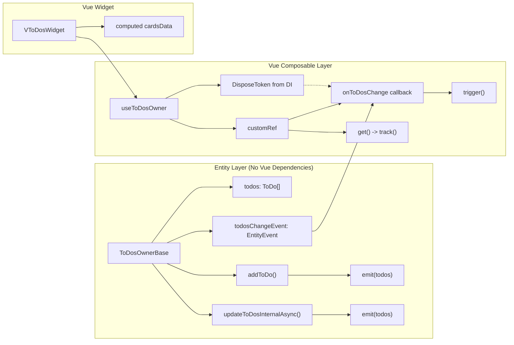

# Remove Vue Dependencies from ToDosOwner

## Objective

Remove Vue reactivity (`shallowReactive`, `Reactive`, `computed`, `Ref`) from the ToDosOwner entity layer, making it framework-agnostic. The reactivity will be handled at the composable layer (`useToDosOwner`) using `customRef` and `EntityEvent`/`DisposeToken`.

All existing todo use cases will be **removed** — their functionality is replaced by the new `useToDosOwner` composable.

## Current Architecture

```
ToDosOwner (abstract)
  └── getAllToDos(): Reactive<ToDo[]>  ← returns Vue reactive

ToDosOwnerBase (concrete)
  └── todos = shallowReactive(new Array<ToDo>())  ← Vue reactive
  └── getAllToDos(): Reactive<ToDo[]>  ← returns shallowReactive proxy
  └── addToDo(todo)  ← pushes to reactive array
  └── updateToDosInternalAsync()  ← uses splice on reactive array

Use Cases (all to be removed):
  └── InitializeToDosUseCase / Impl
  └── CreateToDoUseCase / Impl
  └── EditToDoUseCase / Impl
  └── GetToDoCardsUseCase / Impl

VToDosWidget.vue
  └── uses all 4 use cases via DI
```

## Target Architecture

```
ToDosOwner (abstract) implements Disposable
  └── getAllToDos(): ToDo[]  ← returns plain array
  └── onToDosChange(callback, disposeToken): void  ← new abstract method
  └── [Symbol.dispose](): void  ← abstract

ToDosOwnerBase (concrete)
  └── todos: ToDo[]  ← plain regular array (NO shallowReactive)
  └── todosChangeEvent = new EntityEvent<ToDo[]>()  ← event-driven
  └── getAllToDos(): ToDo[]  ← returns plain array
  └── onToDosChange(callback, disposeToken): void  ← subscribes to event
  └── addToDo(todo)  ← pushes + emits event
  └── updateToDosInternalAsync()  ← splice + emits event
  └── [Symbol.dispose](): void  ← disposes todosChangeEvent

useToDosOwner (composable) — NEW
  └── todos = customRef(...)  ← manually tracks changes
  └── uses onToDosChange with DisposeToken to trigger ref
  └── exposes: { todos, initializeToDosAsync, createToDo, editToDo }

VToDosWidget.vue
  └── uses useToDosOwner composable instead of use cases
```

## Detailed Steps

### Step 1: Update `ToDosOwner` abstract class

**File:** [`app/modules/todo/entities/todosOwner.ts`](app/modules/todo/entities/todosOwner.ts)

- Remove `import type { Reactive } from 'vue'`
- Add imports:
  ```ts
  import type { Action } from '@/modules/shared/types/action';
  import type { DisposeToken } from '@/modules/shared/entities/disposeToken';
  ```
- Make class implement `Disposable`:
  ```ts
  export abstract class ToDosOwner implements Disposable
  ```
- Change `getAllToDos()` return type:
  ```ts
  abstract getAllToDos(): ToDo[];
  ```
- Add abstract methods:
  ```ts
  abstract onToDosChange(callback: Action<[ToDo[]]>, disposeToken: DisposeToken): void;
  abstract [Symbol.dispose](): void;
  ```

### Step 2: Update `ToDosOwnerBase`

**File:** [`app/modules/todo/entities/todosOwnerBase.ts`](app/modules/todo/entities/todosOwnerBase.ts)

- Remove `import { shallowReactive, type Reactive } from 'vue'`
- Add imports:
  ```ts
  import { EntityEvent } from '@/modules/shared/entities/entityEvent';
  import { DisposeToken } from '@/modules/shared/entities/disposeToken';
  import type { Action } from '@/modules/shared/types/action';
  ```
- Change `todos` field:
  ```ts
  private todos = new Array<ToDo>();
  ```
- Add `todosChangeEvent` field:
  ```ts
  private todosChangeEvent = new EntityEvent<ToDo[]>();
  ```
- Change `getAllToDos()` return type and body:
  ```ts
  override getAllToDos(): ToDo[]
  {
      return this.todos;
  }
  ```
- Add `onToDosChange` method:
  ```ts
  override onToDosChange(callback: Action<[ToDo[]]>, disposeToken: DisposeToken): void
  {
      this.todosChangeEvent.on(callback, disposeToken);
  }
  ```
- Add `[Symbol.dispose]()` method:
  ```ts
  override [Symbol.dispose](): void
  {
      this.todosChangeEvent[Symbol.dispose]();
  }
  ```
- In `addToDo()`, after `this.todos.push(todo)`, add:
  ```ts
  this.todosChangeEvent.emit(this.todos);
  ```
- In `updateToDosInternalAsync()`, after `this.todos.splice(...)`, add:
  ```ts
  this.todosChangeEvent.emit(this.todos);
  ```

### Step 3: Create `useToDosOwner` composable

**File:** [`app/modules/todo/composables/useToDosOwner.ts`](app/modules/todo/composables/useToDosOwner.ts) (new file)

```ts
import { customRef } from 'vue';
import { useService } from '@/modules/shared/composables/useService';
import { ToDosOwner } from '../entities/todosOwner';
import { DisposeToken } from '@/modules/shared/entities/disposeToken';
import { ReadonlyRefValueChangeException } from '@/modules/shared/exceptions/readonlyRefValueChangeException';
import type { ToDo } from '../entities/todo';
import type { Ref } from 'vue';

export function useToDosOwner(): {
    todos: Ref<ToDo[]>;
    initializeToDosAsync: () => Promise<void>;
    createToDo: () => void;
    editToDo: (id: string) => Promise<void>;
}
{
    const todosOwner = useService(ToDosOwner);
    const disposeToken = useService(DisposeToken);

    const todos = customRef<ToDo[]>((track, trigger) =>
    {
        todosOwner.onToDosChange(() =>
        {
            trigger();
        }, disposeToken);

        return {
            get()
            {
                track();
                return todosOwner.getAllToDos();
            },
            set()
            {
                throw new ReadonlyRefValueChangeException('todos');
            },
        };
    });

    async function initializeToDosAsync(): Promise<void>
    {
        await todosOwner.initializeToDosAsync();
    }

    function createToDo(): void
    {
        const todo = todosOwner.createToDo();
        todo.showForm();
    }

    async function editToDo(id: string): Promise<void>
    {
        const todo = await todosOwner.getToDoByIdAsync(id);

        if (todo)
        {
            todo.showForm();
        }
    }

    return { todos, initializeToDosAsync, createToDo, editToDo };
}
```

### Step 4: Remove all use case files (8 files)

Delete the following files:

| # | File |
|---|------|
| 1 | `app/modules/todo/usecases/initializeToDosUseCase.ts` |
| 2 | `app/modules/todo/usecases/initializeToDosUseCaseImpl.ts` |
| 3 | `app/modules/todo/usecases/createToDoUseCase.ts` |
| 4 | `app/modules/todo/usecases/createToDoUseCaseImpl.ts` |
| 5 | `app/modules/todo/usecases/editToDoUseCase.ts` |
| 6 | `app/modules/todo/usecases/editToDoUseCaseImpl.ts` |
| 7 | `app/modules/todo/usecases/getToDoCardsUseCase.ts` |
| 8 | `app/modules/todo/usecases/getToDoCardsUseCaseImpl.ts` |

### Step 5: Remove use case test files (4 files)

Delete the following files:

| # | File |
|---|------|
| 1 | `app/modules/todo/test/unit/createToDoUseCaseImpl.test.ts` |
| 2 | `app/modules/todo/test/unit/editToDoUseCaseImpl.test.ts` |
| 3 | `app/modules/todo/test/unit/getToDoCardsUseCaseImpl.test.ts` |
| 4 | `app/modules/todo/test/unit/initializeToDosUseCaseImpl.test.ts` |

### Step 6: Update `useTodoServices.ts`

**File:** [`app/modules/todo/composables/useTodoServices.ts`](app/modules/todo/composables/useTodoServices.ts)

- Remove all use case imports and registrations
- Keep only: `ToDosRepository`, `ToDoDtoMapper`, `ToDoCardDataMapper`, `ToDosOwner`, `ToDoFactory` and their implementations

```ts
import { ToDosRepository } from "../repositories/todosRepository";
import { ToDoDtoMapper } from "../mappers/todoDtoMapper";
import { ToDoDtoMapperImpl } from "../mappers/todoDtoMapperImpl";
import { ToDoCardDataMapper } from "../mappers/todoCardDataMapper";
import { ToDoCardDataMapperImpl } from "../mappers/todoCardDataMapperImpl";
import { ToDosOwner } from "../entities/todosOwner";
import { ToDosOwnerBase } from "../entities/todosOwnerBase";
import { ToDosRepositoryImpl } from "../repositories/todosRepositoryImpl";
import { useServiceRegistration } from '@/modules/shared/composables/useServiceRegistration';
import { ToDoFactoryImpl } from '../factories/todoFactoryImpl';
import { ToDoFactory } from '../factories/todoFactory';

export function useTodoServices(): void
{
    useServiceRegistration(ToDosRepository).to(ToDosRepositoryImpl).asTransient();
    useServiceRegistration(ToDoDtoMapper).to(ToDoDtoMapperImpl).asTransient();
    useServiceRegistration(ToDoCardDataMapper).to(ToDoCardDataMapperImpl).asTransient();
    useServiceRegistration(ToDosOwner).to(ToDosOwnerBase).asSingleton();
    useServiceRegistration(ToDoFactory).to(ToDoFactoryImpl).asTransient();
}
```

### Step 7: Update `VToDosWidget.vue`

**File:** [`app/modules/todo/components/VToDosWidget.vue`](app/modules/todo/components/VToDosWidget.vue)

- Replace all use case imports and DI service calls with `useToDosOwner` composable
- Use `computed` to derive `cardsData` from `todos` ref

```vue
<template>
  <div class="p-4 flex flex-col gap-4">
    <VToolbar>
      <VButtonGeneral title="Добавить задание" @click="handleAddToDoButtonClick" />
    </VToolbar>

    <VGrid>
      <VToDoCard v-for="cardData in cardsData" v-bind="cardData" :key="cardData.id" @edit="handleEditToDoRequest(cardData.id)" />
    </VGrid>
  </div>
</template>

<script setup lang="ts">
import { computed } from 'vue';
import VToolbar from '@/modules/uikit/components/VToolbar.vue';
import VButtonGeneral from '@/modules/uikit/components/VButtonGeneral.vue';
import VGrid from '@/modules/uikit/components/VGrid.vue';
import VToDoCard from './VToDoCard.vue';
import { useToDosOwner } from '../composables/useToDosOwner';
import { useService } from '@/modules/shared/composables/useService';
import { ToDoCardDataMapper } from '../mappers/todoCardDataMapper';

const { todos, initializeToDosAsync, createToDo, editToDo } = useToDosOwner();
const todoCardDataMapper = useService(ToDoCardDataMapper);

const cardsData = computed(() => todos.value.map(todo => todoCardDataMapper.mapToCardData(todo)));

function handleAddToDoButtonClick() {
  createToDo();
}

function handleEditToDoRequest(id: string) {
  editToDo(id);
}

await initializeToDosAsync();
</script>
```

### Step 8: Update `todosOwnerMock`

**File:** [`app/modules/todo/mocks/todoOwnerMock.ts`](app/modules/todo/mocks/todoOwnerMock.ts)

- Add `onToDosChange` and `[Symbol.dispose]`:
  ```ts
  import { vi } from 'vitest';
  import type { ToDosOwner } from '../entities/todosOwner';

  export const todosOwnerMock = {
      getAllToDos: vi.fn(),
      getToDoByIdAsync: vi.fn(),
      updateToDosAsync: vi.fn(),
      initializeToDosAsync: vi.fn(),
      saveToDoAsync: vi.fn(),
      createToDo: vi.fn(),
      onToDosChange: vi.fn(),
      [Symbol.dispose]: vi.fn(),
  } satisfies ToDosOwner;
  ```

### Step 9: Update `todosOwnerBase.test.ts`

**File:** [`app/modules/todo/test/unit/todosOwnerBase.test.ts`](app/modules/todo/test/unit/todosOwnerBase.test.ts)

- Update test descriptions that mention "observable" to say "array" instead
- Add `onToDosChange` tests:
  ```ts
  import { DisposeToken } from '@/modules/shared/entities/disposeToken';

  describe('onToDosChange', () =>
  {
      it('should invoke callback when todo is added', async () =>
      {
          const newTodo = createToDoMock();
          todoRepositoryMock.getAllToDosAsync.mockResolvedValue([]);

          const owner = new ToDosOwnerBase(todoRepositoryMock, todoFactoryMock);
          const disposeToken = new DisposeToken();
          const callback = vi.fn();

          owner.onToDosChange(callback, disposeToken);
          await owner.saveToDoAsync(newTodo);

          expect(callback).toHaveBeenCalledTimes(1);
      });

      it('should invoke callback when todos are updated', async () =>
      {
          const mockTodos = [createToDoMock({ id: '1' })];
          todoRepositoryMock.getAllToDosAsync.mockResolvedValue(mockTodos);

          const owner = new ToDosOwnerBase(todoRepositoryMock, todoFactoryMock);
          const disposeToken = new DisposeToken();
          const callback = vi.fn();

          owner.onToDosChange(callback, disposeToken);
          await owner.initializeToDosAsync();

          expect(callback).toHaveBeenCalledTimes(1);
      });

  });
  ```

## Files Changed Summary

| # | File | Change Type |
|---|------|-------------|
| 1 | `app/modules/todo/entities/todosOwner.ts` | Modify — implement `Disposable`, change `getAllToDos()` return type, add abstract `onToDosChange` and `[Symbol.dispose]()` |
| 2 | `app/modules/todo/entities/todosOwnerBase.ts` | Modify — remove `shallowReactive`, add `EntityEvent`, `onToDosChange`, `[Symbol.dispose]()`, emit on modifications |
| 3 | `app/modules/todo/composables/useToDosOwner.ts` | **New** — composable with `customRef`, `DisposeToken`, exposing `todos` ref and action methods |
| 4 | `app/modules/todo/composables/useTodoServices.ts` | Modify — remove all use case registrations |
| 5 | `app/modules/todo/components/VToDosWidget.vue` | Modify — replace use cases with `useToDosOwner` composable |
| 6 | `app/modules/todo/mocks/todoOwnerMock.ts` | Modify — add `onToDosChange` and `[Symbol.dispose]` |
| 7 | `app/modules/todo/test/unit/todosOwnerBase.test.ts` | Modify — update descriptions, add `onToDosChange` tests |

## Files to Delete (12 files)

| # | File |
|---|------|
| 1 | `app/modules/todo/usecases/initializeToDosUseCase.ts` |
| 2 | `app/modules/todo/usecases/initializeToDosUseCaseImpl.ts` |
| 3 | `app/modules/todo/usecases/createToDoUseCase.ts` |
| 4 | `app/modules/todo/usecases/createToDoUseCaseImpl.ts` |
| 5 | `app/modules/todo/usecases/editToDoUseCase.ts` |
| 6 | `app/modules/todo/usecases/editToDoUseCaseImpl.ts` |
| 7 | `app/modules/todo/usecases/getToDoCardsUseCase.ts` |
| 8 | `app/modules/todo/usecases/getToDoCardsUseCaseImpl.ts` |
| 9 | `app/modules/todo/test/unit/createToDoUseCaseImpl.test.ts` |
| 10 | `app/modules/todo/test/unit/editToDoUseCaseImpl.test.ts` |
| 11 | `app/modules/todo/test/unit/getToDoCardsUseCaseImpl.test.ts` |
| 12 | `app/modules/todo/test/unit/initializeToDosUseCaseImpl.test.ts` |

## Mermaid Diagram: Data Flow After Changes



## Key Design Decisions

1. **All use cases removed** — Their logic is trivial wrappers around `ToDosOwner` methods. The composable exposes the same functionality directly.

2. **`EntityEvent<ToDo[]>` emits the full array** — Follows the same pattern as `OverlayBase.elementsChangeEvent`.

3. **`customRef` with `get()` calling `getAllToDos()` directly** — Same pattern as `useOverlayElements`. No caching, just `track()` + `trigger()`.

4. **`useToDosOwner` exposes action methods** — `initializeToDosAsync()`, `createToDo()`, and `editToDo()` wrap the owner methods so consumers don't need to inject `ToDosOwner` separately.

5. **`VToDosWidget` uses `computed` for `cardsData`** — Since `todos` is a Vue `Ref`, `computed` works naturally to derive card viewmodels.