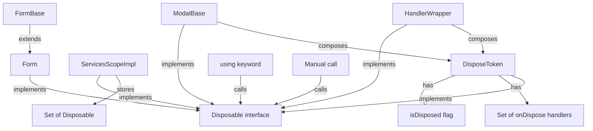

# Plan: Replace Destroyable/DestroyToken with Native Disposable Pattern

## Overview

Replace the custom `Destroyable` abstract class and `DestroyToken` with the native JavaScript `Disposable` interface (`Symbol.dispose`). The new `DisposeToken` will support registering cleanup handlers via `onDispose()`, enabling a more composable and idiomatic approach aligned with the TC39 Explicit Resource Management proposal.

---

## Current Architecture

```
┌─────────────────────────────────────────────────────────────┐
│                    Current State                            │
├─────────────────────────────────────────────────────────────┤
│                                                             │
│  Destroyable (abstract class)          DestroyToken         │
│  ┌──────────────────────────┐         ┌──────────────────┐  │
│  │ + static isDestroyable() │         │ - isDestroyed    │  │
│  │ + abstract destroy()     │         │ + destroy()      │  │
│  └──────────────────────────┘         │ + isDestroyed    │  │
│         ▲                             │ + assertNot...() │  │
│         │                             └──────────────────┘  │
│         │                                    ▲              │
│  ┌──────┴──────────┐                ┌───────┴────────┐     │
│  │    Form         │                │ HandlerWrapper │     │
│  │ (implements)    │                │ (composes)     │     │
│  └─────────────────┘                └────────────────┘     │
│                                                             │
│  ServicesScopeImpl                                          │
│  ┌──────────────────────────────────────┐                   │
│  │ - destroyables: Set<Destroyable>     │                   │
│  │ - isDestroyed: boolean               │                   │
│  │ + destroy()                          │                   │
│  │ - assertNotDestroyed()               │                   │
│  └──────────────────────────────────────┘                   │
│                                                             │
│  ModalBase                                                  │
│  ┌──────────────────────────────────────┐                   │
│  │ - destroyToken: DestroyToken         │                   │
│  │ - destroy()                          │                   │
│  │ - destroyContent()                   │                   │
│  │ - destroyControls()                  │                   │
│  └──────────────────────────────────────┘                   │
└─────────────────────────────────────────────────────────────┘
```

## Target Architecture

```
┌─────────────────────────────────────────────────────────────┐
│                    Target State                             │
├─────────────────────────────────────────────────────────────┤
│                                                             │
│  DisposeToken (implements Disposable)                       │
│  ┌──────────────────────────────────┐                       │
│  │ - isDisposedInternal: boolean    │                       │
│  │ - disposeHandlers: Set<Action>   │                       │
│  │ + get isDisposed(): boolean      │                       │
│  │ + onDispose(handler): void       │                       │
│  │ + assertNotDisposed(): void      │                       │
│  │ + [Symbol.dispose](): void       │  ← native protocol   │
│  └──────────────────────────────────┘                       │
│             ▲                                               │
│    ┌────────┴────────┐                                      │
│    │ HandlerWrapper  │                                      │
│    │ ModalBase       │                                      │
│    │ (composes)      │                                      │
│    └─────────────────┘                                      │
│                                                             │
│  ServicesScopeImpl                                          │
│  ┌──────────────────────────────────────┐                   │
│  │ - disposables: Set<Disposable>       │  ← native type   │
│  │ - isDisposed: boolean                │                   │
│  │ + [Symbol.dispose]()                 │  ← native method │
│  │ - assertNotDisposed()                │                   │
│  └──────────────────────────────────────┘                   │
│                                                             │
│  Form implements Disposable (instead of Destroyable)        │
│  ModalBase uses DisposeToken + [Symbol.dispose]()           │
└─────────────────────────────────────────────────────────────┘
```

---

## Files to Create

### 1. [`app/modules/shared/entities/disposeToken.ts`](app/modules/shared/entities/disposeToken.ts) — NEW

The new `DisposeToken` class implementing the native `Disposable` interface:

```typescript
import type { Action } from '../types/action';
import { DisposedException } from '../exceptions/disposedException';

export class DisposeToken implements Disposable
{
    private isDisposedInternal = false;
    private disposeHandlers = new Set<Action>();

    get isDisposed(): boolean
    {
        return this.isDisposedInternal;
    }

    onDispose(handler: Action): void
    {
        this.assertNotDisposed();
        this.disposeHandlers.add(handler);
    }

    assertNotDisposed(): void
    {
        if (this.isDisposedInternal)
        {
            throw new DisposedException();
        }
    }

    [Symbol.dispose](): void
    {
        if (this.isDisposedInternal)
        {
            return;
        }

        this.disposeHandlers.forEach(handler => handler());
        this.disposeHandlers.clear();
        this.isDisposedInternal = true;
    }
}
```

**Key design decisions:**
- Implements `Disposable` (native interface) — compatible with `using` keyword
- `onDispose(handler)` — allows registering cleanup callbacks (composable)
- `assertNotDisposed()` — guard method, throws typed `DisposedException`
- `[Symbol.dispose]()` — idempotent, runs all registered handlers, then clears them
- `isDisposed` getter — external state check

### 2. [`app/modules/shared/exceptions/disposedException.ts`](app/modules/shared/exceptions/disposedException.ts) — NEW

Rename from `DestroyedException`:

```typescript
export class DisposedException extends Error
{
    constructor()
    {
        super('Object is disposed');
    }
}
```

---

## Files to Modify

### 3. [`app/modules/shared/entities/destroyToken.ts`](app/modules/shared/entities/destroyToken.ts) — DELETE

Remove this file entirely. Replaced by `DisposeToken`.

### 4. [`app/modules/shared/exceptions/destroyedException.ts`](app/modules/shared/exceptions/destroyedException.ts) — DELETE

Remove this file entirely. Replaced by `DisposedException`.

### 5. [`app/modules/shared/interfaces/destroyable.ts`](app/modules/shared/interfaces/destroyable.ts) — DELETE

Remove this file entirely. The native `Disposable` interface replaces it.

### 6. [`app/modules/shared/entities/handlerWrapper.ts`](app/modules/shared/entities/handlerWrapper.ts) — MODIFY

Replace `DestroyToken` with `DisposeToken`, rename `destroy()` to `[Symbol.dispose]()`:

```typescript
import { HandlerAlreadySetException } from '../exceptions/handlerAlreadySetException';
import type { Action } from '../types/action';
import { DisposeToken } from './disposeToken';

export class HandlerWrapper<T extends any[] = []> implements Disposable
{
    private disposeToken = new DisposeToken();
    private handler: Action<T> | undefined;

    setHandler(handler: Action<T>): void
    {
        this.disposeToken.assertNotDisposed();

        if (this.handler)
        {
            throw new HandlerAlreadySetException();
        }

        this.handler = handler;
    }

    handle(...args: T): void
    {
        this.handler?.(...args);
    }

    [Symbol.dispose]()
    {
        this.disposeToken[Symbol.dispose]();
        this.handler = undefined;
    }
}
```

**Changes:**
- `implements Disposable` added
- `destroyToken` → `disposeToken`
- `destroy()` → `[Symbol.dispose]()`
- Delegates to `this.disposeToken[Symbol.dispose]()`

### 7. [`app/modules/shared/entities/servicesContainer.ts`](app/modules/shared/entities/servicesContainer.ts) — MODIFY

Replace `Destroyable` with native `Disposable`:

| Line(s) | Current | Replace With |
|---------|---------|--------------|
| 4 | `import { Destroyable } from '../interfaces/destroyable';` | Remove import |
| 54 | `private destroyables = new Set<Destroyable>();` | `private disposables = new Set<Disposable>();` |
| 88-91 | `for (const instance of this.destroyables) { instance.destroy(); }` | `for (const instance of this.disposables) { instance[Symbol.dispose](); }` |
| 144 | `if (Destroyable.isDestroyable(instance))` | `if (instance && typeof instance[Symbol.dispose] === 'function')` |
| 146 | `this.destroyables.add(instance);` | `this.disposables.add(instance);` |

Also rename `destroy()` method to `[Symbol.dispose]()` on `ServicesScopeImpl` and `ServicesContainer`.

### 8. [`app/modules/overlay/entities/modalBase.ts`](app/modules/overlay/entities/modalBase.ts) — MODIFY

| Line(s) | Current | Replace With |
|---------|---------|--------------|
| 7 | `import { Destroyable } from '@packages/shared';` | Remove import |
| 8 | `import { DestroyToken } from '@packages/shared';` |
| 24 | `private destroyToken = new DestroyToken();` | `private disposeToken = new DisposeToken();` |
| 149 | `this.destroyToken.assertNotDestroyed();` | `this.disposeToken.assertNotDisposed();` |
| 155 | `this.destroyToken.assertNotDestroyed();` | `this.disposeToken.assertNotDisposed();` |
| 161 | `this.destroy();` | `this[Symbol.dispose]();` |
| 166 | `this.destroyToken.assertNotDestroyed();` | `this.disposeToken.assertNotDisposed();` |
| 176-186 | `private destroy()` | `[Symbol.dispose]()` |
| 178 | `this.destroyToken.isDestroyed` | `this.disposeToken.isDisposed` |
| 186 | `this.destroyToken.destroy();` | `this.disposeToken[Symbol.dispose]();` |
| 191 | `Destroyable.isDestroyable(this.content)` | `this.content && typeof this.content[Symbol.dispose] === 'function'` |
| 193 | `this.content.destroy();` | `this.content[Symbol.dispose]();` |
| 203 | `Destroyable.isDestroyable(control)` | `control && typeof control[Symbol.dispose] === 'function'` |
| 205 | `control.destroy();` | `control[Symbol.dispose]();` |

### 9. [`app/modules/forms/entities/form.ts`](app/modules/forms/entities/form.ts) — MODIFY

| Line(s) | Current | Replace With |
|---------|---------|--------------|
| 2 | `import type { Destroyable } from '@packages/shared';` | Remove import |
| 16 | `extends UIElement implements Destroyable` | `extends UIElement implements Disposable` |
| 29 | `abstract destroy(): void;` | `abstract [Symbol.dispose](): void;` |

### 10. [`app/modules/forms/entities/formBase.ts`](app/modules/forms/entities/formBase.ts) — MODIFY

| Line(s) | Current | Replace With |
|---------|---------|--------------|
| 129-131 | `override destroy(): void { }` | `override [Symbol.dispose](): void { }` |

### 11. [`app/modules/shared/composables/useServicesScope.ts`](app/modules/shared/composables/useServicesScope.ts) — MODIFY

| Line(s) | Current | Replace With |
|---------|---------|--------------|
| 73 | `scope?.destroy();` | `scope?.[Symbol.dispose]();` |

### 12. [`app/modules/shared/test/unit/destroyToken.test.ts`](app/modules/shared/test/unit/destroyToken.test.ts) — RENAME & MODIFY

Rename to `disposeToken.test.ts`. Update all references:

- `DestroyToken` → `DisposeToken`
- `DestroyedException` → `DisposedException`
- `token.destroy()` → `token[Symbol.dispose]()`
- `token.isDestroyed` → `token.isDisposed`
- `token.assertNotDestroyed()` → `token.assertNotDisposed()`

Add new tests for `onDispose()`:

```typescript
describe('onDispose', () =>
{
    it('should register and execute dispose handlers', () =>
    {
        const token = new DisposeToken();
        const handler = vi.fn();

        token.onDispose(handler);
        token[Symbol.dispose]();

        expect(handler).toHaveBeenCalledOnce();
    });

    it('should execute all registered handlers', () =>
    {
        const token = new DisposeToken();
        const handler1 = vi.fn();
        const handler2 = vi.fn();

        token.onDispose(handler1);
        token.onDispose(handler2);
        token[Symbol.dispose]();

        expect(handler1).toHaveBeenCalledOnce();
        expect(handler2).toHaveBeenCalledOnce();
    });

    it('should throw DisposedException when registering after dispose', () =>
    {
        const token = new DisposeToken();
        token[Symbol.dispose]();

        expect(() => token.onDispose(() => {})).toThrow(DisposedException);
    });

    it('should not execute handlers twice', () =>
    {
        const token = new DisposeToken();
        const handler = vi.fn();

        token.onDispose(handler);
        token[Symbol.dispose]();
        token[Symbol.dispose](); // second call is no-op

        expect(handler).toHaveBeenCalledTimes(1);
    });
});
```

### 13. [`app/modules/shared/test/unit/handlerWrapper.test.ts`](app/modules/shared/test/unit/handlerWrapper.test.ts) — MODIFY (if exists)

Update `destroy()` calls to `[Symbol.dispose]()`.

---

## Dependency Graph (Execution Order)

```
Step 1: Create DisposeToken + DisposedException
         (no dependencies, new files)
              │
              ▼
Step 2: Update HandlerWrapper
         (depends on DisposeToken)
              │
              ▼
Step 3: Update ServicesContainer
         (depends on DisposeToken, no longer depends on Destroyable)
              │
              ▼
Step 4: Update ModalBase
         (depends on DisposeToken)
              │
              ▼
Step 5: Update Form + FormBase
         (depends on native Disposable interface)
              │
              ▼
Step 6: Update useServicesScope
         (depends on ServicesContainer)
              │
              ▼
Step 7: Update tests
         (depends on all above)
              │
              ▼
Step 8: Delete old files
         (DestroyToken, DestroyedException, Destroyable)
              │
              ▼
Step 9: TypeScript check + test run
```

---

## Detailed Execution Steps

### Step 1: Create [`DisposeToken`](app/modules/shared/entities/disposeToken.ts)

- Create the file with the implementation shown above
- Create [`DisposedException`](app/modules/shared/exceptions/disposedException.ts)

### Step 2: Update [`HandlerWrapper`](app/modules/shared/entities/handlerWrapper.ts)

- Change import from `DestroyToken` to `DisposeToken`
- Add `implements Disposable`
- Rename `destroy()` to `[Symbol.dispose]()`
- Delegate to `this.disposeToken[Symbol.dispose]()`

### Step 3: Update [`ServicesContainer`](app/modules/shared/entities/servicesContainer.ts)

- Remove `Destroyable` import
- Change `Set<Destroyable>` to `Set<Disposable>`
- Change `instance.destroy()` to `instance[Symbol.dispose]()`
- Change `Destroyable.isDestroyable(instance)` to duck-type check on `Symbol.dispose`
- Rename `destroy()` to `[Symbol.dispose]()` on both `ServicesScopeImpl` and `ServicesContainer`

### Step 4: Update [`ModalBase`](app/modules/overlay/entities/modalBase.ts)

- Replace all `DestroyToken` references with `DisposeToken`
- Replace all `destroy()` calls with `[Symbol.dispose]()`
- Replace `Destroyable.isDestroyable()` with duck-type checks

### Step 5: Update [`Form`](app/modules/forms/entities/form.ts) and [`FormBase`](app/modules/forms/entities/formBase.ts)

- Change `implements Destroyable` to `implements Disposable`
- Change `destroy()` to `[Symbol.dispose]()`

### Step 6: Update [`useServicesScope`](app/modules/shared/composables/useServicesScope.ts)

- Change `scope?.destroy()` to `scope?.[Symbol.dispose]()`

### Step 7: Update tests

- Rename `destroyToken.test.ts` → `disposeToken.test.ts`
- Update all references and add `onDispose` tests
- Update any other test files referencing `destroy()` on affected classes

### Step 8: Delete old files

- `app/modules/shared/entities/destroyToken.ts`
- `app/modules/shared/exceptions/destroyedException.ts`
- `app/modules/shared/interfaces/destroyable.ts`

### Step 9: Verify

- Run `pnpm typecheck` — ensure no type errors
- Run `pnpm test` — ensure all tests pass
- Run `pnpm lint` — ensure no lint errors

---

## Backward Compatibility Considerations

1. **`ServicesScope.destroy()`** is part of the public API. Changing it to `[Symbol.dispose]()` is a breaking change for any external consumers. Consider keeping a `destroy()` alias that delegates to `[Symbol.dispose]()`:

```typescript
// On ServicesScope abstract class
destroy(): void {
    this[Symbol.dispose]();
}
```

2. **`Form.destroy()`** is abstract. Changing to `[Symbol.dispose]()` is a breaking change for any subclass. Same alias strategy applies.

3. **`ModalBase.close()`** calls `this.destroy()` internally. Update to `this[Symbol.dispose]()`.

---

## Mermaid Diagram: Data Flow After Refactoring



---

## Summary of Changes

| File | Action |
|------|--------|
| `app/modules/shared/entities/disposeToken.ts` | **CREATE** |
| `app/modules/shared/exceptions/disposedException.ts` | **CREATE** |
| `app/modules/shared/entities/destroyToken.ts` | **DELETE** |
| `app/modules/shared/exceptions/destroyedException.ts` | **DELETE** |
| `app/modules/shared/interfaces/destroyable.ts` | **DELETE** |
| `app/modules/shared/entities/handlerWrapper.ts` | **MODIFY** |
| `app/modules/shared/entities/servicesContainer.ts` | **MODIFY** |
| `app/modules/overlay/entities/modalBase.ts` | **MODIFY** |
| `app/modules/forms/entities/form.ts` | **MODIFY** |
| `app/modules/forms/entities/formBase.ts` | **MODIFY** |
| `app/modules/shared/composables/useServicesScope.ts` | **MODIFY** |
| `app/modules/shared/test/unit/destroyToken.test.ts` | **RENAME + MODIFY** |
| Any other test files referencing `.destroy()` | **MODIFY** |