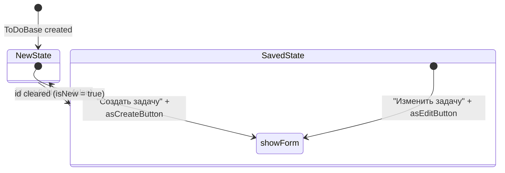
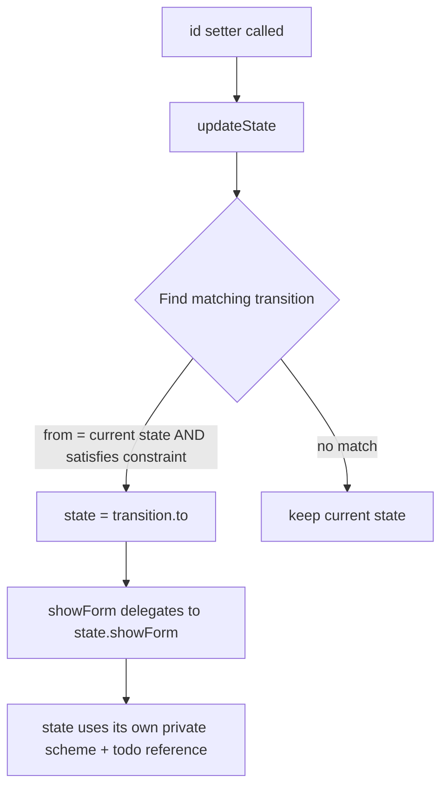

# ToDo State Pattern Refactoring Plan

## Overview

Replace the current `isNew`-based branching in `ToDoBase` with a formal **State pattern**. Two states (`NewToDoState` and `SavedToDoState`) will each own their `showForm` behavior. The `ToDo` interface will no longer expose `getAddScheme()`/`getEditScheme()`. State transitions are driven by a declarative transition table with a `satisfies` utility.

---

## Architecture

### State Classes

Four new files in `app/modules/todo/entities/states/`:

```
app/modules/todo/entities/states/
  todoState.ts              (abstract base — only showForm)
  todoStateBase.ts          (base with protected scheme + todo reference)
  newTodoState.ts           (New state)
  savedTodoState.ts         (Saved state)
```

#### `ToDoState` (abstract)

```typescript
import type { Modal } from '@/modules/overlay/entities/modal';

export abstract class ToDoState
{
  abstract showForm(): Modal;
}
```

- No `scheme` property exposed — scheme is internal to the state hierarchy.
- `showForm` takes no arguments — the todo is passed via constructor.

#### `ToDoStateBase` (abstract, extends `ToDoState`)

```typescript
import type { EntityScheme } from '@packages/shared';
import type { ToDoData } from '../../types/todoData';
import { EntityFieldType } from '@packages/shared';
import { ToDoState } from './todoState';
import type { ToDoBase } from '../todoBase';

export abstract class ToDoStateBase extends ToDoState
{
  protected scheme: EntityScheme<ToDoData> = {
    id: { type: EntityFieldType.hidden },
    title: {
      type: EntityFieldType.string,
      label: 'Название задачи',
      placeholder: 'Введите название задачи',
      isRequired: true,
    },
    description: {
      type: EntityFieldType.string,
      label: 'Описание задачи',
      placeholder: 'Введите описание задачи',
      isLong: true,
    },
    completionDatePlanned: {
      type: EntityFieldType.datetime,
      label: 'Плановая дата выполнения',
    },
    completionDateActual: {
      type: EntityFieldType.hidden,
    },
  };

  constructor(
    protected todo: ToDoBase,
  )
  {
    super();
  }
}
```

- `scheme` is `protected` — the common scheme definition lives here.
- `todo` is `protected` — passed via constructor, available to all concrete states.
- `NewToDoState` and `SavedToDoState` do **not** override `scheme` — they inherit it as-is.

#### `NewToDoState` (extends `ToDoStateBase`)

- Inherits `scheme` from `ToDoStateBase` (no override).
- `showForm` → title "Создать задачу", button `asCreateButton()`.

#### `SavedToDoState` (extends `ToDoStateBase`)

- Inherits `scheme` from `ToDoStateBase` (no override).
- `showForm` → title "Изменить задачу", button `asEditButton()`.

### Transition System

A transition is defined as a shared type:

```typescript
// app/modules/shared/types/stateTransition.ts

export type StateTransition<TState, TConstraint extends Record<string, any>> = {
  from: TState;
  to: TState;
  constraint: TConstraint;
};
```

A typed constraint type for ToDo state transitions:

```typescript
type ToDoStateTransitionConstraint = {
  isNew: boolean;
};
```

A `satisfies` utility function checks whether a target object matches all fields of a constraint:

```typescript
// app/modules/shared/utils/satisfies.ts

export function satisfies<TConstraint extends Record<string, any>>(
  target: Record<string, any>,
  constraint: TConstraint
): boolean
{
  return (Object.keys(constraint) as (keyof TConstraint)[])
    .every(key => target[key as string] === constraint[key]);
}
```

### State Management in `ToDoBase`

```typescript
private newState: NewToDoState;
private savedState: SavedToDoState;
private state: ToDoState;

private transitions: StateTransition<ToDoState, ToDoStateTransitionConstraint>[] = [];

constructor(
  private overlay: Overlay,
  private formFactory: FormFactory,
)
{
  super();

  this.newState = new NewToDoState(this.overlay, this.formFactory, this);
  this.savedState = new SavedToDoState(this.overlay, this.formFactory, this);
  this.state = this.newState;

  this.transitions = [
    { from: this.newState, to: this.savedState, constraint: { isNew: false } },
    { from: this.savedState, to: this.newState, constraint: { isNew: true } },
  ];
}
```

The `updateState()` method:

```typescript
private updateState(): void
{
  const transition = this.transitions.find(t =>
    t.from === this.state && satisfies(this, t.constraint)
  );

  if (transition)
  {
    this.state = transition.to;
  }
}
```

This is called whenever `id` changes (in the `id` setter).

---

## Changes Summary

### Files to Create

| # | File | Description |
|---|------|-------------|
| 1 | `app/modules/shared/utils/satisfies.ts` | `satisfies()` utility function |
| 2 | `app/modules/shared/types/stateTransition.ts` | `StateTransition` type |
| 3 | `app/modules/todo/entities/states/todoState.ts` | Abstract state base class |
| 4 | `app/modules/todo/entities/states/todoStateBase.ts` | Base with protected scheme + todo reference |
| 5 | `app/modules/todo/entities/states/newTodoState.ts` | New state implementation |
| 6 | `app/modules/todo/entities/states/savedTodoState.ts` | Saved state implementation |

### Files to Modify

| # | File | Changes |
|---|------|---------|
| 7 | `app/modules/todo/entities/todo.ts` | Remove `getAddScheme()`, `getEditScheme()` from abstract interface |
| 8 | `app/modules/todo/entities/todoBase.ts` | Replace `isNew`-based branching with state pattern; add `updateState()`; delegate `showForm` to current state; remove `getAddScheme`/`getEditScheme` overrides; remove `addScheme`/`editScheme`/`schemeCommon` private fields |
| 9 | `app/modules/todo/mocks/todoMock.ts` | Remove `getEditScheme`, `getAddScheme` from mock |
| 10 | `app/modules/todo/test/unit/todoImpl.test.ts` | Update tests — remove `getAddScheme`/`getEditScheme` references, remove internal modal config assertions |

### Files to Keep Unchanged

- `app/modules/todo/factories/todoFactoryImpl.ts` — no changes needed (still creates `ToDoBase`)
- `app/modules/todo/usecases/createToDoUseCaseImpl.ts` — calls `todo.showForm()`, unchanged
- `app/modules/todo/usecases/editToDoUseCaseImpl.ts` — calls `todo.showForm()`, unchanged
- `app/modules/todo/mappers/todoDtoMapperImpl.ts` — uses `todo.title`, `todo.id`, etc., unchanged
- `app/modules/todo/mappers/todoCardDataMapperImpl.ts` — uses `ToDoData` fields, unchanged
- `app/modules/todo/entities/todosOwnerBase.ts` — uses `todo.isNew`, which stays as a getter on `ToDoBase`

---

## Detailed File Specifications

### 1. `app/modules/shared/utils/satisfies.ts`

```typescript
export function satisfies<TConstraint extends Record<string, any>>(
  target: Record<string, any>,
  constraint: TConstraint
): boolean
{
  return (Object.keys(constraint) as (keyof TConstraint)[])
    .every(key => target[key as string] === constraint[key]);
}
```

### 2. `app/modules/shared/types/stateTransition.ts`

```typescript
export type StateTransition<TState, TConstraint extends Record<string, any>> = {
  from: TState;
  to: TState;
  constraint: TConstraint;
};
```

### 3. `app/modules/todo/entities/states/todoState.ts`

```typescript
import type { Modal } from '@/modules/overlay/entities/modal';

export abstract class ToDoState
{
  abstract showForm(): Modal;
}
```

### 4. `app/modules/todo/entities/states/todoStateBase.ts`

```typescript
import type { EntityScheme } from '@packages/shared';
import type { ToDoData } from '../../types/todoData';
import { EntityFieldType } from '@packages/shared';
import { ToDoState } from './todoState';
import type { ToDoBase } from '../todoBase';

export abstract class ToDoStateBase extends ToDoState
{
  protected scheme: EntityScheme<ToDoData> = {
    id: {
      type: EntityFieldType.hidden,
    },

    title: {
      type: EntityFieldType.string,
      label: 'Название задачи',
      placeholder: 'Введите название задачи',
      isRequired: true,
    },

    description: {
      type: EntityFieldType.string,
      label: 'Описание задачи',
      placeholder: 'Введите описание задачи',
      isLong: true,
    },

    completionDatePlanned: {
      type: EntityFieldType.datetime,
      label: 'Плановая дата выполнения',
    },

    completionDateActual: {
      type: EntityFieldType.hidden,
    },
  };

  constructor(
    protected todo: ToDoBase,
  )
  {
    super();
  }
}
```

### 5. `app/modules/todo/entities/states/newTodoState.ts`

```typescript
import { ToDoStateBase } from './todoStateBase';
import type { ToDoData } from '../../types/todoData';
import type { ToDoBase } from '../todoBase';
import type { Modal } from '@/modules/overlay/entities/modal';
import type { FormFactory } from '@/modules/forms/factories/formFactory';
import type { Overlay } from '@/modules/overlay/entities/overlay';
import { updatePropertiesWithData } from '@packages/shared';

export class NewToDoState extends ToDoStateBase
{
  constructor(
    private overlay: Overlay,
    private formFactory: FormFactory,
    todo: ToDoBase,
  )
  {
    super(todo);
  }

  showForm(): Modal
  {
    const form = this.formFactory.create<ToDoData>({
      callbacks: {
        submit: async data =>
        {
          updatePropertiesWithData(this.todo, data);
          await this.todo.saveAsync();
        }
      }
    });

    form.setElementsFromScheme(this.scheme);
    form.setData(this.todo.getData());

    return this.overlay.createModal({
      title: 'Создать задачу',
      content: form,

      buttonConfirm: configurator => configurator
        .withCommand(form.getSubmitCommand())
        .asCreateButton(),

      buttonCancel: true,
    });
  }
}
```

### 6. `app/modules/todo/entities/states/savedTodoState.ts`

```typescript
import { ToDoStateBase } from './todoStateBase';
import type { ToDoData } from '../../types/todoData';
import type { ToDoBase } from '../todoBase';
import type { Modal } from '@/modules/overlay/entities/modal';
import type { FormFactory } from '@/modules/forms/factories/formFactory';
import type { Overlay } from '@/modules/overlay/entities/overlay';
import { updatePropertiesWithData } from '@packages/shared';

export class SavedToDoState extends ToDoStateBase
{
  constructor(
    private overlay: Overlay,
    private formFactory: FormFactory,
    todo: ToDoBase,
  )
  {
    super(todo);
  }

  showForm(): Modal
  {
    const form = this.formFactory.create<ToDoData>({
      callbacks: {
        submit: async data =>
        {
          updatePropertiesWithData(this.todo, data);
          await this.todo.saveAsync();
        }
      }
    });

    form.setElementsFromScheme(this.scheme);
    form.setData(this.todo.getData());

    return this.overlay.createModal({
      title: 'Изменить задачу',
      content: form,

      buttonConfirm: configurator => configurator
        .withCommand(form.getSubmitCommand())
        .asEditButton(),

      buttonCancel: true,
    });
  }
}
```

### 7. `app/modules/todo/entities/todo.ts` — Modified

Remove `getAddScheme()` and `getEditScheme()` from the abstract class. Keep `isNew`, `getData()`, `clone()`, `saveAsync()`, `showForm()`.

```typescript
import type { Reactive } from 'vue';
import type { ToDosOwner } from './todosOwner';
import type { ToDoData } from '../types/todoData';
import type { Modal } from '@/modules/overlay/entities/modal';

export abstract class ToDo
{
  abstract id: string;
  abstract title: string;
  abstract description: string;
  abstract completionDatePlanned: Date | undefined;
  abstract completionDateActual: Date | undefined;
  abstract owner: ToDosOwner | undefined;

  abstract get isNew(): boolean;
  abstract getData(): Reactive<ToDoData>;
  abstract clone(): ToDo;
  abstract saveAsync(): Promise<void>;
  abstract showForm(): Modal;
}
```

**Note**: `isNew` stays because `todosOwnerBase.ts` uses it (`todo.isNew`). It's a derived property, not a state-specific behavior.

### 8. `app/modules/todo/entities/todoBase.ts` — Modified

Key changes:
- Remove `addScheme`, `editScheme`, `schemeCommon` private fields
- Remove `getAddScheme()`, `getEditScheme()` overrides
- Add `newState`, `savedState` instances (pass `this` to constructors)
- Add `state` field (defaults to `newState`)
- Add `transitions` array with `StateTransition<ToDoState, ToDoStateTransitionConstraint>` type
- Add `updateState()` method, called in `id` setter
- `showForm()` delegates to `this.state.showForm()`

```typescript
import { ToDo } from "./todo";
import type { ToDoData } from '../types/todoData';
import type { ToDosOwner } from './todosOwner';
import { shallowReactive, type Reactive } from 'vue';
import { isStringEmpty } from '@packages/shared';
import type { FormFactory } from '@/modules/forms/factories/formFactory';
import type { Overlay } from '@/modules/overlay/entities/overlay';
import type { Modal } from '@/modules/overlay/entities/modal';
import { NewToDoState } from './states/newTodoState';
import { SavedToDoState } from './states/savedTodoState';
import { satisfies } from '@packages/shared';
import type { ToDoState } from './states/todoState';
import type { StateTransition } from '@packages/shared';

type ToDoStateTransitionConstraint = {
  isNew: boolean;
};

export class ToDoBase extends ToDo
{
  private ownerInternal: ToDosOwner | undefined;

  private dataInternal = shallowReactive(<ToDoData>{
    id: '',
    title: '',
    description: '',
    completionDatePlanned: undefined,
    completionDateActual: undefined
  });

  private newState: NewToDoState;
  private savedState: SavedToDoState;
  private state: ToDoState;

  private transitions: StateTransition<ToDoState, ToDoStateTransitionConstraint>[] = [];

  constructor(
    private overlay: Overlay,
    private formFactory: FormFactory,
  )
  {
    super();

    this.newState = new NewToDoState(this.overlay, this.formFactory, this);
    this.savedState = new SavedToDoState(this.overlay, this.formFactory, this);
    this.state = this.newState;

    this.transitions = [
      { from: this.newState, to: this.savedState, constraint: { isNew: false } },
      { from: this.savedState, to: this.newState, constraint: { isNew: true } },
    ];
  }

  get owner(): ToDosOwner | undefined
  {
    return this.ownerInternal;
  }

  set owner(value: ToDosOwner | undefined)
  {
    this.ownerInternal = value;
  }

  get id(): string
  {
    return this.dataInternal.id;
  }

  set id(value: string)
  {
    this.dataInternal.id = value;
    this.updateState();
  }

  get title(): string { return this.dataInternal.title; }
  get description(): string { return this.dataInternal.description; }
  get completionDatePlanned(): Date | undefined { return this.dataInternal.completionDatePlanned; }
  get completionDateActual(): Date | undefined { return this.dataInternal.completionDateActual; }

  set title(value: string) { this.dataInternal.title = value; }
  set description(value: string) { this.dataInternal.description = value; }
  set completionDatePlanned(value: Date | undefined) { this.dataInternal.completionDatePlanned = value; }
  set completionDateActual(value: Date | undefined) { this.dataInternal.completionDateActual = value; }

  get isNew()
  {
    return isStringEmpty(this.id);
  }

  private updateState(): void
  {
    const transition = this.transitions.find(t =>
      t.from === this.state && satisfies(this, t.constraint)
    );

    if (transition)
    {
      this.state = transition.to;
    }
  }

  override getData(): Reactive<ToDoData>
  {
    return this.dataInternal;
  }

  override clone(): ToDo
  {
    const todo = new ToDoBase(this.overlay, this.formFactory);

    todo.id = this.id;
    todo.title = this.title;
    todo.description = this.description;
    todo.completionDatePlanned = this.completionDatePlanned;
    todo.completionDateActual = this.completionDateActual;
    todo.owner = this.owner;

    return todo;
  }

  override async saveAsync(): Promise<void>
  {
    if (!this.owner)
    {
      throw new Error('Owner is not available');
    }

    await this.ownerInternal?.saveToDoAsync(this);
  }

  override showForm(): Modal
  {
    return this.state.showForm();
  }
}
```

### 9. `app/modules/todo/mocks/todoMock.ts` — Modified

Remove `getEditScheme`, `getAddScheme` from the mock object.

```typescript
import { vi } from 'vitest';
import type { ToDoData } from '../types/todoData';
import type { ToDosOwner } from '../entities/todosOwner';
import type { ToDo } from '../entities/todo';

const defaultToDoData: ToDoData = {
    id: '',
    title: '',
    description: '',
    completionDatePlanned: undefined,
    completionDateActual: undefined
};

export function createToDoMock(data?: Partial<ToDoData>, owner?: ToDosOwner)
{
    const fullData: ToDoData = {
        ...defaultToDoData,
        ...data,
    };

    return {
        ...fullData,
        owner,
        isNew: fullData.id === '',
        getData: () => fullData,
        clone: vi.fn(),
        saveAsync: vi.fn(),
        showForm: vi.fn(),
    } satisfies ToDo;
};
```

### 10. `app/modules/todo/test/unit/todoImpl.test.ts` — Modified

Remove `getAddScheme`/`getEditScheme` references. Remove tests that assert internal modal config details (title, button config). Keep tests that verify:
- Default property values
- `isNew` behavior
- `getData` returns correct data
- `clone` creates independent copy
- `saveAsync` delegates to owner
- `showForm` creates form, sets data, and returns modal via overlay

```typescript
import { describe, it, expect, beforeEach, vi } from 'vitest';
import { ToDoBase } from '../../entities/todoBase';
import { todosOwnerMock } from '../../mocks/todoOwnerMock';
import { formFactoryMock } from '@/modules/forms/mocks/formFactoryMock';
import { formMock } from '@/modules/forms/mocks/formMock';
import { overlayMock } from '@/modules/overlay/mocks/overlayMock';
import { modalMock } from '@/modules/overlay/mocks/modalMock';

describe('ToDoImpl', () =>
{
    let todo: ToDoBase;

    beforeEach(() =>
    {
        vi.resetAllMocks();

        formFactoryMock.create.mockReturnValue(formMock);
        overlayMock.createModal.mockReturnValue(modalMock);

        todo = new ToDoBase(overlayMock, formFactoryMock);
    });

    describe('properties', () =>
    {
        it('should have default empty values', () =>
        {
            expect(todo.id).toBe('');
            expect(todo.title).toBe('');
            expect(todo.description).toBe('');
            expect(todo.completionDatePlanned).toBeUndefined();
            expect(todo.completionDateActual).toBeUndefined();
            expect(todo.owner).toBeUndefined();
        });
    });

    describe('isNew', () =>
    {
        it('should be true when id is empty', () =>
        {
            todo.id = '';
            expect(todo.isNew).toBe(true);
        });

        it('should be false when id is not empty', () =>
        {
            todo.id = 'some-id';
            expect(todo.isNew).toBe(false);
        });
    });

    describe('getData', () =>
    {
        it('should return current data', () =>
        {
            todo.id = '123';
            todo.title = 'Title';
            todo.description = 'Desc';
            todo.completionDatePlanned = new Date('2025-01-01');

            const data = todo.getData();

            expect(data).toEqual({
                id: '123',
                title: 'Title',
                description: 'Desc',
                completionDatePlanned: new Date('2025-01-01'),
                completionDateActual: undefined,
            });
        });
    });

    describe('clone', () =>
    {
        it('should create a new instance with same data', () =>
        {
            todo.id = '1';
            todo.title = 'Original';
            todo.description = 'Desc';
            todo.completionDatePlanned = new Date('2025-01-01');
            todo.owner = todosOwnerMock;

            const clone = todo.clone();

            expect(clone).toBeInstanceOf(ToDoBase);
            expect(clone.id).toBe('1');
            expect(clone.title).toBe('Original');
            expect(clone.description).toBe('Desc');
            expect(clone.completionDatePlanned).toEqual(new Date('2025-01-01'));
            expect(clone.owner).toBe(todosOwnerMock);
        });

        it('should not share internal data references', () =>
        {
            todo.title = 'Original';
            const clone = todo.clone();
            clone.title = 'Modified';
            expect(todo.title).toBe('Original');
        });
    });

    describe('saveAsync', () =>
    {
        it('should call owner.saveToDoAsync with itself', async () =>
        {
            todo.owner = todosOwnerMock;

            await todo.saveAsync();
            expect(todosOwnerMock.saveToDoAsync).toHaveBeenCalledTimes(1);
            expect(todosOwnerMock.saveToDoAsync).toHaveBeenCalledWith(todo);
        });

        it('should throw if owner is undefined', async () =>
        {
            todo.owner = undefined;
            await expect(todo.saveAsync()).rejects.toThrow();
        });
    });

    describe('showForm', () =>
    {
        it('should create form and set data from todo', () =>
        {
            todo.id = '123';
            todo.title = 'Test';

            todo.showForm();

            expect(formFactoryMock.create).toHaveBeenCalledTimes(1);
            expect(formMock.setElementsFromScheme).toHaveBeenCalledTimes(1);
            expect(formMock.setData).toHaveBeenCalledTimes(1);
            expect(formMock.setData).toHaveBeenCalledWith(todo.getData());
        });

        it('should create modal via overlay', () =>
        {
            todo.id = '';

            const result = todo.showForm();

            expect(overlayMock.createModal).toHaveBeenCalledTimes(1);
            expect(result).toBe(modalMock);
        });
    });
});
```

---

## State Diagram



## Data Flow



## Execution Order

1. Create `app/modules/shared/utils/satisfies.ts`
2. Create `app/modules/shared/types/stateTransition.ts`
3. Create `app/modules/todo/entities/states/todoState.ts`
4. Create `app/modules/todo/entities/states/todoStateBase.ts`
5. Create `app/modules/todo/entities/states/newTodoState.ts`
6. Create `app/modules/todo/entities/states/savedTodoState.ts`
7. Modify `app/modules/todo/entities/todo.ts` — remove `getAddScheme`/`getEditScheme`
8. Modify `app/modules/todo/entities/todoBase.ts` — integrate state pattern
9. Modify `app/modules/todo/mocks/todoMock.ts` — remove `getAddScheme`/`getEditScheme`
10. Modify `app/modules/todo/test/unit/todoImpl.test.ts` — update tests
11. Run tests to verify